# 财教到家项目

负责订单的模块的设计和开发

**项目名称                             财教到家                          **2024\.8\-2024\.10

****技术架构：Spring Cloud\+Spring Boot\+Redis\+RabbitMQ\+Sentinel\+Seata \+Mybatis\+Nacos

**项目描述**

本项目专为财大学子家教定制，搭建用户、服务、机构、管理四端。借 “互联网 \+ 家教” 东风，融合线下商务与互联网技术，让线上成为线下家教服务的前沿阵地，推动家教服务数字化升级。

**项目亮点**

- 超时订单处理：为解决**订单超时**未支付自动关闭问题，采用RabbitMQ的TTL和**死信队列**特性，将超时订单投入死信队列后由消费者统一处理，实现了**高可靠性**的延迟任务。

- 数据一致性：为保障C端搜索服务的**数据一致性**，引入**Canal**来实时解析MySQL Binlog，并通过RabbitMQ异步将数据同步至Elasticsearch，实现了搜索**数据的最终一致性**，延迟控制在秒级。

- 订单提交幂等：为防止用户重复提交或网络抖动导致订单重复创建，基于Redisson实现了分布式锁机制，对用户ID进行加锁，确保了**订单创建的幂等性**，保障了资金安全。

- 分布式事务：涉及订单创建与优惠券核销等分布式场景中，采用**Seata的AT模式**，以对业务低     侵入的方式实现了分布式事务，**平衡了数据一致性与系统性能**。

- 订单状态管理：引入**状态机模式**对复杂的订单状态流转进行重构，将原本分散的条件判断转变为清晰的状态转移图，极大地**降低了代码复杂度**并避免了**非法状态转换**。、

- 订单调度优化：为提升系统扩展性，使用**策略模式**封装多种派单策略（如就近派单、接单数少），并采用**责任链模式**串联接单、调度、推送等流程节点，实现了**业务功能的灵活配置**与**高效解耦**

# 超时订单处理：为解决**订单超时**未支付自动关闭问题，采用RabbitMQ的TTL和**死信队列**特性，将超时订单投入死信队列后由消费者统一处理，实现了**高可靠性**的延迟任务。

如果超时未支付需要恢复库存\-订单状态改为超时未支付


## 为什么normal交换机绑定的key要和死信交换机的绑定的key一致

### 路由键传递机制

在 RabbitMQ 的死信机制中，当消息成为死信并被重新投递到死信交换机时，默认情况下会保留原始的路由键。这意味着：

1. 消息最初通过路由键 "order\.delay" 发送到普通交换机

2. 消息从普通交换机路由到延迟队列

3. 当消息成为死信时，它会带着相同的路由键 "order\.delay" 被发送到死信交换机

4. 死信交换机需要使用相同的路由键 "order\.delay" 才能正确将消息路由到死信队列

### 为什么需要保持一致

1. 消息路由一致性：死信消息保留了原始的路由键，只有匹配的绑定键才能正确路由

2. 简化配置：使用相同的路由键可以减少配置复杂性

3. 可预测性：保持一致使得消息流更加可预测和易于调试

### 替代方案：自定义死信路由键

如果您希望使用不同的路由键，可以通过设置 `x-dead-letter-routing-key` 参数来指定自定义的路由键：

```Python
@Bean
public Queue orderDelayQueue() {
    return QueueBuilder.durable(ORDER_DELAY_QUEUE)
            .withArgument("x-dead-letter-exchange", ORDER_DLX_EXCHANGE)
            .withArgument("x-dead-letter-routing-key", "custom.routing.key") // 自定义路由键
            .withArgument("x-message-ttl", 30 * 60 * 1000)
            .build();
}

// 然后死信队列需要按照自定义的路由键进行绑定
@Bean
public Binding orderDlxBinding() {
    return BindingBuilder.bind(orderDlxQueue())
            .to(orderDlxExchange())
            .with("custom.routing.key"); // 使用自定义路由键
}
```

## 关于 @RabbitListener 自动创建交换机和队列的解释

是的，您理解得完全正确。使用 Spring AMQP 的 `@RabbitListener` 注解配合 `@QueueBinding` 注解时，如果指定的队列、交换机或绑定关系不存在，Spring 会自动创建它们。

## 自动创建机制详解

### 创建死信交换机

在您提供的代码中：

自动创建的时候消费者也创建出来了\-但是normal交换机下是不允许有消费者的所以用下面的显示创建

```TypeScript
@RabbitListener(bindings = @QueueBinding(
    value = @Queue(name = "dlx.queue", durable = "true"), // 自动创建队列
    exchange = @Exchange(name = "dlx.direct", type = ExchangeTypes.DIRECT), // 自动创建交换机
    key = {"hi"} // 自动创建绑定关系
))
public void listenDlxQueue(String message){
    log.info("消费者监听到 dlx.queue的消息: [{}] ", message);
}
```

Spring AMQP 会在应用程序启动时自动执行以下操作：

1. 创建队列：创建一个名为 "dlx\.queue" 的持久化队列

2. 创建交换机：创建一个名为 "dlx\.direct" 的直接类型交换机

3. 创建绑定：使用路由键 "hj" 将队列绑定到交换机

## 配置选项说明

### @Queue 注解的常用属性：

- `name`: 队列名称

- `durable`: 是否持久化（true 表示重启后队列仍存在）

- `exclusive`: 是否排他（true 表示仅限此连接使用）

- `autoDelete`: 是否自动删除（当没有消费者时自动删除）

### @Exchange 注解的常用属性：

- `name`: 交换机名称

- `type`: 交换机类型（DIRECT, TOPIC, FANOUT, HEADERS）

- `durable`: 是否持久化

- `autoDelete`: 是否自动删除

## 与显式声明的对比

### 创建普通交换机无消费者

您也可以选择在配置类中显式声明队列、交换机和绑定：

```TypeScript
import org.springframework.amqp.core.*;
import org.springframework.context.annotation.Bean;
import org.springframework.context.annotation.Configuration;

@Configuration
public class NormalConfiguration {

    // 创建普通直接交换机
    @Bean
    public DirectExchange normalExchange() {
        return new DirectExchange("normal.direct");
        // 创建一个名为"normal.direct"的直接类型交换机
        // 直接交换机根据精确匹配的路由键将消息路由到队列
    }

    // 创建普通队列并配置死信交换机
    @Bean
    public Queue normalQueue() {
        return QueueBuilder.durable("normal.queue") // 创建持久化队列
                .deadLetterExchange("dlx.direct") // 设置死信交换机为"dlx.direct"
                .build();
        // 这个队列中的消息如果成为死信，会被转发到"dlx.direct"交换机
    }

    // 绑定队列到交换机
    @Bean
    public Binding normalExchangeBinding(Queue normalQueue, DirectExchange normalExchange) {
        return BindingBuilder.bind(normalQueue) // 绑定队列
                .to(normalExchange) // 到交换机
                .with("h1"); // 使用路由键"h1"
        // 这意味着发送到"normal.direct"交换机且路由键为"h1"的消息会被路由到"normal.queue"队列
    }
}
```

创建生产者发送消息

```TypeScript
@Test
void testSendDelayMessage() {
    rabbitTemplate.convertAndSend(
        "normal.direct",        // 交换机名称
        "h1",                  // 路由键
        "hello",               // 消息内容
        message -> {           // MessagePostProcessor  lambda表达式
            message.getMessageProperties().setExpiration("16000");  // 设置消息过期时间为16秒
            return message;
        }
    );
}
```

## 推荐做法

1. 生产环境：建议使用显式声明方式，这样可以更精确地控制队列和交换机的属性

2. 开发环境：可以使用注解自动创建，简化开发流程

3. 混合使用：也可以混合使用两种方式，但要注意避免重复声明

## 注意事项

1. 自动创建的功能依赖于 `RabbitAdmin` bean，Spring Boot 会自动配置它

2. 如果队列/交换机已存在但属性不匹配，可能会抛出异常

3. 在生产环境中，建议通过基础设施即代码\(IaC\)方式管理 RabbitMQ 资源，而不是依赖应用程序自动创建

总之，您提供的代码确实会在 RabbitMQ 中自动创建所需的队列、交换机和绑定关系，这是一种非常方便的开发和测试方式

## 延迟消息插件

因为通过延迟队列加上TTL的来实现死信队列的效果需要两组交换机和队列，但是延迟消息插件就需要一组


## 4\.2\.DelayExchange插件

基于死信队列虽然可以实现延迟消息，但是太麻烦了。因此RabbitMQ社区提供了一个延迟消息插件来实现相同的效果。

官方文档说明：

[https://blog.rabbitmq.com/posts/2015/04/scheduling-messages-with-rabbitmq]()

### 4\.2\.1\.下载

插件下载地址：

[https://github.com/rabbitmq/rabbitmq-delayed-message-exchange]()

由于我们安装的MQ是`3.8`版本，因此这里下载`3.8.17`版本：

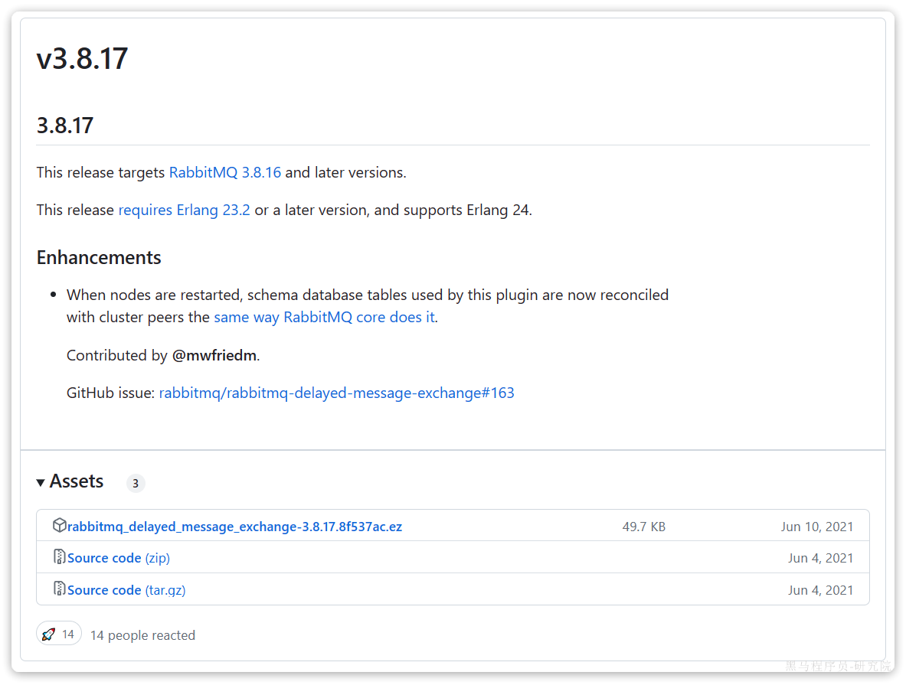

当然，也可以直接使用课前资料提供好的插件：

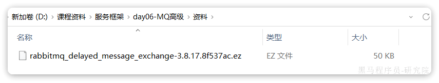

### 4\.2\.2\.安装

因为我们是基于Docker安装，所以需要先查看RabbitMQ的插件目录对应的数据卷。

```Shell
docker volume inspect mq-plugins
```

结果如下：

```JSON
[
    {
        "CreatedAt": "2024-06-19T09:22:59+08:00",
        "Driver": "local",
        "Labels": null,
        "Mountpoint": "/var/lib/docker/volumes/mq-plugins/_data",
        "Name": "mq-plugins",
        "Options": null,
        "Scope": "local"
    }
]
```

插件目录被挂载到了`/var/lib/docker/volumes/mq-plugins/_data`这个目录，我们上传插件到该目录下。

接下来执行命令，安装插件：

```Shell
docker exec -it mq rabbitmq-plugins enable rabbitmq_delayed_message_exchange
```

运行结果如下：

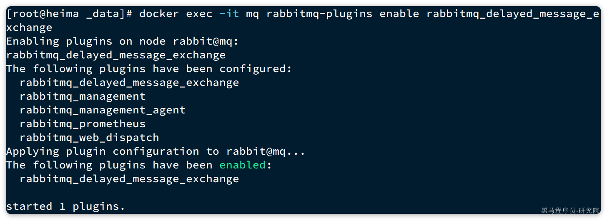

### 4\.2\.3\.声明延迟交换机

基于注解方式：

```Java
@RabbitListener(bindings = @QueueBinding(
        value = @Queue(name = "delay.queue", durable = "true"),
        exchange = @Exchange(name = "delay.direct", delayed = "true"),
        key = "delay"
))
public void listenDelayMessage(String msg){
    log.info("接收到delay.queue的延迟消息：{}", msg);
}
```

基于`@Bean`的方式：

```Java
package com.itheima.consumer.config;

import lombok.extern.slf4j.Slf4j;
import org.springframework.amqp.core.*;
import org.springframework.context.annotation.Bean;
import org.springframework.context.annotation.Configuration;

@Slf4j
@Configuration
public class DelayExchangeConfig {

    @Bean
    public DirectExchange delayExchange(){
        return ExchangeBuilder
                .directExchange("delay.direct") // 指定交换机类型和名称
                .delayed() // 设置delay的属性为true
                .durable(true) // 持久化
                .build();
    }

    @Bean
    public Queue delayedQueue(){
        return new Queue("delay.queue");
    }
    
    @Bean
    public Binding delayQueueBinding(){
        return BindingBuilder.bind(delayedQueue()).to(delayExchange()).with("delay");
    }
}
```

### 4\.2\.4\.发送延迟消息

发送消息时，必须通过x\-delay属性设定延迟时间：

```Java
@Test
void testPublisherDelayMessage() {
    // 1.创建消息
    String message = "hello, delayed message";
    // 2.发送消息，利用消息后置处理器添加消息头
    rabbitTemplate.convertAndSend("delay.direct", "delay", message, new MessagePostProcessor() {
        @Override
        public Message postProcessMessage(Message message) throws AmqpException {
            // 添加延迟消息属性
            message.getMessageProperties().setDelay(5000);
            return message;
        }
    });
}
```

**注意：**

延迟消息插件内部会维护一个本地数据库表，同时使用Elang Timers功能实现计时。如果消息的延迟时间设置较长，可能会导致堆积的延迟消息非常多，会带来较大的CPU开销，同时延迟消息的时间会存在误差。

因此，**不建议设置延迟时间过长的延迟消息**。

## 系统架构核心思想

**延迟任务处理的核心挑战**：传统的定时任务方式（如cron job、定时器）存在精确度不高、重启丢失、扩展困难等问题。而基于消息队列的延迟处理方案通过消息的TTL特性，能够实现精确的延迟执行。

**RabbitMQ的TTL和死信队列机制**：

- TTL（Time To Live）：消息存活时间，超时后消息会被丢弃或转发

- 死信队列（Dead Letter Queue）：接收被拒绝、过期或达到最大重试次数的消息

- 两者结合：消息在延迟队列中等待TTL到期，然后自动转发到死信队列进行处理

# 数据一致性：为保障C端搜索服务的**数据一致性**，引入**Canal**来实时解析MySQL Binlog，并通过RabbitMQ异步将数据同步至Elasticsearch，实现了搜索**数据的最终一致性**，延迟控制在秒级。

大家学习中如果碰到困难，可以加入[**黑马智学伴侣**](https://b11et3un53m.feishu.cn/wiki/M9LKwYAlHiZoyhkB5iKcgOh1nmc)寻求帮助，有学习交流群，老师、同学在线答疑。还有独享的企业级项目，避免与人撞车。


B站对应视频：

[https://www.bilibili.com/video/BV1S142197x7?p=111&vd_source=ad929603daa24f963a8504e41e24ad2b]()


黑马商城作为一个电商项目，商品的搜索肯定是访问频率最高的页面之一。目前搜索功能是基于数据库的模糊搜索来实现的，存在很多问题。

**首先**，查询效率较低。

由于数据库模糊查询不走索引，在数据量较大的时候，查询性能很差。黑马商城的商品表中仅仅有不到9万条数据，基于数据库查询时，搜索接口的表现如图：

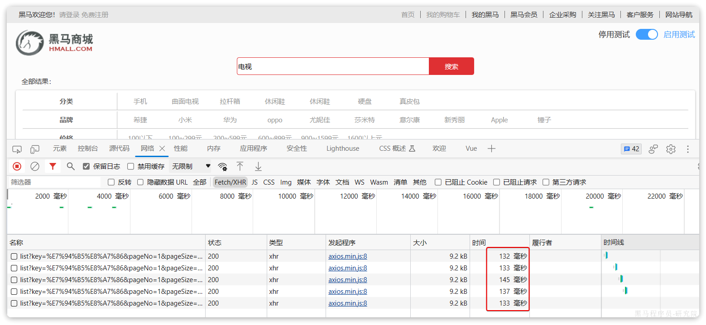

改为基于搜索引擎后，查询表现如下：

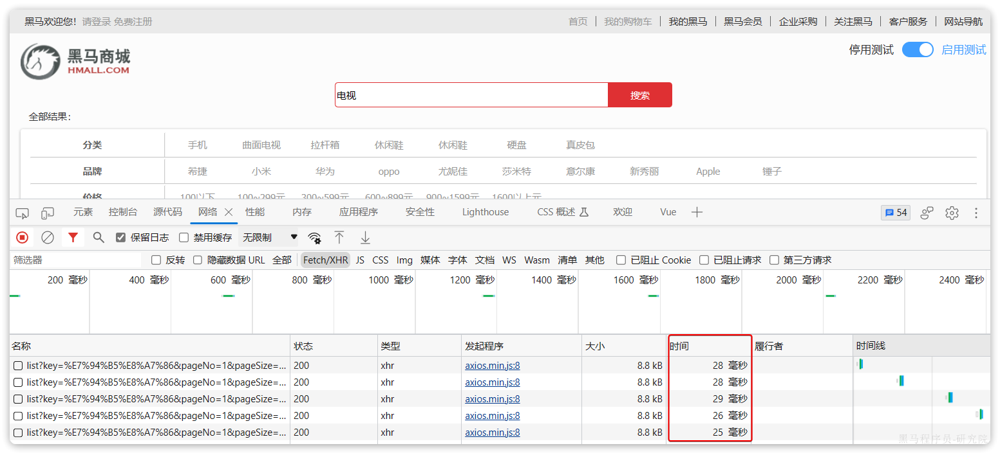

需要注意的是，数据库模糊查询随着表数据量的增多，查询性能的下降会非常明显，而搜索引擎的性能则不会随着数据增多而下降太多。目前仅10万不到的数据量差距就如此明显，如果数据量达到百万、千万、甚至上亿级别，这个性能差距会非常夸张。

**其次**，功能单一

数据库的模糊搜索功能单一，匹配条件非常苛刻，必须恰好包含用户搜索的关键字。而在搜索引擎中，用户输入出现个别错字，或者用拼音搜索、同义词搜索都能正确匹配到数据。

综上，在面临海量数据的搜索，或者有一些复杂搜索需求的时候，推荐使用专门的搜索引擎来实现搜索功能。

目前全球的搜索引擎技术排名如下：

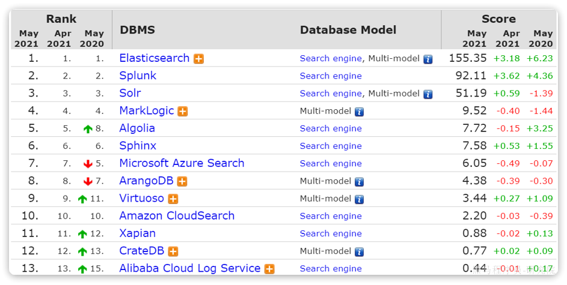

排名第一的就是我们今天要学习的elasticsearch\.

elasticsearch是一款非常强大的开源搜索引擎，支持的功能非常多，例如：


**代码搜索**


**商品搜索**


**解决方案搜索**


**地图搜索**


通过今天的学习大家要达成下列学习目标：

- 理解倒排索引原理

- 会使用IK分词器

- 理解索引库Mapping映射的属性含义

- 能创建索引库及映射

- 能实现文档的CRUD

## 1\.初识elasticsearch

Elasticsearch的官方网站如下：

[https://www.elastic.co/cn/elasticsearch/]()

本章我们一起来初步了解一下Elasticsearch的基本原理和一些基础概念。

### 1\.1\.认识和安装

Elasticsearch是由elastic公司开发的一套搜索引擎技术，它是elastic技术栈中的一部分。完整的技术栈包括：

- Elasticsearch：用于数据存储、计算和搜索

- Logstash/Beats：用于数据收集

- Kibana：用于数据可视化

整套技术栈被称为ELK，经常用来做日志收集、系统监控和状态分析等等：


整套技术栈的核心就是用来**存储**、**搜索**、**计算**的Elasticsearch，因此我们接下来学习的核心也是Elasticsearch。

我们要安装的内容包含2部分：

- elasticsearch：存储、搜索和运算

- kibana：图形化展示 \-里面有一个ES的操作控制台

首先Elasticsearch不用多说，是提供核心的数据存储、搜索、分析功能的。

然后是Kibana，Elasticsearch对外提供的是Restful风格的API，任何操作都可以通过发送http请求来完成。不过http请求的方式、路径、还有请求参数的格式都有严格的规范。这些规范我们肯定记不住，因此我们要借助于Kibana这个服务。

Kibana是elastic公司提供的用于操作Elasticsearch的可视化控制台。它的功能非常强大，包括：

- 对Elasticsearch数据的搜索、展示

- 对Elasticsearch数据的统计、聚合，并形成图形化报表、图形

- 对Elasticsearch的集群状态监控

- 它还提供了一个开发控制台（DevTools），在其中对Elasticsearch的Restful的API接口提供了**语法提示**

#### 1\.1\.1\.安装elasticsearch

通过下面的Docker命令即可安装单机版本的elasticsearch：

```Bash
docker run -d \
  --name es \
  -e "ES_JAVA_OPTS=-Xms512m -Xmx512m" \
  -e "discovery.type=single-node" \
  -v es-data:/usr/share/elasticsearch/data \
  -v es-plugins:/usr/share/elasticsearch/plugins \
  --privileged \
  --network hm-net \
  -p 9200:9200 \
  -p 9300:9300 \
  elasticsearch:7.12.1
```


注意，这里我们采用的是elasticsearch的7\.12\.1版本，由于8以上版本的JavaAPI变化很大，在企业中应用并不广泛，企业中应用较多的还是8以下的版本。

如果拉取镜像困难，可以直接导入课前资料提供的镜像tar包：

如果拉取镜像困难，可以直接导入课前资料提供的镜像tar包：

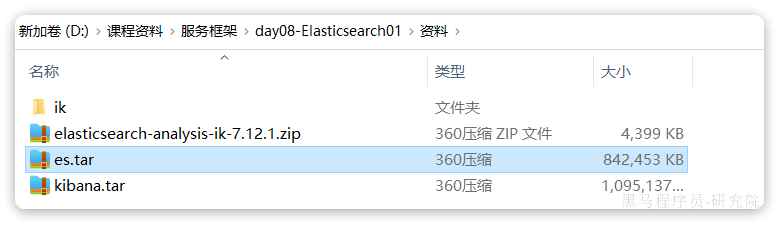


安装完成后，访问9200端口，即可看到响应的Elasticsearch服务的基本信息：

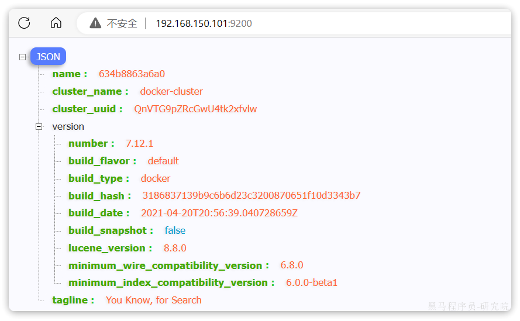


### 1\.1\.2\.安装Kibana

通过下面的Docker命令，即可部署Kibana：

```Bash
docker run -d \
--name kibana \
-e ELASTICSEARCH_HOSTS=http://es:9200 \
--network=hm-net \
-p 5601:5601  \
kibana:7.12.1
```

如果拉取镜像困难，可以直接导入课前资料提供的镜像tar包：

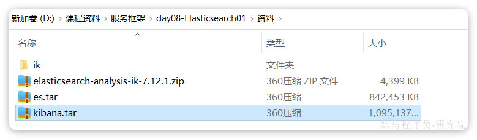


安装完成后，直接访问5601端口，即可看到控制台页面：


选择`Explore on my own`之后，进入主页面：

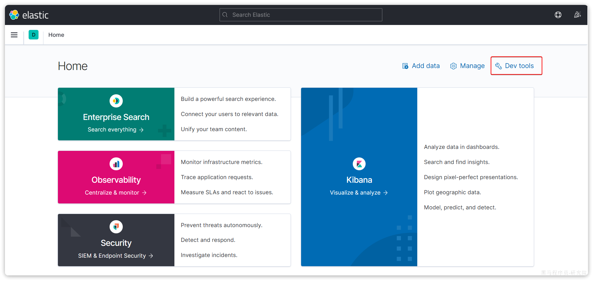

然后选中`Dev tools`，进入开发工具页面：

kibana知道es的地址因为部署的时候指定了es的地址

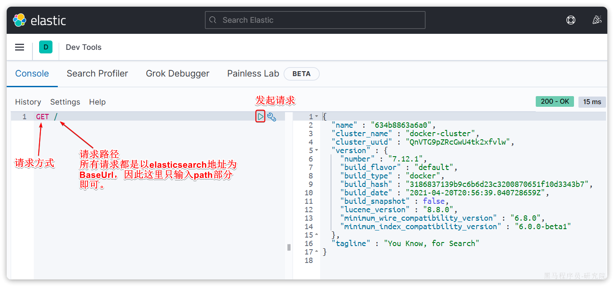

## 1\.2\.倒排索引

elasticsearch之所以有如此高性能的搜索表现，正是得益于底层的倒排索引技术。那么什么是倒排索引呢？

**倒排**索引的概念是基于MySQL这样的**正向**索引而言的。

### 1\.2\.1\.正向索引

我们先来回顾一下正向索引。

例如有一张名为`tb_goods`的表：

|**id**|**title**|**price**|
|---|---|---|
|1|小米手机|3499|
|2|华为手机|4999|
|3|华为小米充电器|49|
|4|小米手环|49|
|\.\.\.|\.\.\.|\.\.\.|


其中的`id`字段已经创建了索引，由于索引底层采用了B\+树结构，因此我们根据id搜索的速度会非常快。但是其他字段例如`title`，只在叶子节点上存在。

因此要根据`title`搜索的时候只能遍历树中的每一个叶子节点，判断title数据是否符合要求。

比如用户的SQL语句为：

```Java
select * from tb_goods where title like '%手机%';
```

那搜索的大概流程如图：

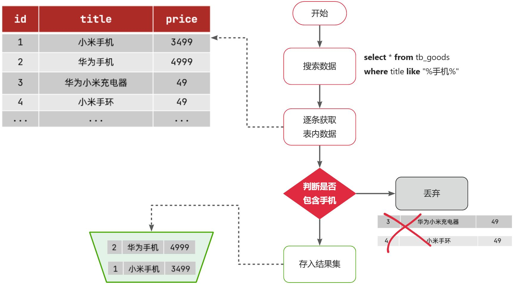

说明：

- 1）检查到搜索条件为`like '%手机%'`，需要找到`title`中包含`手机`的数据

- 2）逐条遍历每行数据（每个叶子节点），比如第1次拿到`id`为1的数据

- 3）判断数据中的`title`字段值是否符合条件

- 4）如果符合则放入结果集，不符合则丢弃

- 5）回到步骤1


综上，根据id精确匹配时，可以走索引，查询效率较高。而当搜索条件为模糊匹配时，由于索引无法生效，导致从索引查询退化为全表扫描，效率很差。

因此，正向索引适合于根据索引字段的精确搜索，不适合基于部分词条的模糊匹配。

而倒排索引恰好解决的就是根据部分词条模糊匹配的问题。

### 1\.2\.2\.倒排索引

倒排索引中有两个非常重要的概念：

- 文档（`Document`）：用来搜索的数据，其中的每一条数据就是一个文档。例如一个网页、一个商品信息

- 词条（`Term`）：对文档数据或用户搜索数据，利用某种算法分词，得到的具备含义的词语就是词条。例如：我是中国人，就可以分为：我、是、中国人、中国、国人这样的几个词条


**创建倒排索引**是对正向索引的一种特殊处理和应用，流程如下：

- 将每一个文档的数据利用**分词算法**根据语义拆分，得到一个个词条

- 创建表，每行数据包括词条、词条所在文档id、位置等信息

- 因为词条唯一性，可以给词条创建**正向**索引\-\-会给词条建立索引

此时形成的这张以词条为索引的表，就是倒排索引表，两者对比如下：

**正向索引**

|**id（索引）**|**title**|**price**|
|---|---|---|
|1|小米手机|3499|
|2|华为手机|4999|
|3|华为小米充电器|49|
|4|小米手环|49|
|\.\.\.|\.\.\.|\.\.\.|

**倒排索引**

|**词条（索引）**|**文档id**|
|---|---|
|小米|1，3，4|
|手机|1，2|
|华为|2，3|
|充电器|3|
|手环|4|

倒排索引的**搜索流程**如下（以搜索"华为手机"为例），如图：


流程描述：

1）用户输入条件`"华为手机"`进行搜索。

2）对用户输入条件**分词**，得到词条：`华为`、`手机`。

3）拿着词条在倒排索引中查找（**由于词条有索引，查询效率很高**），即可得到包含词条的文档id：`1、2、3` 默认是求并集。

4）拿着文档`id`到正向索引中查找具体文档即可（由于`id`也有索引，查询效率也很高）。


虽然要先查询倒排索引，再查询倒排索引，但是无论是词条、还是文档id都建立了索引，查询速度非常快！无需全表扫描。

### 1\.2\.3\.正向和倒排

那么为什么一个叫做正向索引，一个叫做倒排索引呢？

- **正向索引**是最传统的，根据id索引的方式。但根据词条查询时，必须先逐条获取每个文档，然后判断文档中是否包含所需要的词条，是**根据文档找词条的过程**。 

- 而**倒排索引**则相反，是先找到用户要搜索的词条，根据词条得到保护词条的文档的id，然后根据id获取文档。是**根据词条找文档的过程**。 


是不是恰好反过来了？

那么两者方式的优缺点是什么呢？

**正向索引**：

- 优点： 

    - 可以给多个字段创建索引

    - 根据索引字段搜索、排序速度非常快

- 缺点： 

    - 根据非索引字段，或者索引字段中的部分词条查找时，只能全表扫描。


**倒排索引**：

- 优点： 

    - 根据词条搜索、模糊搜索时，速度非常快

- 缺点： 

    - 只能给词条创建索引，而不是字段

    - 无法根据字段做排序


## 1\.3\.基础概念

elasticsearch中有很多独有的概念，与mysql中略有差别，但也有相似之处。

### 1\.3\.1\.文档和字段

elasticsearch是面向**文档（Document）**存储的，可以是数据库中的一条商品数据，一个订单信息。文档数据会被序列化为`json`格式后存储在`elasticsearch`中：


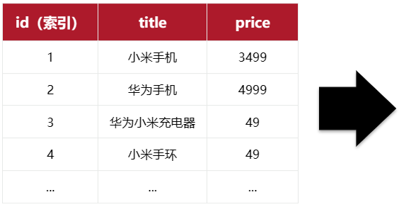


```JSON
{
    "id": 1,
    "title": "小米手机",
    "price": 3499
}
{
    "id": 2,
    "title": "华为手机",
    "price": 4999
}
{
    "id": 3,
    "title": "华为小米充电器",
    "price": 49
}
{
    "id": 4,
    "title": "小米手环",
    "price": 299
}

```

因此，原本数据库中的一行数据就是ES中的一个JSON文档；而数据库中每行数据都包含很多列，这些列就转换为JSON文档中的**字段（Field）**。

### 1\.3\.2\.索引和映射

随着业务发展，需要在es中存储的文档也会越来越多，比如有商品的文档、用户的文档、订单文档等等：

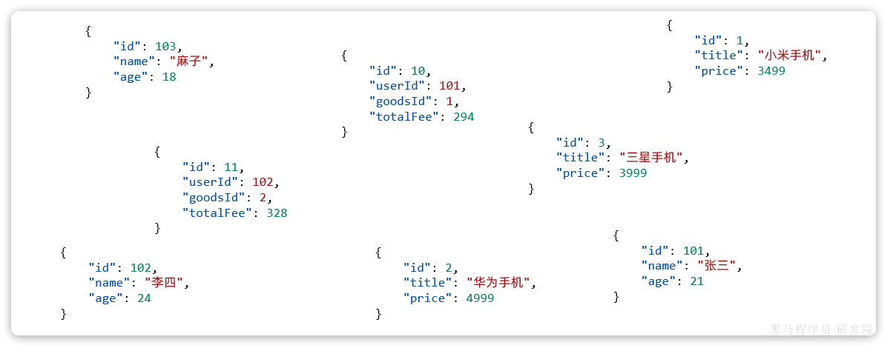

所有文档都散乱存放显然非常混乱，也不方便管理。

因此，我们要将类型相同的文档集中在一起管理，称为**索引（Index）**。例如：

**商品索引库**

```JSON
{
    "id": 1,
    "title": "小米手机",
    "price": 3499
}

{
    "id": 2,
    "title": "华为手机",
    "price": 4999
}

{
    "id": 3,
    "title": "三星手机",
    "price": 3999
}
```

**用户索引库**

```JSON
{
    "id": 101,
    "name": "张三",
    "age": 21
}

{
    "id": 102,
    "name": "李四",
    "age": 24
}

{
    "id": 103,
    "name": "麻子",
    "age": 18
}
```

**订单索引库**

```JSON
{
    "id": 10,
    "userId": 101,
    "goodsId": 1,
    "totalFee": 294
}

{
    "id": 11,
    "userId": 102,
    "goodsId": 2,
    "totalFee": 328
}

```


- 所有用户文档，就可以组织在一起，称为用户的索引；

- 所有商品的文档，可以组织在一起，称为商品的索引；

- 所有订单的文档，可以组织在一起，称为订单的索引；

因此，我们可以把索引当做是数据库中的表。

数据库的表会有约束信息，用来定义表的结构、字段的名称、类型等信息。因此，索引库中就有**映射（mapping）**，是索引中文档的字段约束信息，类似表的结构约束。

### 1\.3\.3\.mysql与elasticsearch

我们统一的把mysql与elasticsearch的概念做一下对比：

|**MySQL**|**Elasticsearch**|**说明**|
|---|---|---|
|Table|Index|索引\(index\)，就是文档的集合，类似数据库的表\(table\)|
|Row|Document|文档（Document），就是一条条的数据，类似数据库中的行（Row），文档都是JSON格式|
|Column|Field|字段（Field），就是JSON文档中的字段，类似数据库中的列（Column）|
|Schema|Mapping|Mapping（映射）是索引中文档的约束，例如字段类型约束。类似数据库的表结构（Schema）|
|SQL|DSL|DSL是elasticsearch提供的JSON风格的请求语句，用来操作elasticsearch，实现CRUD|

如图：

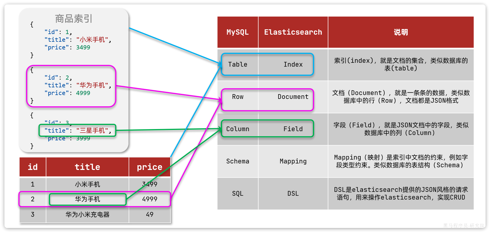


那是不是说，我们学习了elasticsearch就不再需要mysql了呢？

并不是如此，两者各自有自己的擅长之处：

- Mysql：擅长事务类型操作，可以确保数据的安全和一致性 

- Elasticsearch：擅长海量数据的搜索、分析、计算 


因此在企业中，往往是两者结合使用：

- 对安全性要求较高的写操作，使用mysql实现

- 对查询性能要求较高的搜索需求，使用elasticsearch实现

- 两者再基于某种方式，实现数据的同步，保证一致性

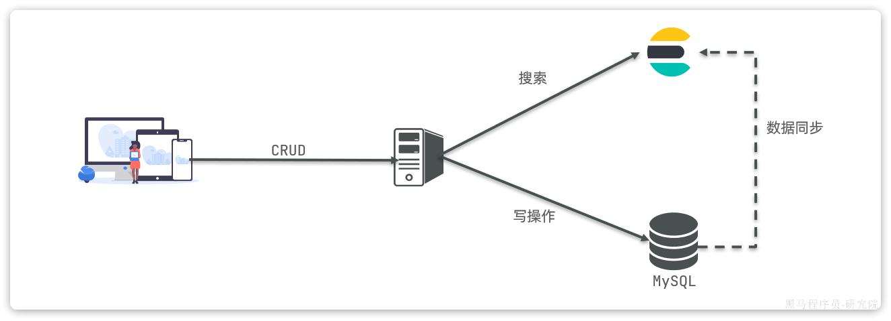

## 1\.4\.IK分词器

Elasticsearch的关键就是倒排索引，而倒排索引依赖于对文档内容的分词，而分词则需要高效、精准的分词算法，IK分词器就是这样一个中文分词算法。

### 1\.4\.1\.安装IK分词器

**方案一**：在线安装

运行一个命令即可：

```Shell
docker exec -it es ./bin/elasticsearch-plugin  install https://github.com/medcl/elasticsearch-analysis-ik/releases/download/v7.12.1/elasticsearch-analysis-ik-7.12.1.zip
```

然后重启es容器：

```Shell
docker restart es
```


**方案二**：离线安装

如果网速较差，也可以选择离线安装。

首先，查看之前安装的Elasticsearch容器的plugins数据卷目录：

```Shell
docker volume inspect es-plugins
```

结果如下：

```JSON
[
    {
        "CreatedAt": "2024-11-06T10:06:34+08:00",
        "Driver": "local",
        "Labels": null,
        "Mountpoint": "/var/lib/docker/volumes/es-plugins/_data",
        "Name": "es-plugins",
        "Options": null,
        "Scope": "local"
    }
]
```

可以看到elasticsearch的插件挂载到了`/var/lib/docker/volumes/es-plugins/_data`这个目录。我们需要把IK分词器上传至这个目录。


找到课前资料提供的ik分词器插件丢到es的插件目录就可以了，课前资料提供了`7.12.1`版本的ik分词器压缩文件，你需要对其解压：

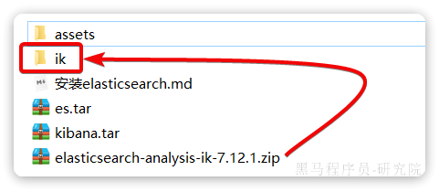

然后上传至虚拟机的`/var/lib/docker/volumes/es-plugins/_data`这个目录：

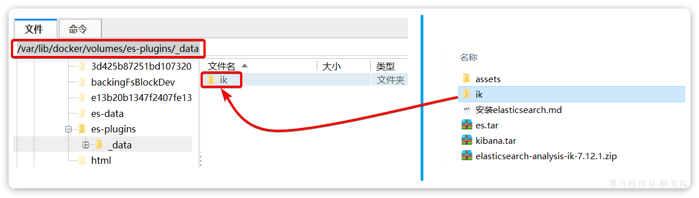

最后，重启es容器：

```Shell
docker restart es
```

### 1\.4\.2\.使用IK分词器

IK分词器包含两种模式：

- `ik_smart`：智能语义切分 

- `ik_max_word`：最细粒度切分 


我们在Kibana的DevTools上来测试分词器，首先测试Elasticsearch官方提供的标准分词器：


```JSON
POST /_analyze //_analyze表示做分析
{
  "analyzer": "standard",//分词器的选择
  "text": "黑马程序员学习java太棒了"//分词的内容
}
```

结果如下：

```JSON
{
  "tokens" : [
    {
      "token" : "黑",
      "start_offset" : 0,
      "end_offset" : 1,
      "type" : "<IDEOGRAPHIC>",
      "position" : 0
    },
    {
      "token" : "马",
      "start_offset" : 1,
      "end_offset" : 2,
      "type" : "<IDEOGRAPHIC>",
      "position" : 1
    },
    {
      "token" : "程",
      "start_offset" : 2,
      "end_offset" : 3,
      "type" : "<IDEOGRAPHIC>",
      "position" : 2
    },
    {
      "token" : "序",
      "start_offset" : 3,
      "end_offset" : 4,
      "type" : "<IDEOGRAPHIC>",
      "position" : 3
    },
    {
      "token" : "员",
      "start_offset" : 4,
      "end_offset" : 5,
      "type" : "<IDEOGRAPHIC>",
      "position" : 4
    },
    {
      "token" : "学",
      "start_offset" : 5,
      "end_offset" : 6,
      "type" : "<IDEOGRAPHIC>",
      "position" : 5
    },
    {
      "token" : "习",
      "start_offset" : 6,
      "end_offset" : 7,
      "type" : "<IDEOGRAPHIC>",
      "position" : 6
    },
    {
      "token" : "java",
      "start_offset" : 7,
      "end_offset" : 11,
      "type" : "<ALPHANUM>",
      "position" : 7
    },
    {
      "token" : "太",
      "start_offset" : 11,
      "end_offset" : 12,
      "type" : "<IDEOGRAPHIC>",
      "position" : 8
    },
    {
      "token" : "棒",
      "start_offset" : 12,
      "end_offset" : 13,
      "type" : "<IDEOGRAPHIC>",
      "position" : 9
    },
    {
      "token" : "了",
      "start_offset" : 13,
      "end_offset" : 14,
      "type" : "<IDEOGRAPHIC>",
      "position" : 10
    }
  ]
}

```


可以看到，标准分词器智能1字1词条，无法正确对中文做分词。

我们再测试IK分词器：

```JSON
POST /_analyze
{
  "analyzer": "ik_smart",
  "text": "黑马程序员学习java太棒了"
}
```

执行结果如下：

```JSON
{
  "tokens" : [
    {
      "token" : "黑马",
      "start_offset" : 0,
      "end_offset" : 2,
      "type" : "CN_WORD",
      "position" : 0
    },
    {
      "token" : "程序员",
      "start_offset" : 2,
      "end_offset" : 5,
      "type" : "CN_WORD",
      "position" : 1
    },
    {
      "token" : "学习",
      "start_offset" : 5,
      "end_offset" : 7,
      "type" : "CN_WORD",
      "position" : 2
    },
    {
      "token" : "java",
      "start_offset" : 7,
      "end_offset" : 11,
      "type" : "ENGLISH",
      "position" : 3
    },
    {
      "token" : "太棒了",
      "start_offset" : 11,
      "end_offset" : 14,
      "type" : "CN_WORD",
      "position" : 4
    }
  ]
}

```

### 1\.4\.3\.拓展词典

随着互联网的发展，“造词运动”也越发的频繁。出现了很多新的词语，在原有的词汇列表中并不存在。比如：“泰裤辣”，“传智播客” 等。

IK分词器无法对这些词汇分词，测试一下：

```JSON
POST /_analyze
{
  "analyzer": "ik_max_word",//分词器的选择
  "text": "传智播客开设大学,真的泰裤辣！" //分词的内容
}
```

结果：

```JSON
{
  "tokens" : [
    {
      "token" : "传",
      "start_offset" : 0,
      "end_offset" : 1,
      "type" : "CN_CHAR",
      "position" : 0
    },
    {
      "token" : "智",
      "start_offset" : 1,
      "end_offset" : 2,
      "type" : "CN_CHAR",
      "position" : 1
    },
    {
      "token" : "播",
      "start_offset" : 2,
      "end_offset" : 3,
      "type" : "CN_CHAR",
      "position" : 2
    },
    {
      "token" : "客",
      "start_offset" : 3,
      "end_offset" : 4,
      "type" : "CN_CHAR",
      "position" : 3
    },
    {
      "token" : "开设",
      "start_offset" : 4,
      "end_offset" : 6,
      "type" : "CN_WORD",
      "position" : 4
    },
    {
      "token" : "大学",
      "start_offset" : 6,
      "end_offset" : 8,
      "type" : "CN_WORD",
      "position" : 5
    },
    {
      "token" : "真的",
      "start_offset" : 9,
      "end_offset" : 11,
      "type" : "CN_WORD",
      "position" : 6
    },
    {
      "token" : "泰",
      "start_offset" : 11,
      "end_offset" : 12,
      "type" : "CN_CHAR",
      "position" : 7
    },
    {
      "token" : "裤",
      "start_offset" : 12,
      "end_offset" : 13,
      "type" : "CN_CHAR",
      "position" : 8
    },
    {
      "token" : "辣",
      "start_offset" : 13,
      "end_offset" : 14,
      "type" : "CN_CHAR",
      "position" : 9
    }
  ]
}

```

可以看到，`传智播客`和`泰裤辣`都无法正确分词。

所以要想正确分词，IK分词器的词库也需要不断的更新，IK分词器提供了扩展词汇的功能。

1）打开IK分词器config目录：

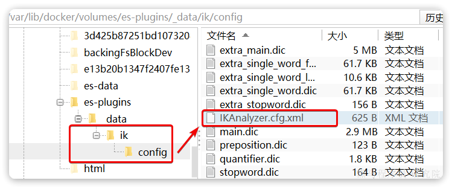

注意，如果采用在线安装的通过，默认是没有config目录的，需要把课前资料提供的ik下的config上传至对应目录。

2）在IKAnalyzer\.cfg\.xml配置文件内容添加：

```XML
<?xml version="1.0" encoding="UTF-8"?>
<!DOCTYPE properties SYSTEM "http://java.sun.com/dtd/properties.dtd">
<properties>
        <comment>IK Analyzer 扩展配置</comment>
        <!--用户可以在这里配置自己的扩展字典 *** 添加扩展词典-->
        <entry key="ext_dict">ext.dic</entry>
</properties>
```


3）在IK分词器的config目录新建一个 `ext.dic`，可以参考config目录下复制一个配置文件进行修改

```Plain Text
传智播客
泰裤辣
```


4）重启elasticsearch

```Shell
docker restart es

# 查看 日志
docker logs -f elasticsearch
```

再次测试，可以发现`传智播客`和`泰裤辣`都正确分词了：

```JSON
{
  "tokens" : [
    {
      "token" : "传智播客",
      "start_offset" : 0,
      "end_offset" : 4,
      "type" : "CN_WORD",
      "position" : 0
    },
    {
      "token" : "开设",
      "start_offset" : 4,
      "end_offset" : 6,
      "type" : "CN_WORD",
      "position" : 1
    },
    {
      "token" : "大学",
      "start_offset" : 6,
      "end_offset" : 8,
      "type" : "CN_WORD",
      "position" : 2
    },
    {
      "token" : "真的",
      "start_offset" : 9,
      "end_offset" : 11,
      "type" : "CN_WORD",
      "position" : 3
    },
    {
      "token" : "泰裤辣",
      "start_offset" : 11,
      "end_offset" : 14,
      "type" : "CN_WORD",
      "position" : 4
    }
  ]
}
```

### 1\.4\.4\.总结

分词器的作用是什么？

- 创建倒排索引时，对文档分词

- 用户搜索时，对输入的内容分词


IK分词器有几种模式？

- `ik_smart`：智能切分，粗粒度

- `ik_max_word`：最细切分，细粒度


IK分词器如何拓展词条？如何停用词条？

- 利用config目录的`IkAnalyzer.cfg.xml`文件添加拓展词典和停用词典

- 在词典中添加拓展词条或者停用词条

## 2\.索引库操作

Index就类似数据库表，Mapping映射就类似表的结构。我们要向es中存储数据，必须先创建Index和Mapping

## 2\.1\.Mapping映射属性

Mapping是对索引库中文档的约束，常见的Mapping属性包括：

- `type`：字段数据类型，常见的简单类型有： 

    - 字符串：`text`（可分词的文本）、`keyword`（精确值，例如：品牌、国家、ip地址）不分词

    - 数值：`long`、`integer`、`short`、`byte`、`double`、`float`、

    - 布尔：`boolean`

    - 日期：`date`

    - 对象：`object`

- `index`：是否创建索引，默认为`true` （需要搜索需要创建）

- `analyzer`：使用哪种分词器

- `properties`：该字段的子字段

ES中是数组不管数组只管数组里面的元素，排序的时候会挑选数组里面的值排序\-例如选最大就选数组里面最大的参与排序

例如下面的json文档：

```JSON
{
    "age": 21,
    "weight": 52.1,
    "isMarried": false,
    "info": "黑马程序员Java讲师",
    "email": "zy@itcast.cn",
    "score": [99.1, 99.5, 98.9],
    "name": {
        "firstName": "云",
        "lastName": "赵"
    }
}
```

对应的每个字段映射（Mapping）：

|**字段名**||**字段类型**|**类型说明**|**是否**<br>**参与搜索**|**是否**<br>**参与分词**|**分词器**|
|---|---|---|---|---|---|---|
|age||`integer`|整数|* [x] |* [ ] |——|
|weight||`float`|浮点数|* [x] |* [ ] |——|
|isMarried||`boolean`|布尔|* [x] |* [ ] |——|
|info||`text`|字符串，但需要分词|* [x] |* [x] |IK|
|email||`keyword`|字符串，但是不分词|* [ ] |* [ ] |——|
|score||`float`|只看数组中元素类型|* [x] |* [ ] |——|
|name|firstName|`keyword`|字符串，但是不分词|* [x] |* [ ] |——|
||lastName|`keyword`|字符串，但是不分词|* [x] |* [ ] |——|

## 2\.2\.索引库的CRUD

由于Elasticsearch采用的是Restful风格的API，因此其请求方式和路径相对都比较规范，而且请求参数也都采用JSON风格。


我们直接基于Kibana的DevTools来编写请求做测试，由于有语法提示，会非常方便。

### 2\.2\.1\.创建索引库和映射

**基本语法**：

- 请求方式：`PUT` 无所谓为什么不用GET

- 请求路径：`/索引库名`，可以自定义 

- 请求参数：`mapping`映射

**格式**：

```Java
PUT /索引库名称
{
  "mappings": {
    "properties": {
      "字段名":{
        "type": "text",
        "analyzer": "ik_smart"
      },
      "字段名2":{
        "type": "keyword",
        "index": "false"
      },
      "字段名3":{
        "properties": {
          "子字段": {
            "type": "keyword"
          }
        }
      },
      // ...略
    }
  }
}
```

**示例**：

```JSON
# PUT /heima
{
  "mappings": {
    "properties": {
      "info":{
        "type": "text",
        "analyzer": "ik_smart"
      },
      "email":{
        "type": "keyword",
        "index": "false"
      },
      "name":{
        "properties": {
          "firstName": {
            "type": "keyword"
          }
        }
      }
    }
  }
}
```


### 2\.2\.2\.查询索引库

**基本语法**：

- 请求方式：GET 

- 请求路径：/索引库名 

- 请求参数：无 

**格式**：

```Plain Text
GET /索引库名
```

**示例**：

```Plain Text
GET /heima
```


### 2\.2\.3\.修改索引库

倒排索引结构虽然不复杂，但是一旦数据结构改变（比如改变了分词器），就需要重新创建倒排索引，这简直是灾难。因此索引库**一旦创建，无法修改mapping**。


虽然无法修改mapping中已有的字段，但是却允许添加新的字段到mapping中，因为不会对倒排索引产生影响。因此修改索引库能做的就是向索引库中添加新字段，或者更新索引库的基础属性。

**语法说明**：

```JSON
PUT /索引库名/_mapping
{
  "properties": {
    "新字段名":{
      "type": "integer"
    }
  }
}
```


**示例**：

```JSON
PUT /heima/_mapping
{
  "properties": {
    "age":{
      "type": "integer"
    }
  }
}
```


### 2\.2\.4\.删除索引库

**语法：**

- 请求方式：DELETE 

- 请求路径：/索引库名 

- 请求参数：无 


**格式：**

```Plain Text
DELETE /索引库名
```


示例：

```Plain Text
DELETE /heima
```


### 2\.2\.5\.总结

索引库操作有哪些？

- 创建索引库：PUT /索引库名

- 查询索引库：GET /索引库名

- 删除索引库：DELETE /索引库名

- 修改索引库，添加字段：PUT /索引库名/\_mapping


可以看到，对索引库的操作基本遵循的Restful的风格，因此API接口非常统一，方便记忆。

## 3\.文档操作

有了索引库，接下来就可以向索引库中添加数据了。

Elasticsearch中的数据其实就是JSON风格的文档。操作文档自然保护`增`、`删`、`改`、`查`等几种常见操作，我们分别来学习。

## 3\.1\.新增文档

**语法：**

```JSON
POST /索引库名/_doc/文档id
{
    "字段1": "值1",
    "字段2": "值2",
    "字段3": {
        "子属性1": "值3",
        "子属性2": "值4"
    },
}
```


**示例：**

```JSON
POST /heima/_doc/1
{
    "info": "黑马程序员Java讲师",
    "email": "zy@itcast.cn",
    "name": {
        "firstName": "云",
        "lastName": "赵"
    }
}
```

**响应：**

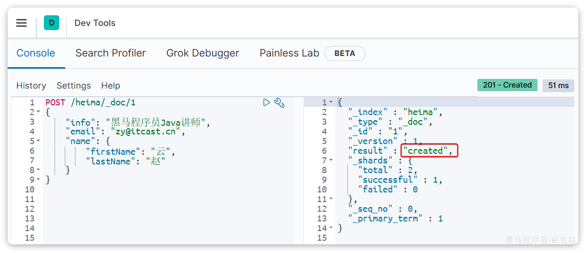

## 3\.2\.查询文档

根据rest风格，新增是post，查询应该是get，不过查询一般都需要条件，这里我们把文档id带上。

**语法：**

```JSON
GET /{索引库名称}/_doc/{id}
```


**示例：**

```JavaScript
GET /heima/_doc/1
```


**查看结果：**

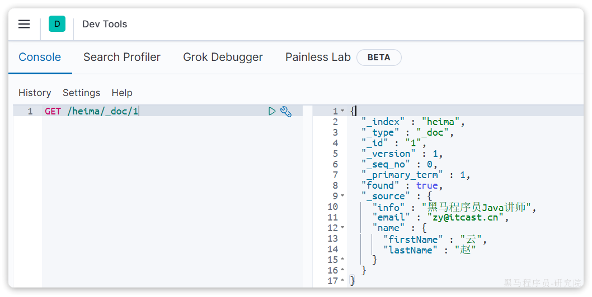

## 3\.3\.删除文档

删除使用DELETE请求，同样，需要根据id进行删除：

**语法：**

```JavaScript
DELETE /{索引库名}/_doc/id值
```

**示例：**

```JSON
DELETE /heima/_doc/1
```


**结果：**

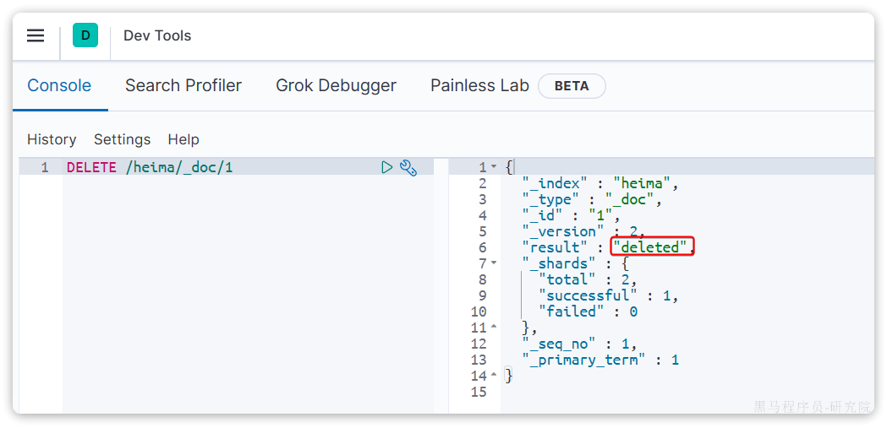

## 3\.4\.修改文档

修改有两种方式：

- 全量修改：直接覆盖原来的文档

- 局部修改：修改文档中的部分字段

### 3\.4\.1\.全量修改

全量修改是覆盖原来的文档，其本质是两步操作：

- 根据指定的id删除文档

- 新增一个相同id的文档

**注意**：如果根据id删除时，id不存在，第二步的新增也会执行，也就从修改变成了新增操作了。

**语法：**

```JSON
PUT /{索引库名}/_doc/文档id
{
    "字段1": "值1",
    "字段2": "值2",
    // ... 略
}
```

**示例：**

```JSON
PUT /heima/_doc/1
{
    "info": "黑马程序员高级Java讲师",
    "email": "zy@itcast.cn",
    "name": {
        "firstName": "云",
        "lastName": "赵"
    }
}
```

由于`id`为`1`的文档已经被删除，所以第一次执行时，得到的反馈是`created`：


所以如果执行第2次时，得到的反馈则是`updated`：

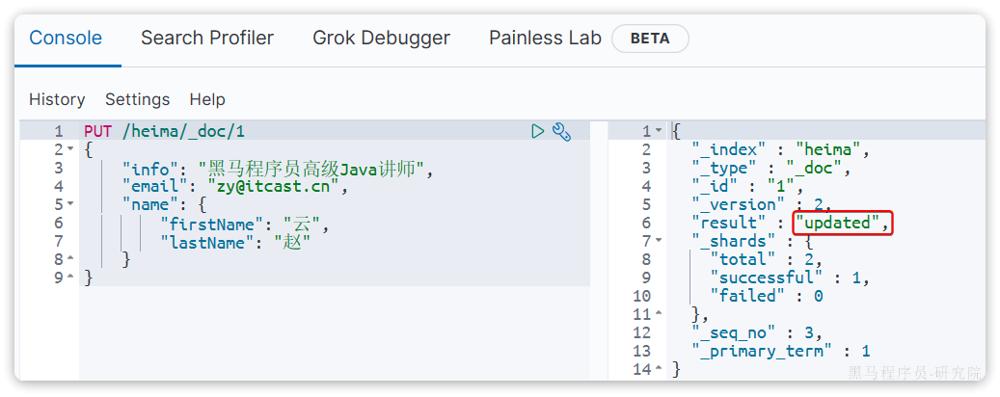


### 3\.4\.2\.局部修改

局部修改是只修改指定id匹配的文档中的部分字段。

**语法：**

```JSON
POST /{索引库名}/_update/文档id
{
    "doc": {
         "字段名": "新的值",
    }
}
```


**示例：**

```JSON
POST /heima/_update/1
{
  "doc": {
    "email": "ZhaoYun@itcast.cn"
  }
}
```


**执行结果**：

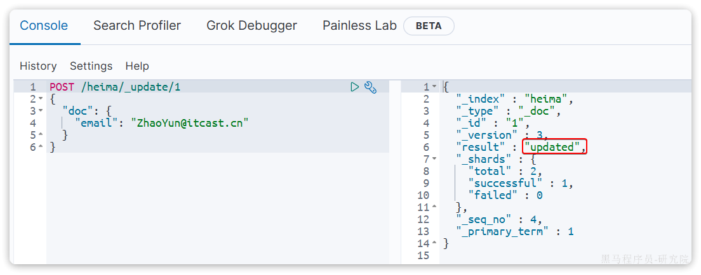


## 3\.5\.批处理

批处理采用POST请求，基本语法如下：

```Java
POST/_bulk
{ "index" : { "_index" : "test", "_id" : "1" } }
{ "field1" : "value1" }
{ "delete" : { "_index" : "test", "_id" : "2" } }
{ "create" : { "_index" : "test", "_id" : "3" } }
{ "field1" : "value3" }
{ "update" : {"_id" : "1", "_index" : "test"} }
{ "doc" : {"field2" : "value2"} }
```

其中：

- `index`代表新增操作

    - `_index`：指定索引库名

    - `_id`指定要操作的文档id

    - `{ "field1" : "value1" }`：则是要新增的文档内容

- `delete`代表删除操作

    - `_index`：指定索引库名

    - `_id`指定要操作的文档id

- `update`代表更新操作

    - `_index`：指定索引库名

    - `_id`指定要操作的文档id

    - `{ "doc" : {"field2" : "value2"} }`：要更新的文档字段


示例，批量新增：

```Java
POST /_bulk
{"index": {"_index":"heima", "_id": "3"}}
{"info": "黑马程序员C++讲师", "email": "ww@itcast.cn", "name":{"firstName": "五", "lastName":"王"}}
{"index": {"_index":"heima", "_id": "4"}}
{"info": "黑马程序员前端讲师", "email": "zhangsan@itcast.cn", "name":{"firstName": "三", "lastName":"张"}}

两两一组
```


批量删除：

```Java
POST /_bulk
{"delete":{"_index":"heima", "_id": "3"}}
{"delete":{"_index":"heima", "_id": "4"}}
```

## 3\.6\.总结

文档操作有哪些？

- 创建文档：`POST /{索引库名}/_doc/文档id   { json文档 }`

- 查询文档：`GET /{索引库名}/_doc/文档id`

- 删除文档：`DELETE /{索引库名}/_doc/文档id`

- 修改文档： 

    - 全量修改：`PUT /{索引库名}/_doc/文档id { json文档 }`

    - 局部修改：`POST /{索引库名}/_update/文档id { "doc": {字段}}`


## 4\.RestAPI

ES官方提供了各种不同语言的客户端，用来操作ES。这些客户端的本质就是组装DSL语句，通过http请求发送给ES。

官方文档地址：

[https://www\.elastic\.co/guide/en/elasticsearch/client/index\.html](https://www.elastic.co/guide/en/elasticsearch/client/index.html)

由于ES目前最新版本是8\.8，提供了全新版本的客户端，老版本的客户端已经被标记为过时。而我们采用的是7\.12版本，因此只能使用老版本客户端：

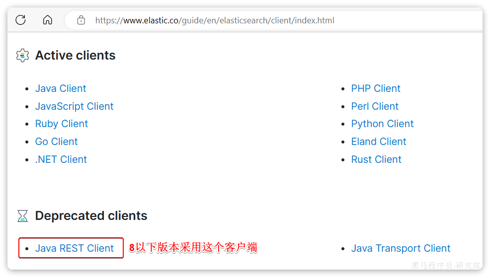

然后选择7\.12版本，HighLevelRestClient版本：

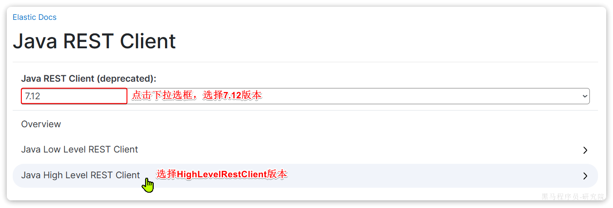

## 4\.1\.初始化RestClient

在elasticsearch提供的API中，与elasticsearch一切交互都封装在一个名为`RestHighLevelClient`的类中，必须先完成这个对象的初始化，建立与elasticsearch的连接。

分为三步：

1）在`item-service`模块中引入`es`的`RestHighLevelClient`依赖：

```XML
<dependency>
    <groupId>org.elasticsearch.client</groupId>
    <artifactId>elasticsearch-rest-high-level-client</artifactId>
</dependency>
```

2）因为SpringBoot默认的ES版本是`7.17.10`，所以我们需要覆盖默认的ES版本：

```XML
<properties>
      <maven.compiler.source>11</maven.compiler.source>
      <maven.compiler.target>11</maven.compiler.target>
      <elasticsearch.version>7.12.1</elasticsearch.version>
  </properties>
```

3）初始化RestHighLevelClient：

初始化的代码如下：

```Java
RestHighLevelClient client = new RestHighLevelClient(RestClient.builder(
        HttpHost.create("http://192.168.150.101:9200")
));
```

这里为了单元测试方便，我们创建一个测试类`IndexTest`，然后将初始化的代码编写在`@BeforeEach`方法中：

```Java
public class IndexTest {

    private RestHighLevelClient client;

    @BeforeEach
    void setUp() {
        this.client = new RestHighLevelClient(RestClient.builder(
                HttpHost.create("http://192.168.150.101:9200")
        ));
    }
   @AfterEach
    void tearDown() throws IOException {
        this.client.close();
    }
    @Test
    void testConnect() {
        System.out.println(client);
    }

   
}
```

## 4\.1\.创建索引库

由于要实现对商品搜索，所以我们需要将商品添加到Elasticsearch中，不过需要根据搜索业务的需求来设定索引库结构，而不是一股脑的把MySQL数据写入Elasticsearch\.

### 4\.1\.1\.Mapping映射

搜索页面的效果如图所示：


实现搜索功能需要的字段包括三大部分：

- 搜索过滤字段

    - 分类

    - 品牌

    - 价格

- 排序字段

    - 默认：按照更新时间降序排序

    - 销量

    - 价格

- 展示字段

    - 商品id：用于点击后跳转

    - 图片地址

    - 是否是广告推广商品

    - 名称

    - 价格

    - 评价数量

    - 销量

对应的商品表结构如下，索引库无关字段已经划掉：

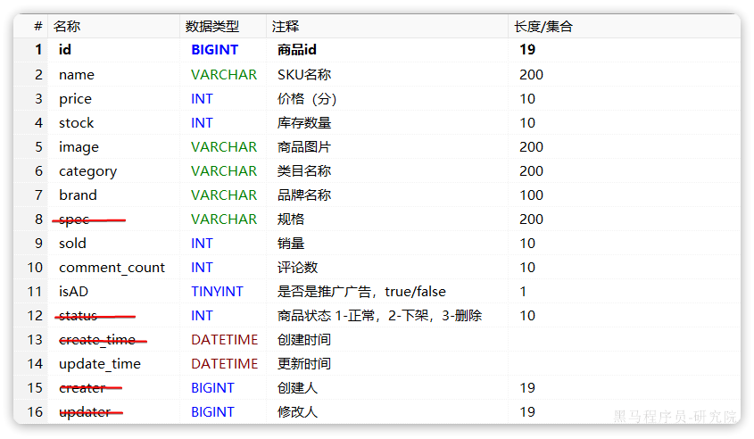

结合数据库表结构，以上字段对应的mapping映射属性如下：

|**字段名**||**字段类型**|**类型说明**|**是否**<br>**参与搜索**|**是否**<br>**参与分词**|**分词器**|
|---|---|---|---|---|---|---|
|id||`long`|长整数|* [x] |* [ ] |——|
|name||`text`|字符串，参与分词搜索|* [x] |* [x] |IK|
|price||`integer`|以分为单位，所以是整数|* [x] |* [ ] |——|
|stock||`integer`|字符串，但需要分词|* [x] |* [ ] |——|
|image||`keyword`|字符串，但是不分词|* [ ] |* [ ] |——|
|category||`keyword`|字符串，但是不分词|* [x] |* [ ] |——|
|brand||`keyword`|字符串，但是不分词|* [x] |* [ ] |——|
|sold||`integer`|销量，整数|* [x] |* [ ] |——|
|commentCount||`integer`|评价，整数|* [ ] |* [ ] |——|
|isAD||`boolean`|布尔类型|* [x] |* [ ] |——|
|updateTime||`Date`|更新时间|* [x] |* [ ] |——|

因此，最终我们的索引库文档结构应该是这样：

```JSON
PUT /items
{
  "mappings": {
    "properties": {
      "id": {
        "type": "keyword"
      },
      "name":{
        "type": "text",
        "analyzer": "ik_max_word"
      },
      "price":{
        "type": "integer"
      },
      "stock":{
        "type": "integer"
      },
      "image":{
        "type": "keyword",
        "index": false
      },
      "category":{
        "type": "keyword"
      },
      "brand":{
        "type": "keyword"
      },
      "sold":{
        "type": "integer"
      },
      "commentCount":{
        "type": "integer",
        "index": false
      },
      "isAD":{
        "type": "boolean"
      },
      "updateTime":{
        "type": "date"
      }
    }
  }
}
```


### 4\.1\.2\.创建索引

创建索引库的API如下：


代码分为三步：

- 1）创建Request对象。

    - 因为是创建索引库的操作，因此Request是`CreateIndexRequest`。

- 2）添加请求参数

    - 其实就是Json格式的Mapping映射参数。因为json字符串很长，这里是定义了静态字符串常量`MAPPING_TEMPLATE`，让代码看起来更加优雅。

- 3）发送请求

    - `client.indices()`方法的返回值是`IndicesClient`类型，封装了所有与索引库操作有关的方法。例如创建索引、删除索引、判断索引是否存在等

在`item-service`中的`IndexTest`测试类中，具体代码如下：

```Java
@Test
void testCreateIndex() throws IOException {
    // 1.创建Request对象
    CreateIndexRequest request = new CreateIndexRequest("items");
    // 2.准备请求参数
    request.source(MAPPING_TEMPLATE, XContentType.JSON);
    // 3.发送请求
    client.indices().create(request, RequestOptions.DEFAULT);
}

static final String MAPPING_TEMPLATE = "{\n" +
            "  \"mappings\": {\n" +
            "    \"properties\": {\n" +
            "      \"id\": {\n" +
            "        \"type\": \"keyword\"\n" +
            "      },\n" +
            "      \"name\":{\n" +
            "        \"type\": \"text\",\n" +
            "        \"analyzer\": \"ik_max_word\"\n" +
            "      },\n" +
            "      \"price\":{\n" +
            "        \"type\": \"integer\"\n" +
            "      },\n" +
            "      \"stock\":{\n" +
            "        \"type\": \"integer\"\n" +
            "      },\n" +
            "      \"image\":{\n" +
            "        \"type\": \"keyword\",\n" +
            "        \"index\": false\n" +
            "      },\n" +
            "      \"category\":{\n" +
            "        \"type\": \"keyword\"\n" +
            "      },\n" +
            "      \"brand\":{\n" +
            "        \"type\": \"keyword\"\n" +
            "      },\n" +
            "      \"sold\":{\n" +
            "        \"type\": \"integer\"\n" +
            "      },\n" +
            "      \"commentCount\":{\n" +
            "        \"type\": \"integer\"\n" +
            "      },\n" +
            "      \"isAD\":{\n" +
            "        \"type\": \"boolean\"\n" +
            "      },\n" +
            "      \"updateTime\":{\n" +
            "        \"type\": \"date\"\n" +
            "      }\n" +
            "    }\n" +
            "  }\n" +
            "}";
```

## 4\.2\.删除索引库

删除索引库的请求非常简单：

```JSON
DELETE /hotel
```

与创建索引库相比：

- 请求方式从PUT变为DELTE

- 请求路径不变

- 无请求参数

所以代码的差异，注意体现在Request对象上。流程如下：

- 1）创建Request对象。这次是DeleteIndexRequest对象

- 2）准备参数。这里是无参，因此省略

- 3）发送请求。改用delete方法


在`item-service`中的`IndexTest`测试类中，编写单元测试，实现删除索引：

```Java
@Test
void testDeleteIndex() throws IOException {
    // 1.创建Request对象
    DeleteIndexRequest request = new DeleteIndexRequest("items");
    // 2.发送请求
    client.indices().delete(request, RequestOptions.DEFAULT);
}
```


## 4\.3\.判断索引库是否存在

判断索引库是否存在，本质就是查询，对应的请求语句是：

```JSON
GET /hotel
```


因此与删除的Java代码流程是类似的，流程如下：

- 1）创建Request对象。这次是GetIndexRequest对象

- 2）准备参数。这里是无参，直接省略

- 3）发送请求。改用exists方法

```Java
@Test
void testExistsIndex() throws IOException {
    // 1.创建Request对象
    GetIndexRequest request = new GetIndexRequest("items");
    // 2.发送请求
    boolean exists = client.indices().exists(request, RequestOptions.DEFAULT);
    // 3.输出
    System.err.println(exists ? "索引库已经存在！" : "索引库不存在！");
}
```

## 4\.4\.总结

JavaRestClient操作elasticsearch的流程基本类似。核心是`client.indices()`方法来获取索引库的操作对象。

索引库操作的基本步骤：

- 初始化`RestHighLevelClient`

- 创建XxxIndexRequest。XXX是`Create`、`Get`、`Delete`

- 准备请求参数（ `Create`时需要，其它是无参，可以省略）

- 发送请求。调用`RestHighLevelClient#indices().xxx()`方法，xxx是`create`、`exists`、`delete`


## 5\.RestClient操作文档

索引库准备好以后，就可以操作文档了。为了与索引库操作分离，我们再次创建一个测试类，做两件事情：

- 初始化RestHighLevelClient

- 我们的商品数据在数据库，需要利用IHotelService去查询，所以注入这个接口

```Java
@SpringBootTest(properties = "spring.profiles.active=local")
public class DocumentTest {

    private RestHighLevelClient client;
    @Autowired
    private IItemService itemService;

    @BeforeEach
    void setUp() {
        this.client = new RestHighLevelClient(RestClient.builder(
                HttpHost.create("http://192.168.150.101:9200")
        ));
    }
    
    @AfterEach
    void tearDown() throws IOException {
        this.client.close();
    }
}
```

## 5\.1\.新增文档

我们需要将数据库中的商品信息导入elasticsearch中，而不是造假数据了。

### 5\.1\.1\.实体类

索引库结构与数据库结构还存在一些差异，因此我们要定义一个索引库结构对应的实体。

在`hm-service`模块的`com.hmall.item.domain.dto`包中定义一个新的DTO：

```Java
package com.hmall.item.domain.po;

import io.swagger.annotations.ApiModel;
import io.swagger.annotations.ApiModelProperty;
import lombok.Data;

import java.time.LocalDateTime;

@Data
@ApiModel(description = "索引库实体")
public class ItemDoc{

    @ApiModelProperty("商品id")
    private String id;

    @ApiModelProperty("商品名称")
    private String name;

    @ApiModelProperty("价格（分）")
    private Integer price;

    @ApiModelProperty("商品图片")
    private String image;

    @ApiModelProperty("类目名称")
    private String category;

    @ApiModelProperty("品牌名称")
    private String brand;

    @ApiModelProperty("销量")
    private Integer sold;

    @ApiModelProperty("评论数")
    private Integer commentCount;

    @ApiModelProperty("是否是推广广告，true/false")
    private Boolean isAD;

    @ApiModelProperty("更新时间")
    private LocalDateTime updateTime;
}
```


### 5\.1\.2\.API语法

新增文档的请求语法如下：

```JSON
POST /{索引库名}/_doc/1
{
    "name": "Jack",
    "age": 21
}
```

对应的JavaAPI如下：

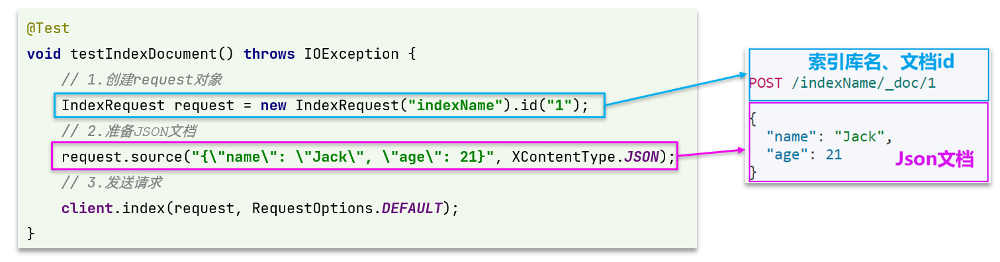

可以看到与索引库操作的API非常类似，同样是三步走：

- 1）创建Request对象，这里是`IndexRequest`，因为添加文档就是创建倒排索引的过程

- 2）准备请求参数，本例中就是Json文档

- 3）发送请求


变化的地方在于，这里直接使用`client.xxx()`的API，不再需要`client.indices()`了。


### 5\.1\.3\.完整代码

我们导入商品数据，除了参考API模板“三步走”以外，还需要做几点准备工作：

- 商品数据来自于数据库，我们需要先查询出来，得到`Item`对象

- `Item`对象需要转为`ItemDoc`对象

- `ItemDTO`需要序列化为`json`格式


因此，代码整体步骤如下：

- 1）根据id查询商品数据`Item`

- 2）将`Item`封装为`ItemDoc`

- 3）将`ItemDoc`序列化为JSON

- 4）创建IndexRequest，指定索引库名和id

- 5）准备请求参数，也就是JSON文档

- 6）发送请求


在`item-service`的`DocumentTest`测试类中，编写单元测试：

```Java
@Test
void testAddDocument() throws IOException {
    // 1.根据id查询商品数据
    Item item = itemService.getById(100002644680L);
    // 2.转换为文档类型
    ItemDoc itemDoc = BeanUtil.copyProperties(item, ItemDoc.class);
    // 3.将ItemDTO转json
    String doc = JSONUtil.toJsonStr(itemDoc);

    // 1.准备Request对象
    IndexRequest request = new IndexRequest("items").id(itemDoc.getId());
    // 2.准备Json文档
    request.source(doc, XContentType.JSON);
    // 3.发送请求
    client.index(request, RequestOptions.DEFAULT);
}
```


## 5\.2\.查询文档

我们以根据id查询文档为例

### 5\.2\.1\.语法说明

查询的请求语句如下：

```JSON
GET /{索引库名}/_doc/{id}
```


与之前的流程类似，代码大概分2步：

- 创建Request对象

- ~~准备请求参数，这里是无参，直接省略~~

- 发送请求


不过查询的目的是得到结果，解析为ItemDTO，还要再加一步对结果的解析。示例代码如下：

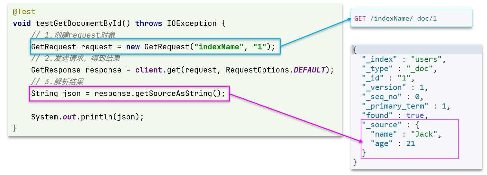

可以看到，响应结果是一个JSON，其中文档放在一个`_source`属性中，因此解析就是拿到`_source`，反序列化为Java对象即可。


其它代码与之前类似，流程如下：

- 1）准备Request对象。这次是查询，所以是`GetRequest`

- 2）发送请求，得到结果。因为是查询，这里调用`client.get()`方法

- 3）解析结果，就是对JSON做反序列化


### 5\.2\.2\.完整代码

在`item-service`的`DocumentTest`测试类中，编写单元测试：

```Java
@Test
void testGetDocumentById() throws IOException {
    // 1.准备Request对象
    GetRequest request = new GetRequest("items").id("100002644680");
    // 2.发送请求
    GetResponse response = client.get(request, RequestOptions.DEFAULT);
    // 3.获取响应结果中的source
    String json = response.getSourceAsString();
    
    ItemDoc itemDoc = JSONUtil.toBean(json, ItemDoc.class);
    System.out.println("itemDoc= " + ItemDoc);
}
```


## 5\.3\.删除文档

删除的请求语句如下：

```JSON
DELETE /hotel/_doc/{id}
```


与查询相比，仅仅是请求方式从`DELETE`变成`GET`，可以想象Java代码应该依然是2步走：

- 1）准备Request对象，因为是删除，这次是`DeleteRequest`对象。要指定索引库名和id

- 2）~~准备参数，无参，直接省略~~

- 3）发送请求。因为是删除，所以是`client.delete()`方法


在`item-service`的`DocumentTest`测试类中，编写单元测试：

```Java
@Test
void testDeleteDocument() throws IOException {
    // 1.准备Request，两个参数，第一个是索引库名，第二个是文档id
    DeleteRequest request = new DeleteRequest("item", "100002644680");
    // 2.发送请求
    client.delete(request, RequestOptions.DEFAULT);
}
```


## 5\.4\.修改文档

修改我们讲过两种方式：

- 全量修改：本质是先根据id删除，再新增

- 局部修改：修改文档中的指定字段值


在RestClient的API中，全量修改与新增的API完全一致，判断依据是ID：

- 如果新增时，ID已经存在，则修改

- 如果新增时，ID不存在，则新增


这里不再赘述，我们主要关注局部修改的API即可。

### 5\.4\.1\.语法说明

局部修改的请求语法如下：

```JSON
POST /{索引库名}/_update/{id}
{
  "doc": {
    "字段名": "字段值",
    "字段名": "字段值"
  }
}
```

代码示例如图：

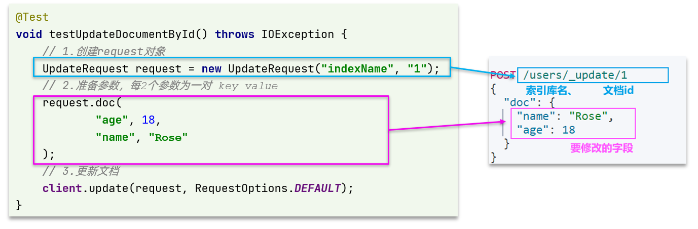

与之前类似，也是三步走：

- 1）准备`Request`对象。这次是修改，所以是`UpdateRequest`

- 2）准备参数。也就是JSON文档，里面包含要修改的字段

- 3）更新文档。这里调用`client.update()`方法


### 5\.4\.2\.完整代码

在`item-service`的`DocumentTest`测试类中，编写单元测试：

```Java
@Test
void testUpdateDocument() throws IOException {
    // 1.准备Request
    UpdateRequest request = new UpdateRequest("items", "100002644680");
    // 2.准备请求参数
    request.doc(
            "price", 58800,
            "commentCount", 1
    );
    // 3.发送请求
    client.update(request, RequestOptions.DEFAULT);
}
```


## 5\.5\.批量导入文档

在之前的案例中，我们都是操作单个文档。而数据库中的商品数据实际会达到数十万条，某些项目中可能达到数百万条。

我们如果要将这些数据导入索引库，肯定不能逐条导入，而是采用批处理方案。常见的方案有：

- 利用Logstash批量导入

    - 需要安装Logstash

    - 对数据的再加工能力较弱

    - 无需编码，但要学习编写Logstash导入配置

- 利用JavaAPI批量导入

    - 需要编码，但基于JavaAPI，学习成本低

    - 更加灵活，可以任意对数据做再加工处理后写入索引库


接下来，我们就学习下如何利用JavaAPI实现批量文档导入。

### 5\.5\.1\.语法说明

批处理与前面讲的文档的CRUD步骤基本一致：

- 创建Request，但这次用的是`BulkRequest`

- 准备请求参数

- 发送请求，这次要用到`client.bulk()`方法


`BulkRequest`本身其实并没有请求参数，其本质就是将多个普通的CRUD请求组合在一起发送。例如：

- 批量新增文档，就是给每个文档创建一个`IndexRequest`请求，然后封装到`BulkRequest`中，一起发出。

- 批量删除，就是创建N个`DeleteRequest`请求，然后封装到`BulkRequest`，一起发出


因此`BulkRequest`中提供了`add`方法，用以添加其它CRUD的请求：

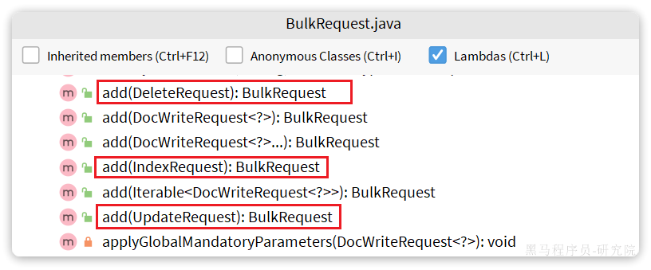

可以看到，能添加的请求有：

- `IndexRequest`，也就是新增

- `UpdateRequest`，也就是修改

- `DeleteRequest`，也就是删除


因此Bulk中添加了多个`IndexRequest`，就是批量新增功能了。示例：

```Java
@Test
void testBulk() throws IOException {
    // 1.创建Request
    BulkRequest request = new BulkRequest();
    // 2.准备请求参数
    request.add(new IndexRequest("items").id("1").source("json doc1", XContentType.JSON));
    request.add(new IndexRequest("items").id("2").source("json doc2", XContentType.JSON));
    // 3.发送请求
    client.bulk(request, RequestOptions.DEFAULT);
}
```

### 5\.5\.2\.完整代码

当我们要导入商品数据时，由于商品数量达到数十万，因此不可能一次性全部导入。建议采用循环遍历方式，每次导入1000条左右的数据。

`item-service`的`DocumentTest`测试类中，编写单元测试：

```Java
@Test
void testLoadItemDocs() throws IOException {
    // 分页查询商品数据
    int pageNo = 1;
    int size = 1000;
    while (true) {
        Page<Item> page = itemService.lambdaQuery().eq(Item::getStatus, 1).page(new Page<Item>(pageNo, size));
        // 非空校验
        List<Item> items = page.getRecords();
        if (CollUtils.isEmpty(items)) {
            return;
        }
        log.info("加载第{}页数据，共{}条", pageNo, items.size());
        // 1.创建Request
        BulkRequest request = new BulkRequest("items");
        // 2.准备参数，添加多个新增的Request
        for (Item item : items) {
            // 2.1.转换为文档类型ItemDTO
            ItemDoc itemDoc = BeanUtil.copyProperties(item, ItemDoc.class);
            // 2.2.创建新增文档的Request对象
            request.add(new IndexRequest()
                            .id(itemDoc.getId())
                            .source(JSONUtil.toJsonStr(itemDoc), XContentType.JSON));
        }
        // 3.发送请求
        client.bulk(request, RequestOptions.DEFAULT);

        // 翻页
        pageNo++;
    }
}
```

## 5\.6\.小结

文档操作的基本步骤：

- 初始化`RestHighLevelClient`

- 创建XxxRequest。

    - XXX是`Index`、`Get`、`Update`、`Delete`、`Bulk`

- 准备参数（`Index`、`Update`、`Bulk`时需要）

- 发送请求。

    - 调用`RestHighLevelClient#.xxx()`方法，xxx是`index`、`get`、`update`、`delete`、`bulk`

- 解析结果（`Get`时需要）

## 1\.DSL查询

Elasticsearch的查询可以分为两大类：

- **叶子查询（Leaf query clauses）**：一般是在特定的字段里查询特定值，属于简单查询，很少单独使用。

- **复合查询（Compound query clauses）**：以逻辑方式组合多个叶子查询或者更改叶子查询的行为方式。

## 1\.1\.快速入门

我们依然在Kibana的DevTools中学习查询的DSL语法。首先来看查询的语法结构：

```JSON
GET /{索引库名}/_search
{
  "query": {
    "查询类型": {
      "查询条件"：“条件值”
    }
  }
}
```

说明：

- `GET /{索引库名}/_search`：其中的`_search`是固定路径，不能修改


例如，我们以最简单的无条件查询为例，无条件查询的类型是：match\_all，因此其查询语句如下：

```JSON
GET /items/_search
{
  "query": {
    "match_all": {
      
    }
  }
}
```

由于match\_all无条件，所以条件位置不写即可。

执行结果如下：

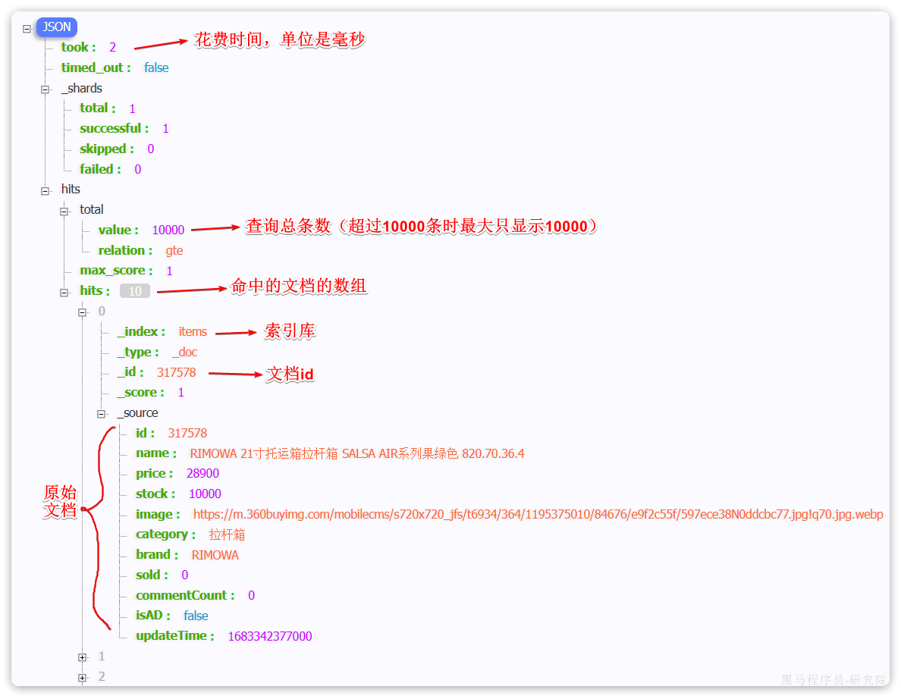

你会发现虽然是match\_all，但是响应结果中并不会包含索引库中的所有文档，而是仅有10条。这是因为处于安全考虑，elasticsearch设置了默认的查询页数。

## 1\.2\.叶子查询

叶子查询的类型也可以做进一步细分，详情大家可以查看官方文档：

[https://www.elastic.co/guide/en/elasticsearch/reference/7.12/query-dsl.html]()

如图：

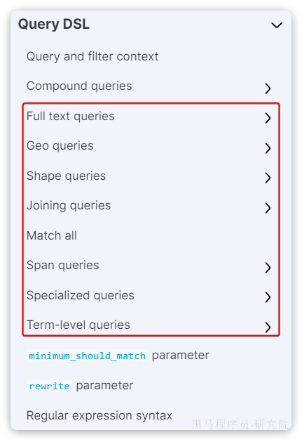


这里列举一些常见的，例如：

- **全文检索查询（Full Text Queries）**：利用分词器对用户输入搜索条件先分词，得到词条，然后再利用倒排索引搜索词条。例如：

    - `match`：

    - `multi_match`

- **精确查询（Term\-level queries）**：不对用户输入搜索条件分词，根据字段内容精确值匹配。但只能查找keyword、数值、日期、boolean类型的字段。例如：

    - `ids`

    - `term` 

    - `range`

- **地理坐标查询：**用于搜索地理位置，搜索方式很多，例如：

    - `geo_bounding_box`：按矩形搜索

    - `geo_distance`：按点和半径搜索

- \.\.\.略


### 1\.2\.1\.全文检索查询

全文检索的种类也很多，详情可以参考官方文档：

[https://www.elastic.co/guide/en/elasticsearch/reference/7.12/full-text-queries.html]()


以全文检索中的`match`为例，语法如下：

```JSON
GET /{索引库名}/_search
{
  "query": {
    "match": {
      "字段名": "搜索条件"
    }
  }
}
```

示例：


与`match`类似的还有`multi_match`，区别在于可以同时对多个字段搜索，而且多个字段都要满足，语法示例：

```JSON
GET /{索引库名}/_search
{
  "query": {
    "multi_match": {
      "query": "搜索条件",
      "fields": ["字段1", "字段2"]
    }
  }
}
```

示例：

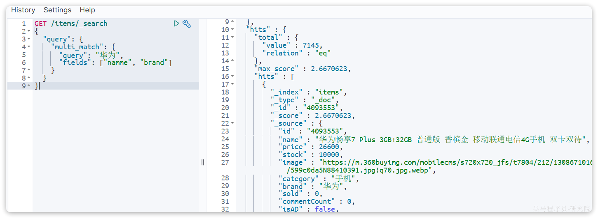

### 1\.2\.2\.精确查询

精确查询，英文是`Term-level query`，顾名思义，词条级别的查询。也就是说不会对用户输入的搜索条件再分词，而是作为一个词条，与搜索的字段内容精确值匹配。因此推荐查找`keyword`、数值、日期、`boolean`类型的字段。例如：

- id

- price

- 城市

- 地名

- 人名

等等，作为一个整体才有含义的字段。

详情可以查看官方文档：

[https://www.elastic.co/guide/en/elasticsearch/reference/7.12/term-level-queries.html]()


以`term`查询为例，其语法如下：

```JSON
GET /{索引库名}/_search
{
  "query": {
    "term": {
      "字段名": {
        "value": "搜索条件"
      }
    }
  }
}
```

示例：

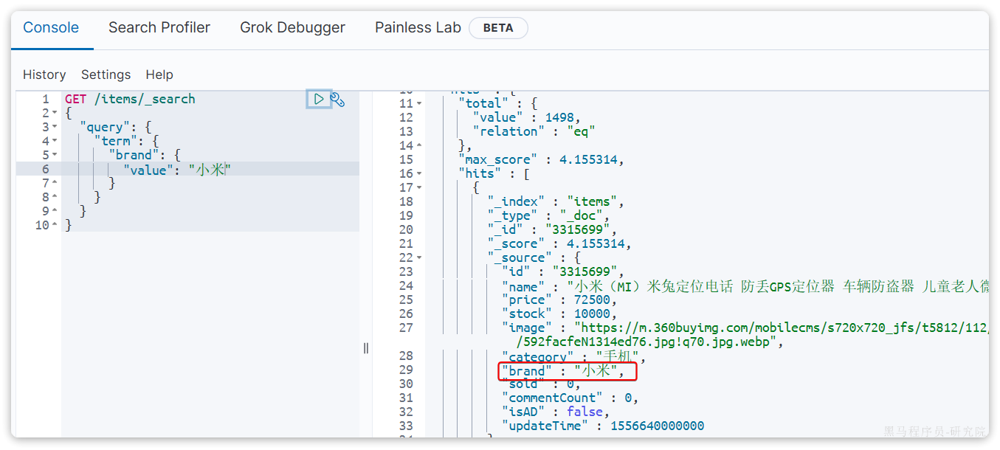

当你输入的搜索条件不是词条，而是短语时，由于不做分词，你反而搜索不到：

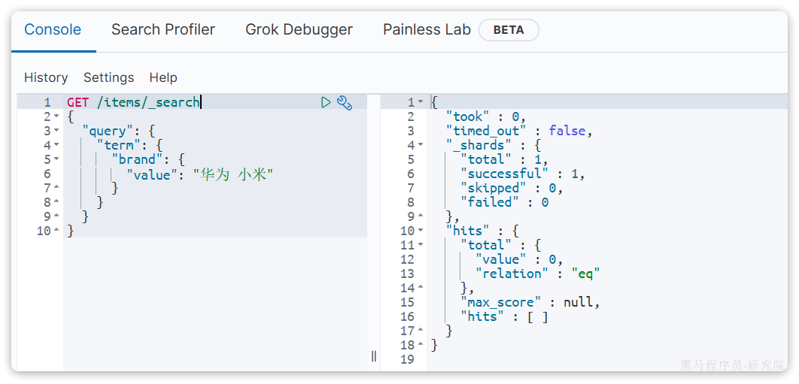


再来看下`range`查询，语法如下：

```JSON
GET /{索引库名}/_search
{
  "query": {
    "range": {
      "字段名": {
        "gte": {最小值},
        "lte": {最大值}
      }
    }
  }
}
```

`range`是范围查询，对于范围筛选的关键字有：

- `gte`：大于等于

- `gt`：大于

- `lte`：小于等于

- `lt`：小于

示例：

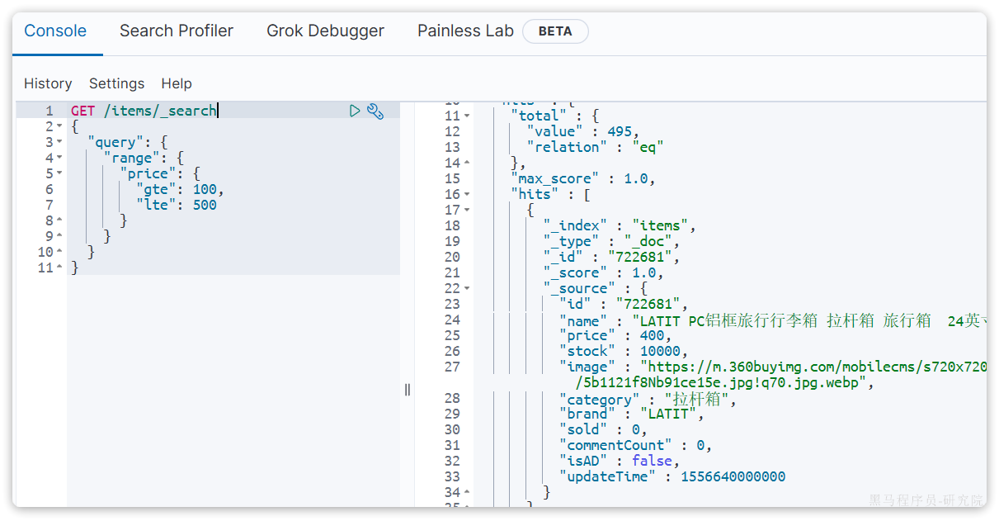

## 1\.3\.复合查询

复合查询大致可以分为两类：

- 第一类：基于逻辑运算组合叶子查询，实现组合条件，例如

    - bool

- 第二类：基于某种算法修改查询时的文档相关性算分，从而改变文档排名。例如：

    - function\_score

    - dis\_max

其它复合查询及相关语法可以参考官方文档：

[https://www.elastic.co/guide/en/elasticsearch/reference/7.12/compound-queries.html]()


### 1\.3\.1\.算分函数查询（选讲）

当我们利用match查询时，文档结果会根据与搜索词条的**关联度打分**（**\_score**），返回结果时按照分值降序排列。

例如，我们搜索 "手机"，结果如下：

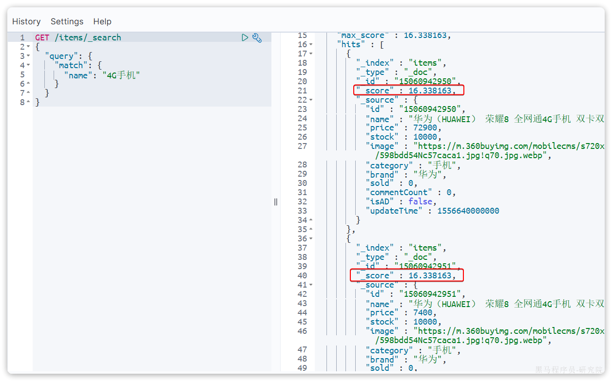

从elasticsearch5\.1开始，采用的相关性打分算法是BM25算法，公式如下：

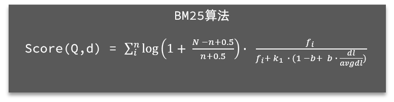


基于这套公式，就可以判断出某个文档与用户搜索的关键字之间的关联度，还是比较准确的。但是，在实际业务需求中，常常会有竞价排名的功能。不是相关度越高排名越靠前，而是掏的钱多的排名靠前。

例如在百度中搜索Java培训，排名靠前的就是广告推广：

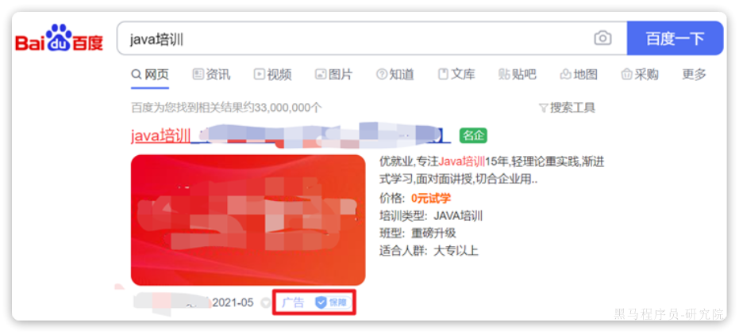

要想认为控制相关性算分，就需要利用elasticsearch中的function score 查询了。

**基本语法**：

function score 查询中包含四部分内容：

- **原始查询**条件：query部分，基于这个条件搜索文档，并且基于BM25算法给文档打分，**原始算分**（query score\)

- **过滤条件**：filter部分，符合该条件的文档才会重新算分

- **算分函数**：符合filter条件的文档要根据这个函数做运算，得到的**函数算分**（function score），有四种函数 

    - weight：函数结果是常量

    - field\_value\_factor：以文档中的某个字段值作为函数结果

    - random\_score：以随机数作为函数结果

    - script\_score：自定义算分函数算法

- **运算模式**：算分函数的结果、原始查询的相关性算分，两者之间的运算方式，包括： 

    - multiply：相乘

    - replace：用function score替换query score

    - 其它，例如：sum、avg、max、min


function score的运行流程如下：

- 1）根据**原始条件**查询搜索文档，并且计算相关性算分，称为**原始算分**（query score）

- 2）根据**过滤条件**，过滤文档

- 3）符合**过滤条件**的文档，基于**算分函数**运算，得到**函数算分**（function score）

- 4）将**原始算分**（query score）和**函数算分**（function score）基于**运算模式**做运算，得到最终结果，作为相关性算分。


因此，其中的关键点是：

- 过滤条件：决定哪些文档的算分被修改

- 算分函数：决定函数算分的算法

- 运算模式：决定最终算分结果


示例：给IPhone这个品牌的手机算分提高十倍，分析如下：

- 过滤条件：品牌必须为IPhone

- 算分函数：常量weight，值为10

- 算分模式：相乘multiply

对应代码如下：

```JSON
GET /hotel/_search
{
  "query": {
    "function_score": {
      "query": {  .... }, // 原始查询，可以是任意条件
      "functions": [ // 算分函数
        {
          "filter": { // 满足的条件，品牌必须是Iphone
            "term": {
              "brand": "Iphone"
            }
          },
          "weight": 10 // 算分权重为2
        }
      ],
      "boost_mode": "multipy" // 加权模式，求乘积
    }
  }
}
```


### 1\.3\.2\.bool查询

bool查询，即布尔查询。就是利用逻辑运算来组合一个或多个查询子句的组合。bool查询支持的逻辑运算有：

- must：必须匹配每个子查询，类似“与”

- should：选择性匹配子查询，类似“或”

- must\_not：必须不匹配，**不参与算分**，类似“非”

- filter：必须匹配，**不参与算分**

bool查询的语法如下：

```JSON
GET /items/_search
{
  "query": {
    "bool": {
      "must": [
        {"match": {"name": "手机"}}
      ],
      "should": [
        {"term": {"brand": { "value": "vivo" }}},
        {"term": {"brand": { "value": "小米" }}}
      ],
      "must_not": [
        {"range": {"price": {"gte": 2500}}}
      ],
      "filter": [
        {"range": {"price": {"lte": 1000}}}
      ]
    }
  }
}
```


出于性能考虑，与搜索关键字无关的查询尽量采用must\_not或filter逻辑运算，避免参与相关性算分。

例如黑马商城的搜索页面：

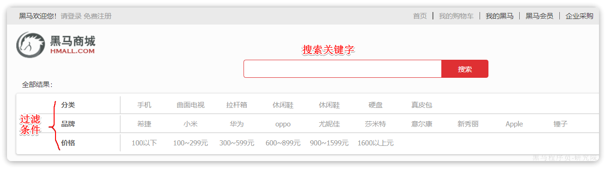

其中输入框的搜索条件肯定要参与相关性算分，可以采用match。但是价格范围过滤、品牌过滤、分类过滤等尽量采用filter，不要参与相关性算分。

比如，我们要搜索`手机`，但品牌必须是`华为`，价格必须是`900~1599`，那么可以这样写：

```JSON
GET /items/_search
{
  "query": {
    "bool": {
      "must": [
        {"match": {"name": "手机"}}
      ],
      "filter": [
        {"term": {"brand": { "value": "华为" }}},
        {"range": {"price": {"gte": 90000, "lt": 159900}}}
      ]
    }
  }
}
```

## 1\.4\.排序

elasticsearch默认是根据相关度算分（`_score`）来排序，但是也支持自定义方式对搜索结果排序。不过分词字段无法排序，能参与排序字段类型有：`keyword`类型、数值类型、地理坐标类型、日期类型等。

详细说明可以参考官方文档：

[https://www.elastic.co/guide/en/elasticsearch/reference/7.12/sort-search-results.html]()

语法说明：

可以指定多个排序字段

```JSON
GET /indexName/_search
{
  "query": {
    "match_all": {}//表示匹配所有文档。
  },
  "sort": [
    {
      "排序字段": {
        "order": "排序方式asc和desc"
      }
    }
  ]
}
```


示例，我们按照商品价格排序：

```JSON
GET /items/_search
{
  "query": {
    "match_all": {}//表示匹配所有文档。
  },
  "sort": [
    {
      "price": {
        "order": "desc"
      }
    }
  ]
}
```


## 1\.5\.分页

elasticsearch 默认情况下只返回top10的数据。而如果要查询更多数据就需要修改分页参数了。

### 1\.5\.1\.基础分页

elasticsearch中通过修改`from`、`size`参数来控制要返回的分页结果：

- `from`：从第几个文档开始

- `size`：总共查询几个文档

类似于mysql中的`limit ?, ?`

官方文档如下：

[https://www.elastic.co/guide/en/elasticsearch/reference/7.12/paginate-search-results.html]()

语法如下：

```JSON
GET /items/_search
{
  "query": {
    "match_all": {}//表示匹配所有文档。
  },
  "from": 0, // 分页开始的位置，默认为0
  "size": 10,  // 每页文档数量，默认10
  "sort": [
    {
      "price": {
        "order": "desc"
      }
    }
  ]
}
```

### 1\.5\.2\.深度分页

有深度分页的话我们可以设置分页的上线来限制服务器的奔溃

elasticsearch的数据一般会采用分片存储，也就是把一个索引中的数据分成N份，存储到不同节点上。这种存储方式比较有利于数据扩展，但给分页带来了一些麻烦。

比如一个索引库中有100000条数据，分别存储到4个分片，每个分片25000条数据。现在每页查询10条，查询第99页。那么分页查询的条件如下：

```JSON
GET /items/_search
{
  "from": 990, // 从第990条开始查询
  "size": 10, // 每页查询10条
  "sort": [
    {
      "price": "asc"
    }
  ]
}
```

从语句来分析，要查询第990\~1000名的数据。

从实现思路来分析，肯定是将所有数据排序，找出前1000名，截取其中的990\~1000的部分。但问题来了，我们如何才能找到所有数据中的前1000名呢？

要知道每一片的数据都不一样，第1片上的第900\~1000，在另1个节点上并不一定依然是900\~1000名。所以我们只能在每一个分片上都找出排名前1000的数据，然后汇总到一起，重新排序，才能找出整个索引库中真正的前1000名，此时截取990\~1000的数据即可。

如图：

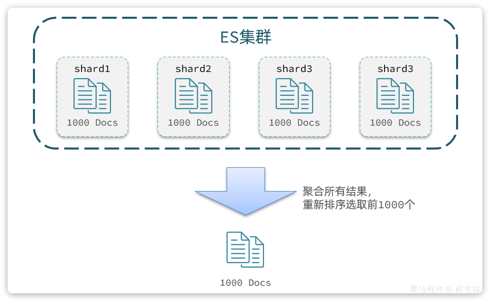


试想一下，假如我们现在要查询的是第999页数据呢，是不是要找第9990\~10000的数据，那岂不是需要把每个分片中的前10000名数据都查询出来，汇总在一起，在内存中排序？如果查询的分页深度更深呢，需要一次检索的数据岂不是更多？

由此可知，当查询分页深度较大时，汇总数据过多，对内存和CPU会产生非常大的压力。

因此elasticsearch会禁止`from+ size `超过10000的请求。


针对深度分页，elasticsearch提供了两种解决方案：

- `search after`：分页时需要排序，原理是从上一次的排序值开始，查询下一页数据。（更换查询的起始位置）官方推荐使用的方式。

- `scroll`：原理将排序后的文档id形成快照，保存下来，基于快照做分页。官方已经不推荐使用。


详情见文档：

[https://www.elastic.co/guide/en/elasticsearch/reference/7.12/paginate-search-results.html]()


**总结：**

大多数情况下，我们采用普通分页就可以了。查看百度、京东等网站，会发现其分页都有限制。例如百度最多支持77页，每页不足20条。京东最多100页，每页最多60条。

因此，一般我们采用限制分页深度的方式即可，无需实现深度分页。


## 1\.6\.高亮

### 1\.6\.1\.高亮原理

什么是高亮显示呢？

我们在百度，京东搜索时，关键字会变成红色，比较醒目，这叫高亮显示：

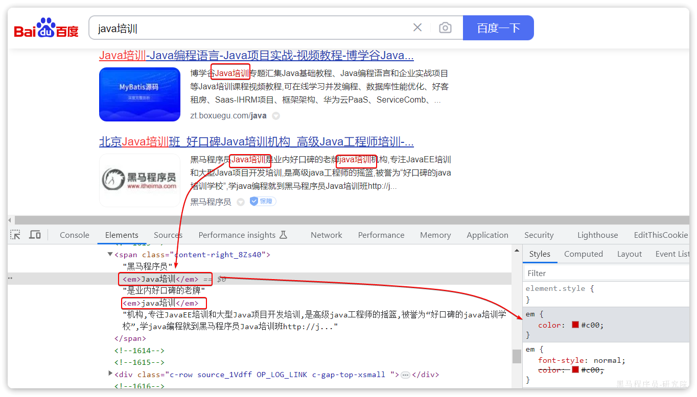

观察页面源码，你会发现两件事情：

- 高亮词条都被加了`<em>`标签

- `<em>`标签都添加了红色样式


css样式肯定是前端实现页面的时候写好的，但是前端编写页面的时候是不知道页面要展示什么数据的，不可能给数据加标签。而服务端实现搜索功能，要是有`elasticsearch`做分词搜索，是知道哪些词条需要高亮的。

因此词条的**高亮标签肯定是由服务端提供数据的时候已经加上的**。


因此实现高亮的思路就是：

- 用户输入搜索关键字搜索数据

- 服务端根据搜索关键字到elasticsearch搜索，并给搜索结果中的关键字词条添加`html`标签

- 前端提前给约定好的`html`标签添加`CSS`样式

### 1\.6\.2\.实现高亮

事实上elasticsearch已经提供了给搜索关键字加标签的语法，无需我们自己编码。

基本语法如下：

```JSON
GET /{索引库名}/_search
{
  "query": {
    "match": {
      "搜索字段": "搜索关键字"
    }
  },
  "highlight": {
    "fields": {
      "高亮字段名称": {
        "pre_tags": "<em>",
        "post_tags": "</em>"
      }
    }
  }
}
```

**注意**：

- 搜索必须有查询条件，而且是全文检索类型的查询条件，例如`match`

- 参与高亮的字段必须是`text`类型的字段

- 默认情况下参与高亮的字段要与搜索字段一致，除非添加：`required_field_match=false`


示例：


## 1\.7\.总结

查询的DSL是一个大的JSON对象，包含下列属性：

- `query`：查询条件

- `from`和`size`：分页条件

- `sort`：排序条件

- `highlight`：高亮条件

示例：


## 2\.RestClient查询

文档的查询依然使用昨天学习的 `RestHighLevelClient`对象，查询的基本步骤如下：

- 1）创建`request`对象，这次是搜索，所以是`SearchRequest`

- 2）准备请求参数，也就是查询DSL对应的JSON参数

- 3）发起请求

- 4）解析响应，响应结果相对复杂，需要逐层解析


## 2\.1\.快速入门

之前说过，由于Elasticsearch对外暴露的接口都是Restful风格的接口，因此JavaAPI调用就是在发送Http请求。而我们核心要做的就是利用**利用Java代码组织请求参数**，**解析响应结果**。

这个参数的格式完全参考DSL查询语句的JSON结构，因此我们在学习的过程中，会不断的把JavaAPI与DSL语句对比。大家在学习记忆的过程中，也应该这样对比学习。

### 2\.1\.1\.发送请求

首先以`match_all`查询为例，其DSL和JavaAPI的对比如图：

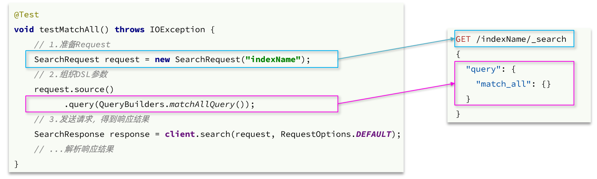

代码解读：

- 第一步，创建`SearchRequest`对象，指定索引库名 

- 第二步，利用`request.source()`构建DSL，DSL中可以包含查询、分页、排序、高亮等 

    - `query()`：代表查询条件，利用`QueryBuilders.matchAllQuery()`构建一个`match_all`查询的DSL

- 第三步，利用`client.search()`发送请求，得到响应 


这里关键的API有两个，一个是`request.source()`，它构建的就是DSL中的完整JSON参数。其中包含了`query`、`sort`、`from`、`size`、`highlight`等所有功能：

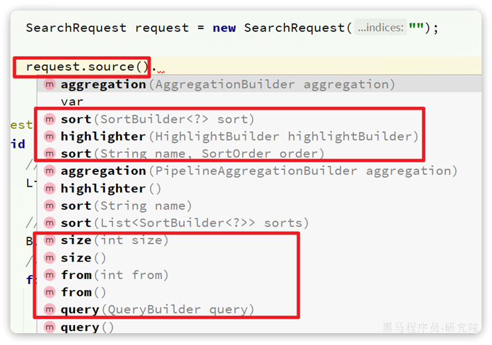

另一个是`QueryBuilders`，其中包含了我们学习过的各种**叶子查询**、**复合查询**等：

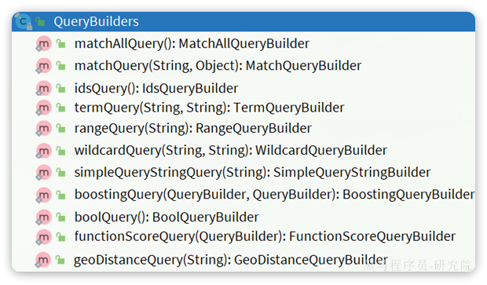


### 2\.1\.2\.解析响应结果

在发送请求以后，得到了响应结果`SearchResponse`，这个类的结构与我们在kibana中看到的响应结果JSON结构完全一致：

```JSON
{
    "took" : 0,
    "timed_out" : false,
    "hits" : {
        "total" : {
            "value" : 2,
            "relation" : "eq"
        },
        "max_score" : 1.0,
        "hits" : [
            {
                "_index" : "heima",
                "_type" : "_doc",
                "_id" : "1",
                "_score" : 1.0,
                "_source" : {
                "info" : "Java讲师",
                "name" : "赵云"
                }
            }
        ]
    }
}
```


因此，我们解析`SearchResponse`的代码就是在解析这个JSON结果，对比如下：

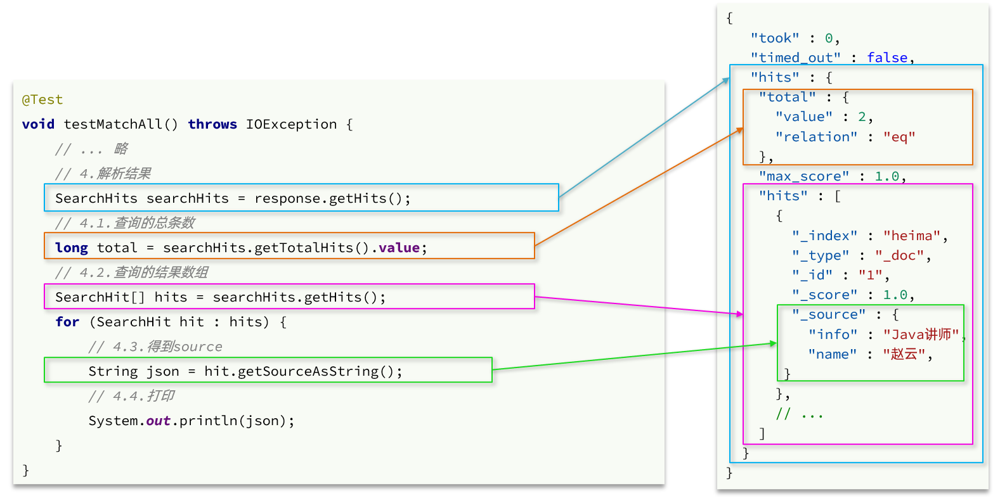


**代码解读**：

elasticsearch返回的结果是一个JSON字符串，结构包含：

- `hits`：命中的结果 

    - `total`：总条数，其中的value是具体的总条数值

    - `max_score`：所有结果中得分最高的文档的相关性算分

    - `hits`：搜索结果的文档数组，其中的每个文档都是一个json对象 

        - `_source`：文档中的原始数据，也是json对象


因此，我们解析响应结果，就是逐层解析JSON字符串，流程如下：

- `SearchHits`：通过`response.getHits()`获取，就是JSON中的最外层的`hits`，代表命中的结果 

    - `SearchHits#getTotalHits().value`：获取总条数信息

    - `SearchHits#getHits()`：获取`SearchHit`数组，也就是文档数组 

        - `SearchHit#getSourceAsString()`：获取文档结果中的`_source`，也就是原始的`json`文档数据


### 2\.1\.3\.总结

文档搜索的基本步骤是：

1. 创建`SearchRequest`对象

2. 准备`request.source()`，也就是DSL。

    1. `QueryBuilders`来构建查询条件

    2. 传入`request.source()` 的` query() `方法

3. 发送请求，得到结果

4. 解析结果（参考JSON结果，从外到内，逐层解析）


完整代码如下：

```Java
@Test
void testMatchAll() throws IOException {
    // 1.创建Request
    SearchRequest request = new SearchRequest("items");
    // 2.组织请求参数
    request.source().query(QueryBuilders.matchAllQuery());
    // 3.发送请求
    SearchResponse response = client.search(request, RequestOptions.DEFAULT);
    // 4.解析响应
    handleResponse(response);
}

private void handleResponse(SearchResponse response) {
    SearchHits searchHits = response.getHits();
    // 1.获取总条数
    long total = searchHits.getTotalHits().value;
    System.out.println("共搜索到" + total + "条数据");
    // 2.遍历结果数组
    SearchHit[] hits = searchHits.getHits();
    for (SearchHit hit : hits) {
        // 3.得到_source，也就是原始json文档
        String source = hit.getSourceAsString();
        // 4.反序列化并打印
        ItemDoc item = JSONUtil.toBean(source, ItemDoc.class);
        System.out.println(item);
    }
}
```


## 2\.2\.叶子查询

所有的查询条件都是由QueryBuilders来构建的，叶子查询也不例外。因此整套代码中变化的部分仅仅是query条件构造的方式，其它不动。

例如`match`查询：

```Java
@Test
void testMatch() throws IOException {
    // 1.创建Request
    SearchRequest request = new SearchRequest("items");
    // 2.组织请求参数
    request.source().query(QueryBuilders.matchQuery("name", "脱脂牛奶"));
    // 3.发送请求
    SearchResponse response = client.search(request, RequestOptions.DEFAULT);
    // 4.解析响应
    handleResponse(response);
}
```

再比如`multi_match`查询：

```Java
@Test
void testMultiMatch() throws IOException {
    // 1.创建Request
    SearchRequest request = new SearchRequest("items");
    // 2.组织请求参数
    request.source().query(QueryBuilders.multiMatchQuery("脱脂牛奶", "name", "category"));
    // 3.发送请求
    SearchResponse response = client.search(request, RequestOptions.DEFAULT);
    // 4.解析响应
    handleResponse(response);
}
```

还有`range`查询：

```Java
@Test
void testRange() throws IOException {
    // 1.创建Request
    SearchRequest request = new SearchRequest("items");
    // 2.组织请求参数
    request.source().query(QueryBuilders.rangeQuery("price").gte(10000).lte(30000));
    // 3.发送请求
    SearchResponse response = client.search(request, RequestOptions.DEFAULT);
    // 4.解析响应
    handleResponse(response);
}
```

还有`term`查询：

```Java
@Test
void testTerm() throws IOException {
    // 1.创建Request
    SearchRequest request = new SearchRequest("items");
    // 2.组织请求参数
    request.source().query(QueryBuilders.termQuery("brand", "华为"));
    // 3.发送请求
    SearchResponse response = client.search(request, RequestOptions.DEFAULT);
    // 4.解析响应
    handleResponse(response);
}
```


## 2\.3\.复合查询

复合查询也是由`QueryBuilders`来构建，我们以`bool`查询为例，DSL和JavaAPI的对比如图：

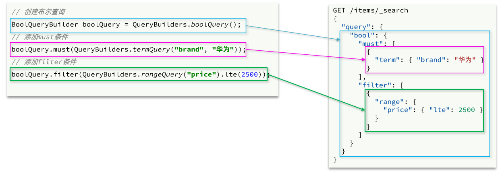

完整代码如下：

```Java
@Test
void testBool() throws IOException {
    // 1.创建Request
    SearchRequest request = new SearchRequest("items");
    // 2.组织请求参数
    // 2.1.准备bool查询
    BoolQueryBuilder bool = QueryBuilders.boolQuery();
    // 2.2.关键字搜索
    bool.must(QueryBuilders.matchQuery("name", "脱脂牛奶"));
    // 2.3.品牌过滤
    bool.filter(QueryBuilders.termQuery("brand", "德亚"));
    // 2.4.价格过滤
    bool.filter(QueryBuilders.rangeQuery("price").lte(30000));
    request.source().query(bool);
    // 3.发送请求
    SearchResponse response = client.search(request, RequestOptions.DEFAULT);
    // 4.解析响应
    handleResponse(response);
}
```


## 2\.4\.排序和分页

之前说过，`requeset.source()`就是整个请求JSON参数，所以排序、分页都是基于这个来设置，其DSL和JavaAPI的对比如下：

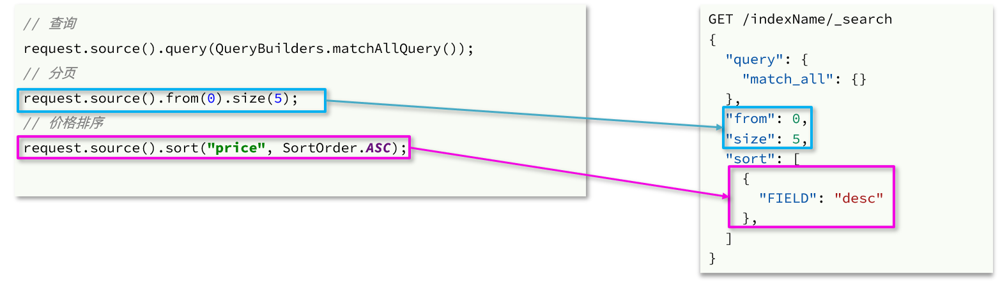

完整示例代码：

```Java
@Test
void testPageAndSort() throws IOException {
    int pageNo = 1, pageSize = 5;

    // 1.创建Request
    SearchRequest request = new SearchRequest("items");
    // 2.组织请求参数
    // 2.1.搜索条件参数
    request.source().query(QueryBuilders.matchQuery("name", "脱脂牛奶"));
    // 2.2.排序参数
    request.source().sort("price", SortOrder.ASC);
    // 2.3.分页参数
    request.source().from((pageNo - 1) * pageSize).size(pageSize);
    // 3.发送请求
    SearchResponse response = client.search(request, RequestOptions.DEFAULT);
    // 4.解析响应
    handleResponse(response);
}
```


## 2\.5\.高亮

高亮查询与前面的查询有两点不同：

- 条件同样是在`request.source()`中指定，只不过高亮条件要基于`HighlightBuilder`来构造

- 高亮响应结果与搜索的文档结果不在一起，需要单独解析


首先来看高亮条件构造，其DSL和JavaAPI的对比如图：

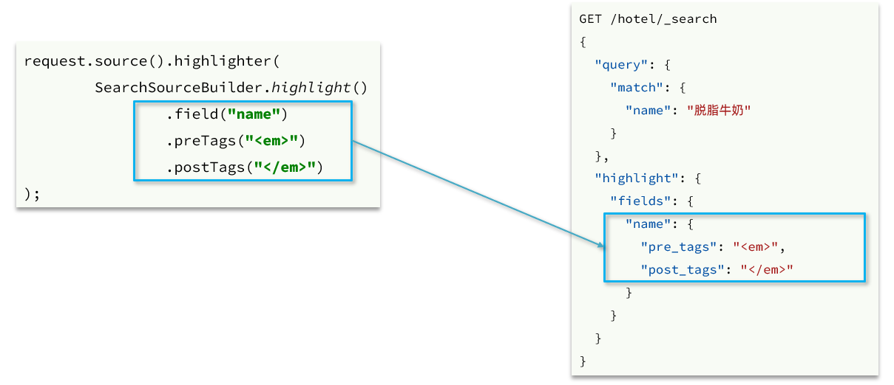

示例代码如下：

```Java
@Test
void testHighlight() throws IOException {
    // 1.创建Request
    SearchRequest request = new SearchRequest("items");
    // 2.组织请求参数
    // 2.1.query条件
    request.source().query(QueryBuilders.matchQuery("name", "脱脂牛奶"));
    // 2.2.高亮条件
    request.source().highlighter(
            SearchSourceBuilder.highlight()
                    .field("name")
                    .preTags("<em>")
                    .postTags("</em>")
    );
    // 3.发送请求
    SearchResponse response = client.search(request, RequestOptions.DEFAULT);
    // 4.解析响应
    handleResponse(response);
}
```


再来看结果解析，文档解析的部分不变，主要是高亮内容需要单独解析出来，其DSL和JavaAPI的对比如图：


代码解读：

- 第`3、4`步：从结果中获取`_source`。`hit.getSourceAsString()`，这部分是非高亮结果，json字符串。还需要反序列为`ItemDoc`对象

- 第`5`步：获取高亮结果。`hit.getHighlightFields()`，返回值是一个`Map`，key是高亮字段名称，值是`HighlightField`对象，代表高亮值

- 第`5.1`步：从`Map`中根据高亮字段名称，获取高亮字段值对象`HighlightField`

- 第`5.2`步：从`HighlightField`中获取`Fragments`，并且转为字符串。这部分就是真正的高亮字符串了

- 最后：用高亮的结果替换`ItemDoc`中的非高亮结果


完整代码如下：

```Java
private void handleResponse(SearchResponse response) {
    SearchHits searchHits = response.getHits();
    // 1.获取总条数
    long total = searchHits.getTotalHits().value;
    System.out.println("共搜索到" + total + "条数据");
    // 2.遍历结果数组
    SearchHit[] hits = searchHits.getHits();
    for (SearchHit hit : hits) {
        // 3.得到_source，也就是原始json文档
        String source = hit.getSourceAsString();
        // 4.反序列化
        ItemDoc item = JSONUtil.toBean(source, ItemDoc.class);
        // 5.获取高亮结果
        Map<String, HighlightField> hfs = hit.getHighlightFields();
        if (CollUtils.isNotEmpty(hfs)) {
            // 5.1.有高亮结果，获取name的高亮结果
            HighlightField hf = hfs.get("name");
            if (hf != null) {
                // 5.2.获取第一个高亮结果片段，就是商品名称的高亮值
                String hfName = hf.getFragments()[0].string();
                item.setName(hfName);
            }
        }
        System.out.println(item);
    }
}
```

## 3\.数据聚合

聚合（`aggregations`）可以让我们极其方便的实现对数据的统计、分析、运算。例如：

- 什么品牌的手机最受欢迎？

- 这些手机的平均价格、最高价格、最低价格？

- 这些手机每月的销售情况如何？

实现这些统计功能的比数据库的sql要方便的多，而且查询速度非常快，可以实现近实时搜索效果。

官方文档：

[https://www.elastic.co/guide/en/elasticsearch/reference/7.12/search-aggregations.html]()


聚合常见的有三类：

- **桶（****`Bucket`****）**聚合：用来对文档做分组 

    - `TermAggregation`：按照文档字段值分组，例如按照品牌值分组、按照国家分组

    - `Date Histogram`：按照日期阶梯分组，例如一周为一组，或者一月为一组

- **度量（****`Metric`****）**聚合：用以计算一些值，比如：最大值、最小值、平均值等 

    - `Avg`：求平均值

    - `Max`：求最大值

    - `Min`：求最小值

    - `Stats`：同时求`max`、`min`、`avg`、`sum`等

- **管道（****`pipeline`****）**聚合：其它聚合的结果为基础做进一步运算 


**注意：**参加聚合的字段必须是keyword、日期、数值、布尔类型


## 3\.1\.DSL实现聚合

与之前的搜索功能类似，我们依然先学习DSL的语法，再学习JavaAPI\.

### 3\.1\.1\.Bucket聚合

例如我们要统计所有商品中共有哪些商品分类，其实就是以分类（category）字段对数据分组。category值一样的放在同一组，属于`Bucket`聚合中的`Term`聚合。

基本语法如下：

```JSON
GET /items/_search
{
  "size": 0, 
  "aggs": {
    "category_agg": {
      "terms": {
        "field": "category",
        "size": 20
      }
    }
  }
}
```

语法说明：

- `size`：设置`size`为0，就是每页查0条，则结果中就不包含文档，只包含聚合

- `aggs`：定义聚合

    - `category_agg`：聚合名称，自定义，但不能重复

        - `terms`：聚合的类型，按分类聚合，所以用`term`

            - `field`：参与聚合的字段名称

            - `size`：希望返回的聚合结果的最大数量

来看下查询的结果：

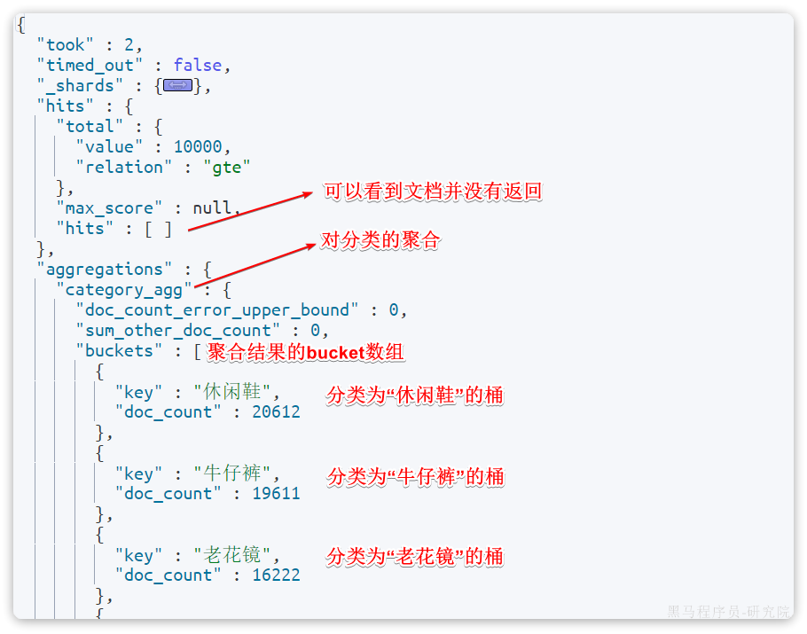


### 3\.1\.2\.带条件聚合

默认情况下，Bucket聚合是对索引库的所有文档做聚合，例如我们统计商品中所有的品牌，结果如下：

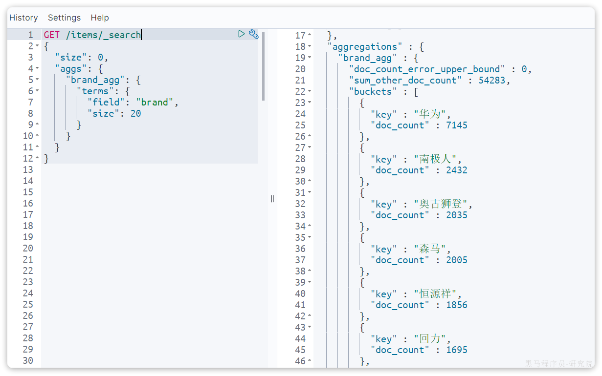

可以看到统计出的品牌非常多。

但真实场景下，用户会输入搜索条件，因此聚合必须是对搜索结果聚合。那么聚合必须添加限定条件。

例如，我想知道价格高于3000元的手机品牌有哪些，该怎么统计呢？

我们需要从需求中分析出搜索查询的条件和聚合的目标：

- 搜索查询条件：

    - 价格高于3000

    - 必须是手机

- 聚合目标：统计的是品牌，肯定是对brand字段做term聚合

语法如下：

```JSON
GET /items/_search
{
  "query": {
    "bool": {
      "filter": [
        {
          "term": {
            "category": "手机"
          }
        },
        {
          "range": {
            "price": {
              "gte": 300000
            }
          }
        }
      ]
    }
  }, 
  "size": 0, 
  "aggs": {
    "brand_agg": {
      "terms": {
        "field": "brand",
        "size": 20
      }
    }
  }
}
```

聚合结果如下：

```JSON
{
  "took" : 2,
  "timed_out" : false,
  "hits" : {
    "total" : {
      "value" : 13,
      "relation" : "eq"
    },
    "max_score" : null,
    "hits" : [ ]
  },
  "aggregations" : {
    "brand_agg" : {
      "doc_count_error_upper_bound" : 0,
      "sum_other_doc_count" : 0,
      "buckets" : [
        {
          "key" : "华为",
          "doc_count" : 7
        },
        {
          "key" : "Apple",
          "doc_count" : 5
        },
        {
          "key" : "小米",
          "doc_count" : 1
        }
      ]
    }
  }
}

```

可以看到，结果中只剩下3个品牌了。

### 3\.1\.3\.Metric聚合

上节课，我们统计了价格高于3000的手机品牌，形成了一个个桶。现在我们需要对桶内的商品做运算，获取每个品牌价格的最小值、最大值、平均值。

这就要用到`Metric`聚合了，例如`stat`聚合，就可以同时获取`min`、`max`、`avg`等结果。

语法如下：

```JSON
GET /items/_search
{
  "query": {
    "bool": {
      "filter": [
        {
          "term": {
            "category": "手机"
          }
        },
        {
          "range": {
            "price": {
              "gte": 300000
            }
          }
        }
      ]
    }
  }, 
  "size": 0, 
  "aggs": {
    "brand_agg": {
      "terms": {
        "field": "brand",
        "size": 20
      },
      "aggs": {
        "stats_meric": {
          "stats": {
            "field": "price"
          }
        }
      }
    }
  }
}
```

`query`部分就不说了，我们重点解读聚合部分语法。

可以看到我们在`brand_agg`聚合的内部，我们新加了一个`aggs`参数。这个聚合就是`brand_agg`的子聚合，会对`brand_agg`形成的每个桶中的文档分别统计。

- `stats_meric`：聚合名称

    - `stats`：聚合类型，stats是`metric`聚合的一种

        - `field`：聚合字段，这里选择`price`，统计价格


由于stats是对brand\_agg形成的每个品牌桶内文档分别做统计，因此每个品牌都会统计出自己的价格最小、最大、平均值。

结果如下：

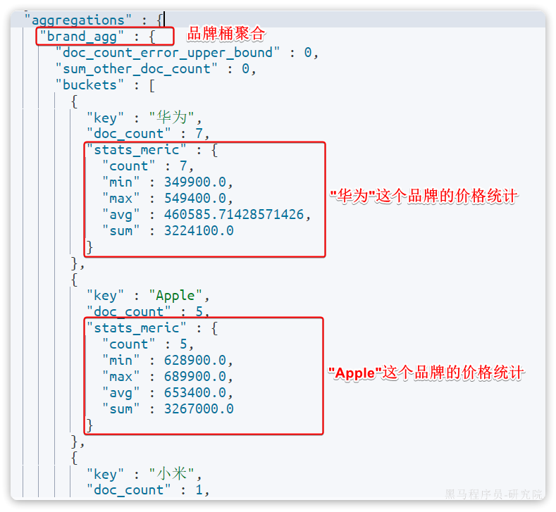

另外，我们还可以让聚合按照每个品牌的价格平均值排序：

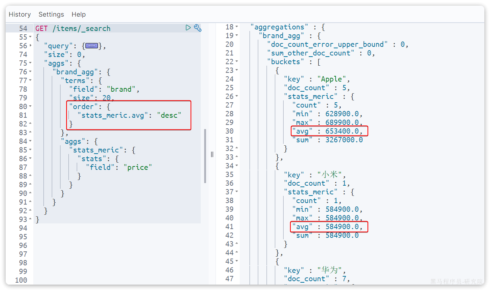


### 3\.1\.4\.总结

aggs代表聚合，与query同级，此时query的作用是？

- 限定聚合的的文档范围

聚合必须的三要素：

- 聚合名称

- 聚合类型

- 聚合字段

聚合可配置属性有：

- size：指定聚合结果数量

- order：指定聚合结果排序方式

- field：指定聚合字段


## 3\.2\.RestClient实现聚合

可以看到在DSL中，`aggs`聚合条件与`query`条件是同一级别，都属于查询JSON参数。因此依然是利用`request.source()`方法来设置。

不过聚合条件的要利用`AggregationBuilders`这个工具类来构造。DSL与JavaAPI的语法对比如下：

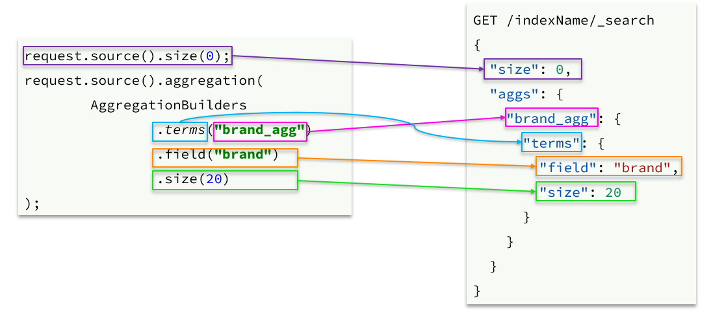

聚合结果与搜索文档同一级别，因此需要单独获取和解析。具体解析语法如下：

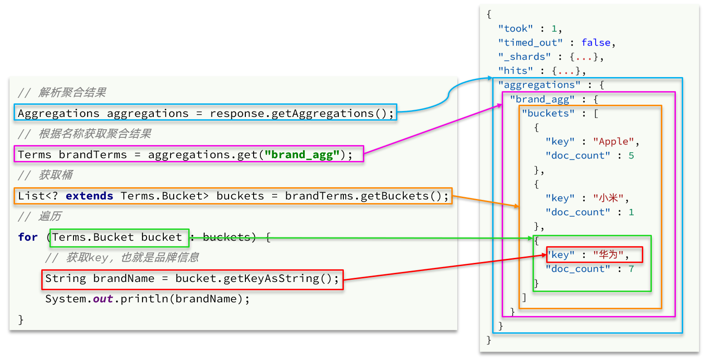


完整代码如下：

```Java
@Test
void testAgg() throws IOException {
    // 1.创建Request
    SearchRequest request = new SearchRequest("items");
    // 2.准备请求参数
    BoolQueryBuilder bool = QueryBuilders.boolQuery()
            .filter(QueryBuilders.termQuery("category", "手机"))
            .filter(QueryBuilders.rangeQuery("price").gte(300000));
    request.source().query(bool).size(0);
    // 3.聚合参数
    request.source().aggregation(
            AggregationBuilders.terms("brand_agg").field("brand").size(5)
    );
    // 4.发送请求
    SearchResponse response = client.search(request, RequestOptions.DEFAULT);
    // 5.解析聚合结果
    Aggregations aggregations = response.getAggregations();
    // 5.1.获取品牌聚合
    Terms brandTerms = aggregations.get("brand_agg");
    // 5.2.获取聚合中的桶
    List<? extends Terms.Bucket> buckets = brandTerms.getBuckets();
    // 5.3.遍历桶内数据
    for (Terms.Bucket bucket : buckets) {
        // 5.4.获取桶内key
        String brand = bucket.getKeyAsString();
        System.out.print("brand = " + brand);
        long count = bucket.getDocCount();
        System.out.println("; count = " + count);
    }
}
```

## 4 服务搜索

## 4\.1 服务搜索技术方案

目标：理解本项目的搜索技术方案


### 1）需求分析

服务搜索的入口有两处：

1. 在门户最上端的搜索入口对服务信息进行搜索。

如下图：


在**第2部分**触发搜索框进入搜索页面，输入关键字进行搜索，如下图：


2. 在门户最下方点击“全部服务”进入全部服务界面。

如下图：

点击服务分类查询分类下的服务。


### 2）技术方案

1. **使用Elasticsearch进行全文检索**

要实现服务搜索使用什么技术呢？

根据需求分析，对服务进行搜索除了根据服务类型查询其下的服务以外还需要根据关键字去搜索与关键字匹配的服务。

通过关键字去匹配服务的哪些信息呢？比如：输入关键字“家庭保洁”，它会去匹配服务相关的信息，比如：服务类型的名称、服务项的名称，甚至根据需要也可能去匹配服务介绍的信息，只要与“家庭保洁”相关的服务都会展示出来。如下效果：


这里最关键的是根据关键字去匹配，使用数据库的like搜索能否实现呢？

上图的搜索效果是一种全文检索方式，在搜索“家庭保洁”关键字时会对关键字先分词，分为“家庭”和“保洁”，再根据分好的词去匹配索引库中的服务类型的名称、服务项的名称、服务项的描述等字段。Like搜索不具有分词功能，它不是一种全文检索的方式。

虽然MySQL也支持全文检索，但是考虑搜索接口具有高性能需求，并且它面向的是C端用户，如果C端用户直接访问数据库在高并发时就会对数据库造成很大的压力，影响接口的性能，同时也会对其它业务使用数据库造成影响，所以一般C端用户的高性能接口不会直接访问数据库。

如果要实现全文检索且对接口性能有一定的要求，最常用的是Elasticsearch，本项目使用ES完成服务搜索功能的开发。

Elasticsearch是基于倒排索引的原理，正排索引是从文章中找词，倒排索引是根据词去找文章，原理如下： 

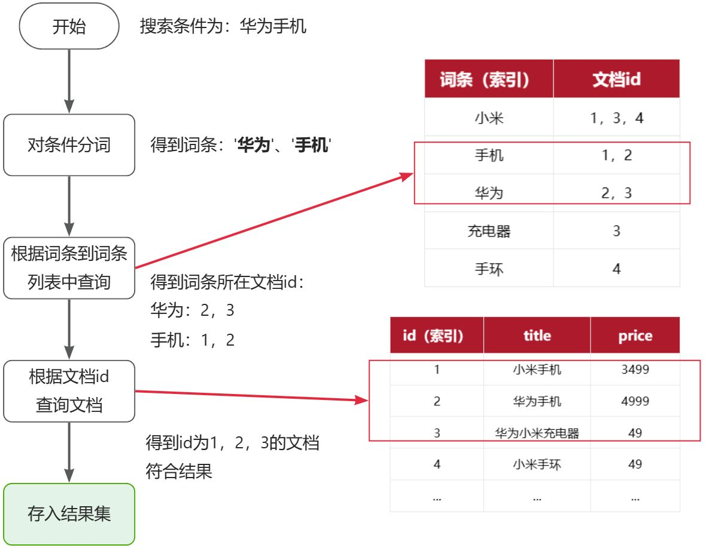


2. **索引同步方案**

如果要使用ES去搜索服务信息需要提前对服务信息在ES中创建索引，运营端在管理服务时是将服务信息保存在数据库，如何对数据库中的服务信息去创建索引，保证数据库中的信息与ES的索引信息同步呢，本节对索引同步的方案进行分析与确定。

**方案1： 添加服务信息维护索引**

在服务项的增删改查Service方法中添加维护ES索引的代码。

在区域服务的增删改查Service方法中添加维护ES索引的代码。

例如下边的代码：

无法保证数据一致性\-\-多系统

```Java
public Serve onSale(Long id){
    //操作serve表
    //添加向ES创建索引的代码
}
```

首先上边的代码是在原有业务方式的基础上添加索引同步的代码，增加代码的复杂度不方便维护，扩展性差。

其次上边的代码存在分布式事务，操作serve表会访问数据库，添加索引会访问ES，使用数据库本地事务是无法控制整个方法的一致性的，比如：向ES写成功了由于网络问题抛出网络超时异常，最终数据库操作回滚了ES操作没有回滚，数据库的数据和ES中的索引不一致。

方案1通常在生产中不会使用。

**方案2：使用Canal\+MQ**

Canal是什么？

**canal \[kə'næl\]**，译意为水道/管道/沟渠，主要用途是基于 MySQL 数据库增量日志解析，对数据进行同步，如下图：

Canal可与很多数据源进行对接，将数据由MySQL同步到ES、MQ、DB等各个数据源。

Canal的意思是水道/管道/沟渠，它相当于一个数据管道，通过解析MySQL的binlog日志完成数据同步工作。

官方文档：[https://github\.com/alibaba/canal/wiki](https://github.com/alibaba/canal/wiki)


要理解上图中Canal的工作原理需要首先要知道MySQL主从数据同步的原理，如下图：


MySQL主从集群由MySQL主服务器\(master\)和MySQL从服务器\(slave\)组成，MySQL主从数据同步是一种数据库复制技术，进行写数据会先向主服务器写，写成功后将数据同步到从服务器，流程如下：

1、主服务器将所有写操作（INSERT、UPDATE、DELETE）以二进制日志（binlog）的形式记录下来。

2、从服务器连接到主服务器，发送dump 协议,请求获取主服务器上的binlog日志。

MySQL的`dump`协议是MySQL复制协议中的一部分。

3、MySQL master 收到 dump 请求，开始推送 binary log 给 slave

4、从服务器解析日志，根据日志内容更新从服务器的数据库，完成从服务器的数据保持与主服务器同步。


理解了MySQL主从同步的原理，Canal在整个过程充当什么角色呢？

如下图：


工作流程如下：

1、Canal模拟 MySQL slave 的交互协议，伪装自己为 MySQL slave ，向 MySQL master 发送dump 协议

MySQL的`dump`协议是MySQL复制协议中的一部分。

2、MySQL master 收到 dump 请求，开始推送 binary log 给 slave \(即 canal \)

。一旦连接建立成功，Canal会一直等待并监听来自MySQL主服务器的binlog事件流，当有新的数据库变更发生时MySQL master主服务器发送binlog事件流给Canal。

3、Canal会及时接收并解析这些变更事件并解析 binary log 

通过以上流程可知Canal和MySQL master主服务器之间建立了长连接。


本方案需要借助Canal和消息队列，具体实现方案如下：

通过上边的技术分析下边对本项目服务搜索方案进行总结。

本项目使用Elasticsearch实现服务的搜索功能，使用Canal\+MQ完成服务信息与ES索引同步。

如下图：

流程如下：

运营人员对服务信息进行增删改操作，MySQL记录binlog日志。

Canal定时读取binlog 解析出增加、修改、删除数据的记录。

Canal将修改记录发送到MQ。

同步程序监听MQ，收到增加、修改、删除数据的记录，请求ES创建、修改、删除索引。

C端用户请求服务搜索接口从ES中搜索服务信息。


### 4）小结

项目为什么要用Elasticsearch？数据很多吗？

项目中如何进行索引同步的？


## 4\.2 MQ技术方案

目标：

能说出如何保证MQ消息的可靠性？

能说出如何保证MQ幂等性？或 如何防止重复消费？


### 1）保证生产消息可靠性

上述技术方案中有一个关键点，首先数据增删改的信息是保证写入binlog的，Canal解析出增删改的信息后写入MQ，同步程序从MQ去读取消息，如果MQ中的消息丢失了数据将无法进行同步。

**如何保证MQ消息的可靠性？**

保证MQ消息的可靠性分两个方面：保证生产消息的可靠性、保证消费消息的可靠性。

**保证生产消息的可靠性：**

RabbitMQ提供生产者确认机制保证生产消息的可靠性，技术方案如下 ：

1. **首先发送消息的方法如果执行失败会进行重试，重试次数耗尽记录失败消息**

项目中抽取了发送消息的工具方法，代码 在jzo2o\-rabbitmq中，如下图：


@Retryable注解可实现方法执行失败进行重试，如下：

```JSON
@Retryable(value = MqException.class, maxAttempts = 3, backoff = @Backoff(value = 3000, multiplier = 1.5), recover = "saveFailMag")
```

说明如下：

value：抛出指定异常才会重试

include：和value一样，默认为空，当exclude也为空时，默认所有异常

exclude：指定不处理的异常

maxAttempts：最大重试次数，默认3次

backoff：重试等待策略，默认使用@Backoff，@Backoff的value默认为1000L，我们设置为3000L；表示第一次失败后等待3秒后重试，multiplier（指定延迟倍数）默认为0，如果把multiplier设置为1\.5表示每次等待重试时间是上一次的1\.5倍，则第一次重试为3秒，第二次为4\.5秒，第三次为6\.75秒。

Recover: 设置回调方法名，当重试耗尽时，通过recover属性设置回调的方法名。通过@Recover注解定义重试失败后的处理方法，在Recover方法中记录失败消息到数据库。

下边的方法表示将失败消息存储到失败表中

```Java
*/***
* * @param mqException mq异常消息*
* * @param exchange    交换机*
* * @param routingKey  路由key*
* * @param msg         mq消息*
* * @param delay       延迟消息*
* * @param msgId       消息id*
* */*
@Recover
public void saveFailMag(MqException mqException, String exchange, String routingKey, Object msg, Integer delay, String msgId) {
    *//发送消息失败，需要将消息持久化到数据库，通过任务调度的方式处理失败的消息*
*    *failMsgDao.save(mqException.getMqId(), exchange, routingKey, JsonUtils.*toJsonStr*(msg), delay, DateUtils.*getCurrentTime*() + 10,  ExceptionUtil.*getMessage*(mqException));
}
```


2. **通过MQ的提供的生产者确认机制保证生产消息的可靠性**

使用生产者确认机制需要给每个消息指定一个唯一ID，生产者确认机制通过异步回调的方式进行，包括**ConfirmCallback和Return回调。**

**ConfirmCallback：**消息发送到Broker会有一个结果返回给发送者表示消息是否处理成功：

**1）消息成功投递到交换机，返回ack**

**2）消息未投递到交换机，返回nack**

源代码如下：

在发送消息时指定回调对象


回调类中回调方法源代码：

如果没有返回ack则将消息记录到失败消息表，如果经过重试后返回了ack说明消息发送成功，此时将消息从失败消息表删除。


**Return回调：**如果消息发送到交换机成功了但是并没有到达队列，此时会调用ReturnCallback回调方法，在回调方法中我们可以收到失败的消息存入失败消息表以便进行补偿。

要使用Return回调需要开启设置：

首先在shared\-rabbitmq\.yaml中配置rabbitMQ参数，如下：

```Java
spring:
  rabbitmq:
    publisher-confirm-type: correlated
    publisher-returns: true
    template:
      mandatory: true
   
说明：
publish-confirm-type：开启publisher-confirm，这里支持两种类型：
simple：同步等待confirm结果，直到超时
correlated：异步回调，定义ConfirmCallback，MQ返回结果时会回调这个ConfirmCallback
publish-returns：开启publish-return功能，同样是基于callback机制，不过是定义ReturnCallback
template.mandatory：定义消息路由失败时的策略。true，则调用ReturnCallback；false：则直接丢弃消息
```

阅读下边的代码理解写入失败消息表的逻辑。


### 2）保证消费消息可靠性

首先设置消息持久化，保证消息发送到MQ消息不丢失。具体需要设置交换机和队列支持持久化，发送消息设置deliveryMode=2。

RabbitMQ是通过消费者回执来确认消费者是否成功处理消息的：消费者获取消息后，应该向RabbitMQ发送ACK回执，表明自己已经处理完成消息，RabbitMQ收到ACK后删除消息。

消费消息失败重试3次，仍失败则将消费失败的消息入库。

通过任务调度扫描失败消息表重新发送，达到一定的次数还未成功则由人工处理。


RabbitMQ提供三个确认模式：

•manual：手动ack，需要在业务代码结束后，调用api发送ack。

•auto：自动ack，由spring监测listener代码是否出现异常，没有异常则返回ack；抛出异常则返回nack

•none：关闭ack，MQ假定消费者获取消息后会成功处理，因此消息投递后立即被删除

由此可知：

- none模式下，消息投递是不可靠的，可能丢失

- auto模式类似事务机制，出现异常时返回nack，消息回滚到mq；没有异常，返回ack

- manual：自己根据业务情况，判断什么时候该ack

一般，我们都是使用默认的auto即可。

在shared\-rabbitmq\.yaml中配置：

```Java
spring:
    rabbitmq:
       ....
        listener:
            simple:
                acknowledge-mode: auto #，出现异常时返回nack，消息回滚到mq；没有异常，返回ack
                retry:
                    enabled: true # 开启消费者失败重试
                    initial-interval: 1000 # 初识的失败等待时长为1秒
                    multiplier: 10 # 失败的等待时长倍数，下次等待时长 = multiplier * last-interval
                    max-attempts: 3 # 最大重试次数
                    stateless: true # true无状态；false有状态。如果业务中包含事务，这里改为false

```

本项目使用自动ack模式，当消费消息失败会重试，重试3次如果还失败会将消息投递到失败消息队列，由定时任务程序定时读取队列的消息,达到一定的次数还未成功则由人工处理。


### 3）保证消息幂等性

消费者在消费消息时难免出现重复消费的情况，比如：消费者没有向MQ返回ack导致重复消费，所以消费者需要保证消费消息幂等性。

什么是幂等性？

**幂等性是指不论执行多少次其结果是一致的。**

举例：

收到消息需要向数据新增一条记录，如果重复消费则会出现重复添加记录的问题。

下边根据场景分析解决方案：

1、查询操作

本身具有幂等性。

2、添加操作

如果主键是自增则可能重复添加记录。

保证幂等性可以设置数据库的唯一约束，比如：添加学生信息，将学号字段设置为唯一索引，即使重复添加相同的学生同一个学号只会添加一条记录。

3、更新操作

如果是更新一个固定的值，比如: update users set status =1 where id=?，本身具有幂等性。

如果只允许更新成功一次则可以使用token机制，发送消息前生成一个token写入redis，收到消息后解析出token从redis查询token如果成功则说明没有消费，此时更新成功将token从redis删除，当重复消费相同 的消息时由于token已经从redis删除不会再执行更新操作。

4、删除操作

与更新操作类似，如果是删除某个具体的记录，比如：delete from users where id=?，本身具有幂等性。

如果只允许删除成功一次可以采用更新操作相同的方法。


通过以上分析进行总结：

1、使用数据库的唯一约束去控制。 

2、使用token机制，如下：

消息具有唯一的ID

发送消息时将消息ID写入Redis

消费时根据消息ID查询Redis判断是否已经消费，如果已经消费则不再消费。


### 3）小结

如何保证MQ消息的可靠性？

如何保证MQ幂等性？或 如何防止重复消费？


可以百分百保证MQ的消息可靠性吗？

保证消息可靠性分两个方面：保证生产消息可靠性和保证消费消息可靠性。

保证生产消息可靠性：

生产消息可靠性是通过判断MQ是否发送ack回执，如果发nack表示发送消息失败，此时会进行重发或记录到失败消息表，通过定时任务进行补偿发送。如果Java程序并没有收到回执（如jvm进程异常结束了，或断电等因素），此时将无法保证生产消息的可靠性。

保证消费消息可靠性：

保证消费消息可靠性方案首先保证发送消息设置为持久化，其次通过MQ的消费确认机制保证消费者消费成功消息后再将消息删除。

虽然设置了消息持久化，消息进入MQ首先是在缓存存在，MQ会根据一定的规则进行刷盘，比如：每隔几毫秒进行刷盘，如果在消息还没有保存到磁盘时MQ进程终止，此时将会丢失消息。虽然可以使用镜像队列（用于在 RabbitMQ 集群中复制队列的消息，这样做的目的是提高队列的可用性和容错性，以防止在单个节点故障时导致消息的丢失。）但也不能百分百保证消息不丢失。

虽然我们加了很多保证可靠性的机制，这样也只是去提高消息的可靠性，不能百分百做的可靠，所以使用MQ的场景要考虑这种问题的存在，做好补偿处理任务。


## 4\.3 配置数据同步环境

目标：

理解Canal\+MQ的同步流程

参考文档配置Canal\+MQ的同步环境

### 1\) Canal\+MQ同步流程

下边回顾Canal的工作原理，如下图：

1、Canal模拟 MySQL slave 的交互协议，伪装自己为 MySQL slave ，向 MySQL master 发送dump 协议

MySQL的`dump`协议是MySQL复制协议中的一部分。

2、MySQL master 收到 dump 请求，开始推送 binary log 给 slave \(即 canal \)

。一旦连接建立成功，Canal会一直等待并监听来自MySQL主服务器的binlog事件流，当有新的数据库变更发生时MySQL master主服务器发送binlog事件流给Canal。

3、Canal会及时接收并解析这些变更事件并解析 binary log 

通过以上流程可知Canal和MySQL master主服务器之间建立了长连接。


基于Canal\+MQ数据同步流程：

1. 服务管理不仅向serve、serve\_item、serve\_type表写数据，同时也向serve\_sync表写数据，serve\_sync用于Canal同步数据使用。

2. 向serve\_sync写数据产生binlog

3. Canal请求读取binlog，并解析出serve\_sync表的数据更新日志，并发送至MQ的数据同步队列。

4. 异步同步程序监听MQ的数据同步队列，收到消息后解析出serve\_sync表的更新日志。

5. 异步同步程序根据serve\_sync表的更新日志请求Elasticsearch添加、更新、删除索引文档。

最终实现了将MySQL中的serve\_sync表的数据同步至Elasticsearch


**本节实现将MySQL的变更数据通过Canal写入MQ。**

### 2）配置Canal\+MQ数据同步环境

根据Canal\+MQ同步流程，下边进行如下配置：

1. 配置Mysql主从同步，开启MySQL主服务器的binlog

2. 安装Canal并配置，保证Canal连接MySQL主服务器成功

3. 安装RabbitMQ，并配置同步队列。

4. 在Canal中配置RabbitMQ的连接信息，保证Canal收到binlog消息写入MQ

对于异步程序监听MQ通过Java程序中实现。

以上四步配置详细参考“配置搜索及数据同步环境v1\.0”。

## 1 配置Canal\+MQ数据同步环境

## 1\.1 配置Mysql主从同步

根据Canal的工作原理，首先需要开启MySQL主从同步。


1\.在MySQL中需要创建一个用户，并授权

进入mysql容器：

docker exec \-it mysql /bin/bash

\-\- 使用命令登录：

mysql \-u root \-p

\-\- 创建用户 用户名：canal 密码：canal

```Java
create user 'canal'@'%' identified WITH mysql_native_password by 'canal';
```

\-\- 授权 \*\.\*表示所有库

```Java
GRANT SELECT,REPLICATION SLAVE,REPLICATION CLIENT ON *.* TO 'canal'@'%';
FLUSH PRIVILEGES;
```

- **SELECT：** 允许用户查询（读取）数据库中的数据。

- **REPLICATION SLAVE：** 允许用户作为 MySQL 复制从库，用于同步主库的数据。

- **REPLICATION CLIENT：** 允许用户连接到主库并获取关于主库状态的信息。


在MySQL配置文件my\.cnf设置如下信息，开启 Binlog 写入功能，配置 binlog\-format 为 ROW 模式

`ROW` 模式表示以行为单位记录每个被修改的行的变更

修改如下：

vi /usr/mysql/conf/my\.cnf

```Java
[mysqld]
#打开binlog
log-bin=mysql-bin
#选择ROW(行)模式
binlog-format=ROW
#配置MySQL replaction需要定义，不要和canal的slaveId重复
server_id=1

expire_logs_days=3
max_binlog_size = 100m
max_binlog_cache_size = 512m

```

**说明：在学习阶段为了保证足够的服务器存储空间，binlog日志最大保存100m，mysql会定时清理binlog**


2、重启MySQL，查看配置信息

- 使用命令查看是否打开binlog模式：

`SHOW VARIABLES LIKE 'log_bin';`


ON表示开启binlog模式。


`show variables like 'binlog_format';`

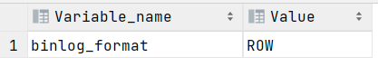

当 `binlog_format` 的值为 `row` 时，表示 MySQL 服务器当前配置为使用行级别的二进制日志记录，这对于数据库复制和数据同步来说更为安全，因为它记录了对数据行的确切更改。


- 查看binlog日志文件列表：

`SHOW BINARY LOGS;`


- 查看当前正在写入的binlog文件：

`SHOW MASTER STATUS;`


## 1\.2 安装Canal（**使用下发虚拟机无需安装**）

获取canal镜像

`docker pull canal/canal-server:latest`


创建/data/soft/canal目录:

mkdir \-p /data/soft/canal

在/data/soft/canal下创建 canal\.properties，内容如下，注意修改mq的配置信息：

```YAML
#################################################
#########               common argument         #############
#################################################
# tcp bind ip
canal.ip =
# register ip to zookeeper
canal.register.ip =
canal.port = 11111
canal.metrics.pull.port = 11112
# canal instance user/passwd
# canal.user = canal
# canal.passwd = E3619321C1A937C46A0D8BD1DAC39F93B27D4458

# canal admin config
#canal.admin.manager = 127.0.0.1:8089
canal.admin.port = 11110
canal.admin.user = admin
canal.admin.passwd = 4ACFE3202A5FF5CF467898FC58AAB1D615029441
# admin auto register
#canal.admin.register.auto = true
#canal.admin.register.cluster =
#canal.admin.register.name =

canal.zkServers =
# flush data to zk
canal.zookeeper.flush.period = 1000
canal.withoutNetty = false
# tcp, kafka, rocketMQ, rabbitMQ
canal.serverMode = rabbitMQ
# flush meta cursor/parse position to file
canal.file.data.dir = ${canal.conf.dir}
canal.file.flush.period = 1000
## memory store RingBuffer size, should be Math.pow(2,n)
canal.instance.memory.buffer.size = 16384
## memory store RingBuffer used memory unit size , default 1kb
canal.instance.memory.buffer.memunit = 1024 
## meory store gets mode used MEMSIZE or ITEMSIZE
canal.instance.memory.batch.mode = MEMSIZE
canal.instance.memory.rawEntry = true

## detecing config
canal.instance.detecting.enable = false
#canal.instance.detecting.sql = insert into retl.xdual values(1,now()) on duplicate key update x=now()
canal.instance.detecting.sql = select 1
canal.instance.detecting.interval.time = 3
canal.instance.detecting.retry.threshold = 3
canal.instance.detecting.heartbeatHaEnable = false

# support maximum transaction size, more than the size of the transaction will be cut into multiple transactions delivery
canal.instance.transaction.size =  1024
# mysql fallback connected to new master should fallback times
canal.instance.fallbackIntervalInSeconds = 60

# network config
canal.instance.network.receiveBufferSize = 16384
canal.instance.network.sendBufferSize = 16384
canal.instance.network.soTimeout = 30

# binlog filter config
canal.instance.filter.druid.ddl = true
canal.instance.filter.query.dcl = false
# 这个配置一定要修改
canal.instance.filter.query.dml = true
canal.instance.filter.query.ddl = false
canal.instance.filter.table.error = false
canal.instance.filter.rows = false
canal.instance.filter.transaction.entry = false
canal.instance.filter.dml.insert = false
canal.instance.filter.dml.update = false
canal.instance.filter.dml.delete = false

# binlog format/image check
canal.instance.binlog.format = ROW,STATEMENT,MIXED 
canal.instance.binlog.image = FULL,MINIMAL,NOBLOB

# binlog ddl isolation
canal.instance.get.ddl.isolation = false

# parallel parser config
canal.instance.parser.parallel = true
## concurrent thread number, default 60% available processors, suggest not to exceed Runtime.getRuntime().availableProcessors()
#canal.instance.parser.parallelThreadSize = 16
## disruptor ringbuffer size, must be power of 2
canal.instance.parser.parallelBufferSize = 256

# table meta tsdb info
canal.instance.tsdb.enable = true
canal.instance.tsdb.dir = ${canal.file.data.dir:../conf}/${canal.instance.destination:}
canal.instance.tsdb.url = jdbc:h2:${canal.instance.tsdb.dir}/h2;CACHE_SIZE=1000;MODE=MYSQL;
canal.instance.tsdb.dbUsername = canal
canal.instance.tsdb.dbPassword = canal
# dump snapshot interval, default 24 hour
canal.instance.tsdb.snapshot.interval = 24
# purge snapshot expire , default 360 hour(15 days)
canal.instance.tsdb.snapshot.expire = 360

#################################################
#########               destinations            #############
#################################################
canal.destinations = xzb-canal
# conf root dir
canal.conf.dir = ../conf
# auto scan instance dir add/remove and start/stop instance
canal.auto.scan = true
canal.auto.scan.interval = 5
# set this value to 'true' means that when binlog pos not found, skip to latest.
# WARN: pls keep 'false' in production env, or if you know what you want.
canal.auto.reset.latest.pos.mode = false

canal.instance.tsdb.spring.xml = classpath:spring/tsdb/h2-tsdb.xml
#canal.instance.tsdb.spring.xml = classpath:spring/tsdb/mysql-tsdb.xml

canal.instance.global.mode = spring
canal.instance.global.lazy = false
canal.instance.global.manager.address = ${canal.admin.manager}
#canal.instance.global.spring.xml = classpath:spring/memory-instance.xml
canal.instance.global.spring.xml = classpath:spring/file-instance.xml
#canal.instance.global.spring.xml = classpath:spring/default-instance.xml

##################################################
#########             MQ Properties      #############
##################################################
# aliyun ak/sk , support rds/mq
canal.aliyun.accessKey =
canal.aliyun.secretKey =
canal.aliyun.uid=

canal.mq.flatMessage = true
canal.mq.canalBatchSize = 50
canal.mq.canalGetTimeout = 100
# Set this value to "cloud", if you want open message trace feature in aliyun.
canal.mq.accessChannel = local

canal.mq.database.hash = true
canal.mq.send.thread.size = 30
canal.mq.build.thread.size = 8

##################################################
#########                    Kafka                   #############
##################################################
kafka.bootstrap.servers = 127.0.0.1:9092
kafka.acks = all
kafka.compression.type = none
kafka.batch.size = 16384
kafka.linger.ms = 1
kafka.max.request.size = 1048576
kafka.buffer.memory = 33554432
kafka.max.in.flight.requests.per.connection = 1
kafka.retries = 0

kafka.kerberos.enable = false
kafka.kerberos.krb5.file = "../conf/kerberos/krb5.conf"
kafka.kerberos.jaas.file = "../conf/kerberos/jaas.conf"

##################################################
#########                   RocketMQ         #############
##################################################
rocketmq.producer.group = test
rocketmq.enable.message.trace = false
rocketmq.customized.trace.topic =
rocketmq.namespace =
rocketmq.namesrv.addr = 127.0.0.1:9876
rocketmq.retry.times.when.send.failed = 0
rocketmq.vip.channel.enabled = false
rocketmq.tag = 

##################################################
#########                   RabbitMQ         #############
##################################################
rabbitmq.host = 192.168.101.68
rabbitmq.virtual.host = /xzb
rabbitmq.exchange = exchange.canal-jzo2o
rabbitmq.username = xzb
rabbitmq.password = xzb
rabbitmq.deliveryMode = 2

```

创建instance\.properties，内容如下：

`canal.instance.master.journal.name` 用于指定主库正在写入的 binlog 文件的名称。

如果不配置 `canal.instance.master.journal.name`，Canal 会尝试自动检测 MySQL 主库的 binlog 文件，并从最新位置开始进行复制。

```Java
#################################################
## mysql serverId , v1.0.26+ will autoGen
canal.instance.mysql.slaveId=1000

# enable gtid use true/false
canal.instance.gtidon=false

# position info
canal.instance.master.address=192.168.101.68:3306
canal.instance.master.journal.name=mysql-bin.000001
canal.instance.master.position=0
canal.instance.master.timestamp=
canal.instance.master.gtid=

# rds oss binlog
canal.instance.rds.accesskey=
canal.instance.rds.secretkey=
canal.instance.rds.instanceId=

# table meta tsdb info
canal.instance.tsdb.enable=true
#canal.instance.tsdb.url=jdbc:mysql://127.0.0.1:3306/canal_tsdb
#canal.instance.tsdb.dbUsername=canal
#canal.instance.tsdb.dbPassword=canal

#canal.instance.standby.address =
#canal.instance.standby.journal.name =
#canal.instance.standby.position =
#canal.instance.standby.timestamp =
#canal.instance.standby.gtid=

# username/password
canal.instance.dbUsername=canal
canal.instance.dbPassword=canal
canal.instance.connectionCharset = UTF-8
# enable druid Decrypt database password
canal.instance.enableDruid=false
#canal.instance.pwdPublicKey=MFwwDQYJKoZIhvcNAQEBBQADSwAwSAJBALK4BUxdDltRRE5/zXpVEVPUgunvscYFtEip3pmLlhrWpacX7y7GCMo2/JM6LeHmiiNdH1FWgGCpUfircSwlWKUCAwEAAQ==

# table regex
# canal.instance.filter.regex=test01\\..*,test02\\..*
#canal.instance.filter.regex=test01\\..*,test02\\.t1
#canal.instance.filter.regex=jzo2o-foundations\\.serve_sync,jzo2o-orders-0\\.orders_seize,jzo2o-orders-0\\.orders_dispatch,jzo2o-orders-0\\.serve_provider_sync,jzo2o-customer\\.serve_provider_sync
canal.instance.filter.regex=jzo2o-orders-1\\.orders_dispatch,jzo2o-orders-1\\.orders_seize,jzo2o-foundations\\.serve_sync,jzo2o-customer\\.serve_provider_sync,jzo2o-orders-1\\.serve_provider_sync,jzo2o-orders-1\\.history_orders_sync,jzo2o-orders-1\\.history_orders_serve_sync,jzo2o-market\\.activity
# table black regex
canal.instance.filter.black.regex=mysql\\.slave_.*
# table field filter(format: schema1.tableName1:field1/field2,schema2.tableName2:field1/field2)
#canal.instance.filter.field=test1.t_product:id/subject/keywords,test2.t_company:id/name/contact/ch
# table field black filter(format: schema1.tableName1:field1/field2,schema2.tableName2:field1/field2)
#canal.instance.filter.black.field=test1.t_product:subject/product_image,test2.t_company:id/name/contact/ch

# mq config
#canal.mq.topic=topic_test01
# dynamic topic route by schema or table regex
#canal.mq.dynamicTopic=mytest1.user,mytest2\\..*,.*\\..*
#canal.mq.dynamicTopic=topic_test01:test01\\..*,topic_test02:test02\\..*
#canal.mq.dynamicTopic=canal-mq-jzo2o-orders-dispatch:jzo2o-orders-0\\.orders_dispatch,canal-mq-jzo2o-orders-seize:jzo2o-orders-0\\.orders_seize,canal-mq-jzo2o-foundations:jzo2o-foundations\\.serve_sync,canal-mq-jzo2o-customer-provider:jzo2o-customer\\.serve_provider_sync,canal-mq-jzo2o-orders-provider:jzo2o-orders-0\\.serve_provider_sync
canal.mq.dynamicTopic=canal-mq-jzo2o-orders-dispatch:jzo2o-orders-1\\.orders_dispatch,canal-mq-jzo2o-orders-seize:jzo2o-orders-1\\.orders_seize,canal-mq-jzo2o-foundations:jzo2o-foundations\\.serve_sync,canal-mq-jzo2o-customer-provider:jzo2o-customer\\.serve_provider_sync,canal-mq-jzo2o-orders-provider:jzo2o-orders-1\\.serve_provider_sync,canal-mq-jzo2o-orders-serve-history:jzo2o-orders-1\\.history_orders_serve_sync,canal-mq-jzo2o-orders-history:jzo2o-orders-1\\.history_orders_sync,canal-mq-jzo2o-market-resource:jzo2o-market\\.activity
canal.mq.partition=0
# hash partition config
#canal.mq.partitionsNum=3
#canal.mq.partitionHash=test.table:id^name,.*\\..*
#canal.mq.dynamicTopicPartitionNum=test.*:4,mycanal:6
#################################################

```

canal\.instance\.filter\.regex和canal\.mq\.dynamicTopic的配置稍后解释。


创建日志目录：

mkdir \-p /data/soft/canal/logs   /data/soft/canal/conf

启动容器：

```Java
docker run --name canal -p 11111:11111 -d -v /data/soft/canal/instance.properties:/home/admin/canal-server/conf/xzb-canal/instance.properties  -v /data/soft/canal/canal.properties:/home/admin/canal-server/conf/canal.properties -v /data/soft/canal/logs:/home/admin/canal-server/logs/xzb-canal -v /data/soft/canal/conf:/home/admin/canal-server/conf/xzb-canal canal/canal-server:latest
```


## 1\.3 安装RabbitMQ（**使用下发虚拟机无需安装**）


1. 拉取镜像（如果未拉取过镜像）

docker pull registry\.cn\-hangzhou\.aliyuncs\.com/itheima/rabbitmq:3\.9\.17\-management\-delayed

2. 创建文件夹和文件

mkdir \-p /data/soft/rabbitmq/config /data/soft/rabbitmq/data /data/soft/rabbitmq/plugins

3. 启动容器

```PowerShell
docker run \
--privileged \
 -e RABBITMQ_DEFAULT_USER=czri \
 -e RABBITMQ_DEFAULT_PASS=czri1234 \
 --restart=always \
 --name rabbitmq \
 --hostname rabbitmq \
 -v /data/soft/rabbitmq/config:/etc/rabbitmq \
 -v /data/soft/rabbitmq/data:/var/lib/rabbitmq \
 -p 15672:15672 \
 -p 5672:5672 \
 -d \
 registry.cn-hangzhou.aliyuncs.com/itheima/rabbitmq:3.9.17-management-delayed
```

4. 启动rabbitmq管理端

进入rabbitmq容器:docker exec \-it rabbitmq /bin/bash

运行下边的命令：

```Shell
# 启动rabbitmq管理端
rabbitmq-plugins enable rabbitmq_management
# 启动延迟队列插件
rabbitmq-plugins enable rabbitmq_delayed_message_exchange
```

5、进入rabbitmq管理界面 

http://192\.168\.101\.68:15672/

账号：czri

密码：czri1234


6、创建虚拟主机 /xzb


7、创建账号和密码

xzb/xzb


设置权限可以访问/   /xzb


设置成功：


## 1\.4 配置Canal\+RabbitMQ

下边通过配置Canal与RabbitMQ，保证Canal收到binlog消息将数据发送至MQ。

最终我们要实现的是：

**修改jzo2o\-foundations数据库下的serve\_sync表的数据后通过canal将修改信息发送到MQ。**


**1、在Canal中配置RabbitMQ的连接信息**

**修改/data/soft/canal/****canal\.properties**

```Java
# tcp, kafka, rocketMQ, rabbitMQ
canal.serverMode = rabbitMQ

##################################################
#########                     RabbitMQ             #############
##################################################
rabbitmq.host = 192.168.101.68
rabbitmq.virtual.host = /xzb
rabbitmq.exchange = exchange.canal-jzo2o
rabbitmq.username = xzb
rabbitmq.password = xzb
rabbitmq.deliveryMode = 2
```

本项目用于数据同步的MQ交换机：exchange\.canal\-jzo2o

虚拟主机地址：/xzb

账号和密码：xzb/xzb

rabbitmq\.deliveryMode = 2   设置消息持久化


**2、设置需要监听的mysql库和表**

**修改/data/soft/canal/instance\.properties**

- `canal.instance.filter.regex` 需要监听的mysql库和表

    - 全库： `.*\\..*`

    - 指定库下的所有表： `canal\\..*`

    - 指定库下的指定表： `canal\\.canal,test\\.test`

        - `库名\\.表名`：转义需要用\\\\，使用逗号分隔多个库

这里配置监听 jzo2o\-foundations数据库下serve\_sync表，如下：

```YAML
canal.instance.filter.regex=jzo2o-foundations\\.serve_sync
```

**3、在Canal配置MQ的topic**

这里使用动态topic，格式为：topic:[schema](https://so.csdn.net/so/search?q=schema&spm=1001.2101.3001.7020)\.table,topic:schema\.table,topic:schema\.table

配置如下：

```Java
canal.mq.dynamicTopic=canal-mq-jzo2o-foundations:jzo2o-foundations\\.serve_sync
```

上边的配置表示：对jzo2o\-foundations数据库的serve\_sync表的修改消息发到topic为canal\-mq\-jzo2o\-foundations关联的队列

**4、进入rabbitMQ配置交换机和队列**

创建exchange\.canal\-jzo2o交换机：


创建队列：canal\-mq\-jzo2o\-foundations


绑定交换机：


绑定成功：


## 1\.5 测试数据同步

重启canal

修改jzo2o\-foundations数据库的serve\_sync表的数据，稍等片刻查看canal\-mq\-jzo2o\-foundations队列，如果队列中有的消息说明同步成功，如下 图：


如果没有同步到 MQ参考常见问题中“数据不同步”进行解决。


我们可以查询队列中的消息内容发现它一条type为"UPDATE"的消息，如下所示：

```JSON
{
   "data" : [
      {
         "city_code" : "010",
         "detail_img" : "https://yjy-xzbjzfw-oss.oss-cn-hangzhou.aliyuncs.com/be1449d6-1c2d-4cca-9f8a-4b562b79998d.jpg",
         "hot_time_stamp" : "1692256062300",
         "id" : "1686352662791016449",
         "is_hot" : "1",
         "price" : "5.0",
         "serve_item_icon" : "https://yjy-xzbjzfw-oss.oss-cn-hangzhou.aliyuncs.com/8179d29c-6b85-4c08-aa13-08429a91d86a.png",
         "serve_item_id" : "1678727478181957634",
         "serve_item_img" : "https://yjy-xzbjzfw-oss.oss-cn-hangzhou.aliyuncs.com/9b87ab7c-9592-4090-9299-5bcf97409fb9.png",
         "serve_item_name" : "日常维修ab",
         "serve_item_sort_num" : "6",
         "serve_type_icon" : "https://yjy-xzbjzfw-oss.oss-cn-hangzhou.aliyuncs.com/c8725882-1fa7-49a6-94ab-cac2530b3b7b.png",
         "serve_type_id" : "1678654490336124929",
         "serve_type_img" : "https://yjy-xzbjzfw-oss.oss-cn-hangzhou.aliyuncs.com/00ba6d8a-fd7e-4691-8415-8ada95004b33.png",
         "serve_type_name" : "日常维修12",
         "serve_type_sort_num" : "2",
         "unit" : "1"
      }
   ],
   "database" : "jzo2o-foundations",
   "es" : 1697443035000.0,
   "id" : 1,
   "isDdl" : false,
   "mysqlType" : {
      "city_code" : "varchar(20)",
      "detail_img" : "varchar(255)",
      "hot_time_stamp" : "bigint",
      "id" : "bigint",
      "is_hot" : "int",
      "price" : "decimal(10,2)",
      "serve_item_icon" : "varchar(255)",
      "serve_item_id" : "bigint",
      "serve_item_img" : "varchar(255)",
      "serve_item_name" : "varchar(100)",
      "serve_item_sort_num" : "int",
      "serve_type_icon" : "varchar(255)",
      "serve_type_id" : "bigint",
      "serve_type_img" : "varchar(255)",
      "serve_type_name" : "varchar(255)",
      "serve_type_sort_num" : "int",
      "unit" : "int"
   },
   "old" : [
      {
         "serve_item_name" : "日常维修a"
      }
   ],
   "pkNames" : [ "id" ],
   "sql" : "",
   "sqlType" : {
      "city_code" : 12,
      "detail_img" : 12,
      "hot_time_stamp" : -5,
      "id" : -5,
      "is_hot" : 4,
      "price" : 3,
      "serve_item_icon" : 12,
      "serve_item_id" : -5,
      "serve_item_img" : 12,
      "serve_item_name" : 12,
      "serve_item_sort_num" : 4,
      "serve_type_icon" : 12,
      "serve_type_id" : -5,
      "serve_type_img" : 12,
      "serve_type_name" : 12,
      "serve_type_sort_num" : 4,
      "unit" : 4
   },
   "table" : "serve_sync",
   "ts" : 1697443782457.0,
   "type" : "UPDATE"
}

```


## 1\.5 配置其它同步队列

按上边的方法配置以下同步队列并与交换机绑定：

canal\-mq\-jzo2o\-customer\-provider

canal\-mq\-jzo2o\-foundations

canal\-mq\-jzo2o\-market\-resource

canal\-mq\-jzo2o\-orders\-dispatch

canal\-mq\-jzo2o\-orders\-history

canal\-mq\-jzo2o\-orders\-provider

canal\-mq\-jzo2o\-orders\-seize

canal\-mq\-jzo2o\-orders\-serve\-history


先创建队列，再将队列绑定到交换机。


配置完成如下：


查询队列如下：


## 常见问题

## 数据不同步

当发现修改了数据库后修改的数据并没有发送到MQ，通过查看Canal的日志发现下边的错误。

进入Canal目录，查看日志：

```Java
cd /data/soft/canal/logs
tail -f logs/xzb-canal.log 
```

Canal报错如下：

```Java
2023-09-22 08:34:40.802 [destination = xzb-canal , address = /192.168.101.68:3306 , EventParser] WARN  c.a.o.c.p.inbound.mysql.rds.RdsBinlogEventParserProxy - ---> find start position successfully, EntryPosition[included=false,journalName=mysql-bin.000055,position=486221,serverId=1,gtid=,timestamp=1695341830000] cost : 13ms , the next step is binlog dump
2023-09-22 08:34:40.811 [destination = xzb-canal , address = /192.168.101.68:3306 , EventParser] ERROR c.a.o.canal.parse.inbound.mysql.dbsync.DirectLogFetcher - I/O error while reading from client socket
java.io.IOException: Received error packet: errno = 1236, sqlstate = HY000 errmsg = **Could not find first log file name in binary log index file**
        at com.alibaba.otter.canal.parse.inbound.mysql.dbsync.DirectLogFetcher.fetch(DirectLogFetcher.java:102) ~[canal.parse-1.1.5.jar:na]
        at com.alibaba.otter.canal.parse.inbound.mysql.MysqlConnection.dump(MysqlConnection.java:238) [canal.parse-1.1.5.jar:na]
        at com.alibaba.otter.canal.parse.inbound.AbstractEventParser$1.run(AbstractEventParser.java:262) [canal.parse-1.1.5.jar:na]
        at java.lang.Thread.run(Thread.java:748) [na:1.8.0_181]
```

找到关键的位置：**Could not find first log file name in binary log index file**

根据日志分析是Canal找不到mysql\-bin\.000055 的486221位置，原因是mysql\-bin\.000055文件不存在，这是由于为了节省磁盘空间将binlog日志清理了。


解决方法：

把canal复位从最开始开始同步的位置。

1）首先重置mysql的bin log：

连接mysql执行：reset master

执行后所有的binlog删除，从000001号开始

通过show master status;查看 ，结果显示 mysql\-bin\.000001

2）先停止canal

docker stop canal

3）删除meta\.dat

rm \-rf /data/soft/canal/conf/meta\.dat 

4\) 再启动canal

docker start canal


## MQ同步消息无法消费

这里以Es和MySQL之间的同步举例：

当出现ES和MySQL数据不同步时可能会出现MQ的同步消息无法被消费，比如：从MySQL删除一条记录通过同步程序将ES中对应的记录进行删除，此时由于ES中没有该记录导致删除ES中的记录失败。出现此问题的原因是因为测试数据混乱导致，可以手动将MQ中的消息删除。

进入MQ的管理控制台，进入要清理消息的队列，通过purge功能清理消息：


### 3）小结

Canal是怎么伪装成 MySQL slave？

Canal数据同步异常了怎么处理？


## 4\.3 索引同步

### 4\.3\.1 编写同步程序

刚才通过配置Canal\+MQ的数据同步环境实现了Canal从数据库读取binlog并且将数据写入MQ。

下边编写同步程序监听MQ，收到消息后向ES创建索引。

#### 1\) 创建索引结构

启动ES和kibana:

如果没有安装参考“第三方软件安装说明”安装elasticsearch7\.17\.7 和 kibana7\.17\.7。

安装完成后进行启动：

```JSON
docker start elasticsearch7.17.7 
docker start kibana7.17.7
```

下边创建索引serve\_aggregation，serve\_aggregation索引的结构与jzo2o\-foundations数据库的serve\_sync表结构对应。


首先通过下边的命令查询索引

```JSON
GET /_cat/indices?v 
```


如果需要修改索引结构需要删除重新创建：

```JSON
DELETE 索引名

```

查询索引结构

```JSON
GET /索引名/_mapping
```

创建serve\_aggregation索引  **（已经存在无法重复创建）**

```Java
PUT /serve_aggregation
{
   "mappings" : {
      "properties" : {
        "city_code" : {
          "type" : "keyword"
        },
        "detail_img" : {
          "type" : "text",
          "index" : false
        },
        "hot_time_stamp" : {
          "type" : "long"
        },
        "id" : {
          "type" : "keyword"
        },
        "is_hot" : {
          "type" : "short"
        },
        "price" : {
          "type" : "double"
        },
        "serve_item_icon" : {
          "type" : "text",
          "index" : false
        },
        "serve_item_id" : {
          "type" : "keyword"
        },
        "serve_item_img" : {
          "type" : "text",
          "index" : false
        },
        "serve_item_name" : {
          "type" : "text",
          "analyzer": "ik_max_word",
          "search_analyzer":"ik_smart"
          
        },
        "serve_item_sort_num" : {
          "type" : "short"
        },
        "serve_type_icon" : {
          "type" : "text",
          "index" : false
        },
        "serve_type_id" : {
          "type" : "keyword"
        },
        "serve_type_img" : {
          "type" : "text",
          "index" : false
        },
        "serve_type_name" : {
          "type" : "text",
          "analyzer": "ik_max_word",
          "search_analyzer":"ik_smart"
        },
        "serve_type_sort_num" : {
          "type" : "short"
        }
      }
    }
}
```


#### 2）编写同步程序

**1\.添加依赖**

首先在foundations工程添加下边的依赖

```Java
<dependency>
    <groupId>com.jzo2o</groupId>
    <artifactId>jzo2o-canal-sync</artifactId>
</dependency>
<dependency>
    <groupId>com.jzo2o</groupId>
    <artifactId>jzo2o-es</artifactId>
</dependency>
```

**2\.配置连接 ES**

修改foundations的配置文件：


修改nacos中es的配置文件


修改nacos中rabbitmq的配置文件


**3\.编写同步程序**

同步程序继承AbstractCanalRabbitMqMsgListener类，泛型中指定同步表对应的类型。

根据数据同步环境去配置监听MQ：

```Java
/**
 * 服务信息同步程序
 *
 * @author itcast
 * @create 2023/8/15 18:14
 **/
@Component
public class ServeCanalDataSyncHandler extends AbstractCanalRabbitMqMsgListener<ServeSync> {

    @Resource
    private ElasticSearchTemplate elasticSearchTemplate;

    *//*@RabbitListener(queues = "canal-mq-jzo2o-foundations", concurrency = "1")
*    @RabbitListener(bindings = @QueueBinding(*
*            value = @Queue(name = "canal-mq-jzo2o-foundations"),*
*            exchange = @Exchange(name = "exchange.canal-jzo2o", type = ExchangeTypes.TOPIC),*
*            key = "canal-mq-jzo2o-foundations"),*
*            concurrency = "1"*
*    )*
    public void onMessage(Message message) throws Exception {
    }
```

concurrency = "1"：表示消费线程数为1。

在同步程序中需要根据业务需求编写同步方法，当服务下架时会删除索引需要重写抽象类中的batchDelete\(List\<Long\> ids\)方法，此方法是当删除Serve\_sync表的记录时 对索引执行删除操作。

当服务上架后需要添加索引，当服务信息修改时需要修改索引，需要重写抽象类中的batchSave\(List\<ServeSync\> data\)方法，此方法是当向Serve\_sync表新增或修改记录时对索引执行添加及修改操作。


完整代码如下：

```Java


/**
 * 服务信息同步程序
 *
 * @author itcast
 * @create 2023/8/15 18:14
 **/
@Component
public class ServeCanalDataSyncHandler extends AbstractCanalRabbitMqMsgListener<ServeSync> {

    @Resource
    private ElasticSearchTemplate elasticSearchTemplate;

    @RabbitListener(bindings = @QueueBinding(
            value = @Queue(name = "canal-mq-jzo2o-foundations"),
            exchange = @Exchange(name = "exchange.canal-jzo2o", type = ExchangeTypes.TOPIC),
            key = "canal-mq-jzo2o-foundations"),
            concurrency = "1"   ///指定消费线程个数为1保证线程安全性
    )
    public void onMessage(Message message) throws Exception {
        parseMsg(message);//解析消息--里面有下面两个方法的执行
    }

    @Override
    //抽象类中的方法 向ES中保存数据-解析到binlog中的新增，更新消息执行方法
    public void batchSave(List<ServeSync> data) {
        Boolean aBoolean = elasticSearchTemplate.opsForDoc().batchInsert(IndexConstants.SERVE, data);
        if(!aBoolean){
            try {
                Thread.sleep(1000);
            } catch (InterruptedException e) {
                throw new RuntimeException(e);
            }
            throw new RuntimeException("同步失败");
        }
    }

    @Override
    ////抽象类中的方法 向ES中删除数据-解析到binlog中的删除，更新消息执行方法
    public void batchDelete(List<Long> ids) {
        Boolean aBoolean = elasticSearchTemplate.opsForDoc().batchDelete(IndexConstants.SERVE, ids);
        if(!aBoolean){
            try {
                Thread.sleep(1000);
            } catch (InterruptedException e) {
                throw new RuntimeException(e);
            }
            throw new RuntimeException("同步失败");
        }
    }
}
```

#### 3）测试

启动jzo2o\-foundations服务。

启动成功,jzo2o\-foundations服务作为MQ的消费者和MQ建立通道，进入canal\-mq\-jzo2o\-foundations队列的管理界面，查看是否建立 了监听通道。


监听通道建立 成功，下边在同步程序打断点：


手动修改jzo2o\-foundations数据库的serve\_sync表的记录，这里修改了服务项的名称


正常执行同步程序：


放行继续执行到batchSave方法：


保证ES服务正常，同步方法执行成功后进入Kibana查看

执行命令：

```Java

GET /serve_aggregation/_search
{
}
```


查询服务信息与数据库serve\_sync表中1686352662791016449记录的信息一致。

下边再将服务项名称恢复。


再进入Kibana查看索引的内容与数据库一致


#### 3）小结

编写同步程序的步骤：

1. 根据数据库同步表的结构 创建索引结构。

2. 同步程序监听MQ的同步队列

3. 同步程序收到数据同步消息写入Elasticsearch，写的失败抛出异常，消息回到MQ。


如何保证Canal\+MQ同步消息的顺序性？

场景：

如下图：

首先明确Canal解析binlog日志信息按顺序发到MQ的队列中，现在是要保证消费端如何按顺序消费队列中的消息。

生产中同一个jzo2o\-foundations服务会启动多个jvm进程，每个进程作为canal\-mq\-jzo2o\-foundations的消费者,如下图：


现在对服务名称先修改为aa再修改为bb，在MQ中的有两个消息：

修改服务名称为aa

修改服务名称为bb

预期：最终将服务名称修改为bb

此时两条消息会被分发给两个jvm进程，假设“修改服务名称为aa”的消息发给jvm进程1，“修改服务名称为bb”的消息发给jvm进程2，两个进程分别去消费，此时无法控制两个消息的先后顺序，可能导致服务名称最终并非修改为bb。

解决方法：

多个jvm进程监听同一个队列保证只有消费者活跃，即只有一个消费者接收消息。

消费队列中的数据使用单线程。


如何保证只有一个消费者接收消息？

队列需要增加x\-single\-active\-consumer参数，表示否启用单一活动消费者模式。


配置完成查保证队列上存在SAC标识，如下图：


当有多个jvm进程都去监听该队列时，只有一个为活跃状态


如果使用x\-single\-active\-consumer参数需要修改为如下代码：

在Queue中添加：arguments=\{@Argument\(name="x\-single\-active\-consumer", value = "true", type = "java\.lang\.Boolean"\) \}

如下所示：

```JSON
@RabbitListener(bindings = @QueueBinding(
            value = @Queue(name = "canal-mq-jzo2o-foundations",arguments={@Argument(name="x-single-active-consumer", value = "true", type = "java.lang.Boolean") }),
            exchange = @Exchange(name="exchange.canal-jzo2o",type = ExchangeTypes.*TOPIC*),
            key="canal-mq-jzo2o-foundations"),
            concurrency="1"
    )
*    *public void onMessage(Message message) throws Exception{
        parseMsg(message);
    }
```

concurrency=”1“表示 指定消费线程为1。


### 4\.3\.2 管理同步表

通过测试Canal\+MQ同步流程，只有当serve\_sync表变化时才会触发同步，serve\_sync表什么时候变化 ？

当服务信息变更时需要同时修改serve\_sync表，下边先分析serve\_sync的变化需求，再进行代码实现。

#### 1）管理同步表需求

现在如何去维护serve\_sync这张表呢？

根据serve\_sync表的结构分析：

添加：区域服务上架向serve\_sync表添加记录，同步程序新增索引记录。

删除：区域服务下架从serve\_sync表删除记录，同步程序删除索引记录。

修改：

修改服务项修改serve\_sync的记录。

修改服务分类修改serve\_sync的记录。

修改服务价格修改serve\_sync的记录。

设置热门/取消热门修改serve\_sync的记录。


#### 2）代码实现

1. **区域服务上架向serve\_sync表添加记录**

在ServeServiceImpl增加私有方法，如下：

```Java
/**
 * 新增服务同步数据
 *
 * @param serveId 服务id
 */
private void addServeSync(Long serveId) {
    //服务信息
    Serve serve = baseMapper.selectById(serveId);
    //区域信息
    Region region = regionMapper.selectById(serve.getRegionId());
    //服务项信息
    ServeItem serveItem = serveItemMapper.selectById(serve.getServeItemId());
    //服务类型
    ServeType serveType = serveTypeMapper.selectById(serveItem.getServeTypeId());

    ServeSync serveSync = new ServeSync();
    serveSync.setServeTypeId(serveType.getId());
    serveSync.setServeTypeName(serveType.getName());
    serveSync.setServeTypeIcon(serveType.getServeTypeIcon());
    serveSync.setServeTypeImg(serveType.getImg());
    serveSync.setServeTypeSortNum(serveType.getSortNum());

    serveSync.setServeItemId(serveItem.getId());
    serveSync.setServeItemIcon(serveItem.getServeItemIcon());
    serveSync.setServeItemName(serveItem.getName());
    serveSync.setServeItemImg(serveItem.getImg());
    serveSync.setServeItemSortNum(serveItem.getSortNum());
    serveSync.setUnit(serveItem.getUnit());
    serveSync.setDetailImg(serveItem.getDetailImg());
    serveSync.setPrice(serve.getPrice());

    serveSync.setCityCode(region.getCityCode());
    serveSync.setId(serve.getId());
    serveSync.setIsHot(serve.getIsHot());
    serveSyncMapper.insert(serveSync);
}
```

修改服务上架的方法：

```Java
@Override
@Transactional
@CachePut(value = RedisConstants.CacheName.SERVE, key = "#id",  cacheManager = RedisConstants.CacheManager.ONE_DAY)
public Serve onSale(Long id){
    ...
    //添加同步表
    addServeSync(id);
    return baseMapper.selectById(id);

}
```


2. **区域服务下架从serve\_sync表删除记录**


3. **修改服务项修改serve\_sync的记录**

代码已提供，阅读代码。


4. **修改服务分类修改serve\_sync的记录**

代码已提供，阅读代码。


#### 3）测试

测试服务上架添加索引。

测试服务下架删除索引。

测试修改服务价格修改索引。

测试修改服务项名称修改索引。

测试修改修改服务分类名称修改索引。


## 4\.4 搜索接口

目标：开发搜索接口。


### 1）定义接口

参数内容：区域编码，服务类型id、关键字

区域编码：用户定位成功前端记录区域编码（city\_code），搜索时根据city\_code搜索该区域的服务。

服务类型id：在全部服务界面选择一个服务类型查询其它下的服务列表。

关键字：输入关键字搜索服务项名称、服务类型名称。


接口名称：服务搜索接口

接口路径：**GET**/foundations/customer/serve/search


编写controller方法：

```Java
@RestController("consumerServeController")
@RequestMapping("/customer/serve")
@Api(tags = "用户端 - 首页服务查询接口")
public class FirstPageServeController {
...
    @GetMapping("/search")
    @ApiOperation("首页服务搜索")
    @ApiImplicitParams({
            @ApiImplicitParam(name = "cityCode", value = "城市编码", required = true, dataTypeClass = String.class),
            @ApiImplicitParam(name = "serveTypeId", value = "服务类型id", dataTypeClass = Long.class),
            @ApiImplicitParam(name = "keyword", value = "关键词", dataTypeClass = String.class)
    })
    public List<ServeSimpleResDTO> findServeList(@RequestParam("cityCode") String cityCode,
                                                 @RequestParam(value = "serveTypeId", required = false) Long serveTypeId,
                                                 @RequestParam(value = "keyword", required = false) String keyword) {

        return null;
    }
```

### 2）搜索方法

首先通过ES的查询语言进行查询，如下：

```JSON
GET /serve_aggregation/_search
{
   "query" : {
      "bool" : {
         "must" : [
            {
               "term" : {
                  "city_code" : {
                     "value" : "010"
                  }
               }
            },
            {
               "multi_match" : {
                  "fields" : [ "serve_item_name", "serve_type_name" ],
                  "query" : "保洁"
               }
            }
         ]
      }
   },
   "sort" : [
      {
         "serve_item_sort_num" : {
            "order" : "asc"
         }
      }
   ]
}
```


### 3\) service方法

下边按照ES查询语句编写service方法：

定义service接口：

```Java
package com.jzo2o.foundations.service;

import com.jzo2o.foundations.model.dto.response.ServeSimpleResDTO;

import java.util.List;

/**
 * @author itcast
 */
public interface ServeAggregationService {

    /**
     * 查询服务列表
     *
     * @param cityCode    城市编码
     * @param serveTypeId 服务类型id
     * @param keyword     关键词
     * @return 服务列表
     */
    List<ServeSimpleResDTO> findServeList(String cityCode, Long serveTypeId, String keyword);
}
```

service实现类

```Java

/**
 * 服务相关
 *
 * @author itcast
 * @create 2023/7/9 14:42
 **/
@Slf4j
@Service
public class ServeAggregationServiceImpl implements ServeAggregationService {

    @Resource
    private ElasticSearchTemplate elasticSearchTemplate;


    /**
     * 查询服务列表
     *
     * @param cityCode    城市编码
     * @param serveTypeId 服务类型id
     * @param keyword     关键词
     * @return 服务列表
     */
    @Override
public List<ServeSimpleResDTO> findServeList(String cityCode, Long serveTypeId, String keyword) {
    *// 构造查询条件*
*    *SearchRequest.Builder builder = new SearchRequest.Builder();

    builder.query(query->query.bool(bool->{
        *//匹配citycode*
*        *bool.must(must->
                must.term(term->
                        term.field("city_code").value(cityCode)));
        *//todo 匹配服务类型*

        *//匹配关键字*
*        if(ObjectUtils.isNotEmpty(keyword)){
**    *        *bool.must(must->*
                *must.multiMatch(multiMatch->*
                    *multiMatch.fields("serve_item_name","serve_type_name").query(keyword)));
*        *}*
        return bool;
    }));
    *// 排序 按服务项的serveItemSortNum排序(升序)*
*    *List<SortOptions> sortOptions = new ArrayList<>();
    sortOptions.add(SortOptions.*of*(sortOption -> sortOption.field(field->field.field("serve_item_sort_num").order(SortOrder.*Asc*))));
    builder.sort(sortOptions);
    *//指定索引*
    builder.index("serve_aggregation");
    *//请求对象*
    SearchRequest searchRequest = builder.build();
    *// 检索数据*
*    *SearchResponse<ServeAggregation> searchResponse = elasticSearchTemplate.opsForDoc().search(searchRequest, ServeAggregation.class);
    *//如果搜索成功返回结果集*
*    *if (SearchResponseUtils.*isSuccess*(searchResponse)) {
        List<ServeAggregation> collect = searchResponse.hits().hits()
                .stream().map(hit -> {
                    ServeAggregation serve = hit.source();
                    return serve;
                })
                .collect(Collectors.*toList*());
        List<ServeSimpleResDTO> serveSimpleResDTOS = BeanUtil.*copyToList*(collect, ServeSimpleResDTO.class);
        return serveSimpleResDTOS;
    }
    return  Collections.*emptyList*();

}

}
```

### 4）controller方法

完善controller方法

```Java
@GetMapping("/search")
@ApiOperation("首页服务搜索")
@ApiImplicitParams({
        @ApiImplicitParam(name = "cityCode", value = "城市编码", required = true, dataTypeClass = String.class),
        @ApiImplicitParam(name = "serveTypeId", value = "服务类型id", dataTypeClass = Long.class),
        @ApiImplicitParam(name = "keyword", value = "关键词", dataTypeClass = String.class)
})
public List<ServeSimpleResDTO> findServeList(@RequestParam("cityCode") String cityCode,
                                             @RequestParam(value = "serveTypeId", required = false) Long serveTypeId,
                                             @RequestParam(value = "keyword", required = false) String keyword) {
    List<ServeSimpleResDTO> serveList = serveAggregationService.findServeList(cityCode, serveTypeId, keyword);
    return serveList;
}
```


### 5）测试

进入小程序，进入搜索界面


跟踪Network


查看response

```JSON
{"code":200,"msg":"OK","data": [{"id":"1693815624114970626","serveItemId":"1685894105234755585","serveItemName":"日常保洁","serveItemIcon":"https://yjy-xzbjzfw-oss.oss-cn-hangzhou.aliyuncs.com/072e4709-9be3-4df2-96ad-c3e2d5790556.png","serveItemSortNum":1}]}
```

# 高并发秒杀：通过Redis\+Lua脚本保障**原子性库存扣减**，并借助XXL\-Job与线程池异步完成数据库持久化，实现了高性能与最终**数据一致性**。

### 2\.3\.1 **解决超卖问题**

#### 1）系统需求

在抢券模块中需要实现下边两个需求：

**1、提升高并发吞吐量**

抢券类似抢购、秒杀等业务场景具有时效性的特点，提前规定好用户在什么时间可以抢购，用户访问集中，这样就会给系统造成高并发，抢券模块在设计时要以提升系统在高并发下的吞吐量为目标，**吞吐量表示单位时间内系统处理的总请求数量，吞吐量高意味着系统处理能力强。**

衡量系统吞吐量的常用指标有哪些？

**QPS（Queries Per Second）：**

每秒查询数（Queries Per Second），它表示系统在每秒内能够处理的查询或请求的数量，是衡量一个系统处理请求的性能和吞吐量的指标。

计算公式：总请求数/时间窗口大小

示例：

在10秒内处理1万个请求，QPS为1000。每个请求处理的时间越短，QPS越大。

假设：一个网站有10万用户，有2万日活跃用户，并发量是4000，每个用户每秒平均发起2个请求，那么总请求数就是 2\*4000，那么QPS就是 8000，如果单机支持2000的qps理论上需要4台服务器。

qps指标是需要根据服务器硬件性能、及具体的业务场景去测试，比如：门户查询数据如果直接走Nginx静态服务器则QPS可以达到上万，如果请求查询Tomcat，并且通过数据库去查询数据库返回，此时QPS会远低于查询Nginx静态服务器的QPS值，如果不走数据库,而是从Redis查询数其QPS也会大大提升。


**TPS（Transactions Per Second）：**

表示系统每秒完成的事务数，与QPS不同，TPS更关注系统的事务处理能力，而不仅仅是单纯的查询或请求，一次事务通常会包括多个请求。在高度事务性的系统中，如在线交易系统、支付系统等，TPS是一个关键指标，用于衡量系统的处理能力。

TPS指标通常会涉及业务处理及数据库存储，在测试时也需要根据服务器硬件性能、及具体的业务场景去测试，拿下单举例：单机支持几十到几百的TPS指标属于正常。

在开发中，对以上性能指标的优化，可通过CDN、缓存、异步处理、数据库优化、多线程、集群、负载均衡等技术去提高系统的吞吐量。当然，再优化也不要忘记系统保护，通过限流技术根据系统的性能指标进行限流保护。


**2、解决超卖问题**

抢购、秒杀等业务场景还需要解决超卖问题，超卖是最终下单购买数量大于库存数量，比如：库存有１00个，用户最终购买了101个，多出这一个就是超卖了，结合抢券业务即用户最终抢到的优惠券总数大于优惠券库存数。

下边先分析超卖问题的解决方案。

#### 2）**什么是超卖问题**

超卖是最终下单购买数量大于库存数量，比如：库存１00个用户最终购买成功了101个，多出这一个就是超卖了，结合抢券业务，用户最终抢到的优惠券总数大于优惠券库存数就出现了超卖问题。

**导致超卖问题的原因是什么呢？**

下边举例说明超卖问题并分析导致超卖问题的原因。

下图是两个线程更新数据库的库存字段。

线程1：先查询库存为1，判断是否大于0，如果大于则库存减1，最后更新数据库库存字段。

线程2：先查询库存为1，判断是否大于0，如果大于则库存减1，最后更新数据库库存字段。

线程1和线程2查询到的库存都是1，两个线程分别减1得到剩余库存数0，由于线程2并不是基于线程1扣减库存后的值进行扣减，线程2更新库存覆盖了线程1更新的库存值。

上边的例子就出现了超卖的问题。

**造成超卖问题的原因是在高并发场景下对库存这个共享资源进行操作存在线程不安全所导致。应该顺序执行**


#### 3）悲观锁与乐观锁

提到解决线程安全问题大家想到了锁，下边复习下关于锁的基本概念。

jvm提供了很多锁，比如：synchronized、reentrantLock、CAS等，它们都可以解决线程安全问题，synchronized、reentrantLock可以实现悲观锁，CAS可以实现乐观锁，关于这些锁的知识掌握不牢固的一定要自行复习。下边理解悲观锁与乐观锁的概念。

1. **悲观锁**

悲观锁是一种悲观思想，总认为会有其它线程修改数据，为了保证线程安全所以在操作前总是先加锁，操作完成后释放锁，其它线程只有当锁释放后才可以获取锁继续操作数据。synchronized和ReentrantLock都可以实现悲观锁。

使用悲观锁后原来的多线程并发执行改为了顺序（同步）执行，当线程2去执行时查询到库存发现为0，不满足条件更新库存失败。

2. **乐观锁**

乐观锁则是一种乐观思想，认为不会有太多线程去并发修改数据，所以谁都可以去执行代码。

Java提供的CAS机制可以实现乐观锁，CAS即Compare And Swap 比较并交换，在修改数据前先比较版本号，如果数据的版本号没有变化说明数据没有修改，此时再去更改数据。

示例如下：

库存数据对应一个版本，库存每次变化则版本号跟着变化，如下：

|库存|版本号|
|---|---|
|100|1|
|99|2|
|\.\.\.|\.\.\.|
|1|100|
|0|101|

线程1修改库存前拿到库存及对应的版本号：1和100。

线程1判断库存如果大于0则将库存减1，准备更新库存。

更新库存时要校验当前库存的版本是否和自己之前拿到的一致，如果版本号为1说明自己在执行的这过程没有其它线程去修改过库存，此时将库存更新为99并将库存加1为2。

线程2执行和线程1一样的逻辑，线程2去更新库存时发现库存的版本号为2与自己之前拿到的不一致，更新库存失败。

3. **结论**

悲观锁和乐观锁都是一种解决共享资源的线程安全问题的方法，悲观锁是在读数据时就加锁，如果读比较多则加锁频繁影响性能，相比而言乐观锁性能比悲观锁要好。


#### 4）**数据库行锁控制方案**

数据库的行级锁可以实现悲观锁也可以实现乐观锁。

1. **实现悲观锁（排他锁）**

执行select … for update 实现加锁，select … for update 会锁住符合条件的行的数据，如下语句会锁一行的数据

```Java
select * from 库存表 where id=? for update
```

通常此语句放在事务中，开启事务开始时执行此语句获取锁，事务提交或回滚自动锁释放，保证在事务处理过程中没有其它线程去修改数据。

测试：

使用一个线程执行下边的命令：

```SQL
start transaction;

select ... for update;

COMMIT;
```

另一个线程修改数据，如果上边不释放锁将无法修改。

**高并发场景不推荐使用select … for update方法，同时也可能存在死锁的潜在风险。**


2. **实现乐观锁**

数据库的行级锁也可以实现乐观锁，通用的做法是在表中添加一个version版本字段，在更新时对比版本号，更新成功将版本号加1，SQL为：

```Java
update 表名 set 字段=值,version=version+1 where  id =? and version =? 
```

针对扣减库存业务扣减库存SQL：

```Java
update 库存表 set 库存=库存-1 where 库存>0 and id =? 
```

多线程执行上边的SQL，假如线程1先执行会添加排他锁，当事务没有结束前其它线程去更新同一条记录会被阻塞，等到线程1更新结束其它线程才可以更新库存。

当执行update后返回影响的记录行数为1表示更新成功即扣减库存成功，返回0表示没有更新记录行，即扣减库存失败。

3. **结论**

悲观锁在查询时就开始加锁，如果读比较多则加锁频繁影响性能，相比而言乐观锁性能比悲观锁要好。

对于并发不高的场景可以使用数据乐观锁去控制扣减库存，由于抢购业务并发较高且对性能要求也高，如果使用数据库行锁去控制，并发高就会对数据造成压力，如果进行限流控制并发数又无法满足性能要求，所以对于抢购业务使用数据库行锁进行控制是不适合的。

#### 乐观锁什么时候用

##### 为什么并发不高时适合使用？

在并发不高的场景下，多个线程同时更新同一条记录的概率很小。

- 冲突很少：大部分情况下，线程B去更新时，版本号依然还是1，更新会成功。即使发生了冲突，也只是极少数情况。

- 重试成本低：因为并发不高，偶尔发生的冲突导致的重试，不会对系统造成太大压力。可能100个请求中，只有1\-2个需要重试一次，整体成功率高，系统稳定。

- 无锁优势：在“读多写少”的低并发场景下，乐观锁在“读取”阶段不加锁，这大大提升了系统的吞吐量和响应速度，避免了数据库锁的开销和死锁的风险。它的优势得到了充分发挥。

##### 为什么高并发（如抢购）下不适合使用？

在高并发抢购场景下，大量请求瞬间涌入，竞争同一件商品（同一条数据库记录）。

1. 极高概率的冲突：成千上万的线程同时查到的都是 `version=1`，然后都去执行UPDATE。但只有一个线程能成功（将version改为2），其余所有线程的UPDATE都会因为版本号不匹配而失败。

2. 巨大的重试开销：这会导致：

    - 数据库压力剧增：每一个失败的请求都意味着至少执行了一次无效的UPDATE操作。如果有1万个请求竞争，1次成功，9999次失败，这9999次UPDATE操作对数据库来说是巨大的、毫无意义的压力。数据库需要处理这些更新，写日志，最终却因为条件不满足而不修改数据。这纯粹是资源浪费。

    - 应用服务器压力剧增：那9999个失败的请求，通常不会直接返回失败，而是会触发重试机制。这意味着应用服务器需要重新发起一次甚至多次的查询\-\>计算\-\>更新流程。在秒杀瞬间，这会导致滚雪球效应，产生指数级增长的无用请求，最终可能压垮数据库和应用服务器。

3. 极差的用户体验：虽然底层可能重试了多次，但最终绝大多数请求还是会失败。用户感受到的就是点击按钮后，系统卡顿了很久，然后显示“抢购失败”。这种体验远不如瞬间返回“已售罄”来得好。

4. 成功率的“天花板”：在高并发下，乐观锁的成功率并不高。大量请求在内部相互踩踏，最终只有少数幸运儿能成功。你可能会发现，100个库存的商品，可能直到第5000个请求才真正卖完，前4999个请求都在相互覆盖和重试，效率极低。


#### 5\) **  Redis分布式锁方案**

数据库乐观锁不适用高并发场景，我们能否将库存数据放在Redis，并且通过JVM锁去控制扣减库存呢？

上边介绍的synchronized、reentrantLock、CAS只控制了JVM本身的线程争抢同一个锁，无法控制多个JVM之间争抢同一个锁。

如下图，有两个JVM进程，每个JVM进程都有一个Lock01锁，这两个JVM进程中的线程1仍然会同时去修改库存：

线程1：先查询库存为1，判断是否大于0，如果大于则库存减1，最后更新Redis库存数据。

线程2：先查询库存为1，判断是否大于0，如果大于则库存减1，最后更新Redis库存数据。

此时就会出现修改库存数据的线程不安全问题。

所以，如果是单机环境下，使用JVM的锁在内存加锁可以解决资源并发访问的线程安全问题。

微服务架构的项目在部署时每个微服务会部署多个实例（JVM），每个实例就是一个JVM，如果要控制多个JVM之间争抢资源需要用到分布式锁，分布式锁是由一个统一的服务提供分布式锁服务，比如：使用redis、数据库都可以实现分布式锁，下边介绍分布式锁控制争抢资源的方法。

如下图：每个JVM中的线程去争抢同一个分布式锁，在扣减库存前先获取分布式锁，拿到锁再扣减库存，执行完释放锁之后其它JVM的线程才可以获取锁继续扣减库存，如下图：

上边的方案将库存放在Redis中避免与数据库交互，很大的提高的了执行效率，在分布式场景下使用分布式锁是一种常用的控制共享资源的方案。

分布式锁需要搭建独立的分布式锁服务（例如Redis、Zookeeper等），每次操作需要远程与分布式锁服务频繁交互获取锁、释放锁，还有没有性能更高的方案呢？跨网络频繁请求释放锁

##### redis分布式锁为什么不推荐使用

###### 为什么不推荐？主要弊端

1. 性能瓶颈与违背Redis设计初衷

    - Redis的优势在于内存操作和原子命令，能处理极高的并发请求。

    - 分布式锁（如用 `SETNX` 或 `Redisson` 实现）要求同一时间只有一个客户端能持有锁。这意味着，即使有10000个并发请求来扣减同一个商品的库存，它们也需要串行执行，一个一个地排队处理。

    - 这完全浪费了Redis高并发的处理能力，使其退化为一个串行化的中间件，响应时间会随着并发数增加而线性增长，形成性能瓶颈。这比使用数据库行锁好不了多少，甚至更糟，因为所有请求都集中到了Redis这一个点。

2. 网络I/O开销巨大（重点）

    - 每次扣减库存都需要经历：`获取锁 -> 执行扣减 -> 释放锁` 的过程。

    - 这至少需要2\-3次与Redis的网络通信（获取锁和释放锁是两次，如果锁获取失败可能还有重试）。而网络延迟通常在毫秒级，这在超高并发下是巨大的开销。

    - 对比原子操作：使用Redis的 `INCR`/`DECR` 或 `Lua` 脚本，一次网络通信就能完成“判断库存”和“扣减”两个操作，性能天差地别。

3. 复杂性增加与潜在风险

    - 锁超时问题：如果客户端获取锁后处理时间过长（如Full GC、网络延迟），导致锁超时自动释放，其他客户端就能获取到锁并操作共享资源。这时第一个客户端执行完可能会错误地释放了别人的锁或执行了重复扣减。

    - 客户端宕机：如果客户端持有锁期间宕机，需要有一套机制来保证锁最终能被释放，避免死锁。虽然Redisson等库用看门狗机制解决了这个问题，但也增加了系统的复杂性。

    - 时钟漂移问题：在某些基于时间的锁实现中，如果多台服务器时钟不同步，可能会引起锁的异常失效。

#### 6）**Redis原子操作方案**

上边使用分布式锁的方案每次操作需要远程与分布式锁服务交互获取锁、释放锁，有没有优化的方法避免申请锁与释放锁的交互呢？

在分布式锁方案中是在java程序扣减库存最后更新redis库存的值，能否使用redis的decr命令去扣减库存呢？

Redis Decr 命令将 key 中储存的数字值减一，并且具有原子性，Redis中所有命令都具有原子性。

**原子性表示该命令在执行过程中是不被中断的**，也就实现了多线程去执行decr命令扣减库存是顺序执行的，假如库存原来是100，扣减到0结束，多线程并发执行decr命令不会出现扣减次数超过100次，如下图：

基于这个思想可以对分布式锁方案优化如下：

此方案中没有使用分布式锁，而是基于Redis命令具有原子性的特点实现。

本项目使用Redis原子操作控制超卖问题。

#### 7）**小结**

###### 各种解决超卖问题的弊端

悲观锁

悲观锁是在读数据时就加锁，如果读比较多则加锁频繁影响性能

乐观锁

对于并发不高的场景可以使用数据乐观锁去控制扣减库存\-并发高的时候有频繁的并发冲突重试和错误的概率提升

redis分布式锁

每次操作需要远程与分布式锁服务频繁交互获取锁、释放锁，跨网络频繁请求释放锁 网络IO开销大


解决超卖问题有哪些方案？

什么是悲观锁和乐观锁？

数据库的怎么实现悲观锁和乐观锁？


### 2\.3\.2 Redis原子操作方案

在Redis原子操作方案中扣减库存使用decr命令实现，decr命令具有原子性，如果在扣减库存操作中有多个操作 ，那么整体还是原子性吗？如下图：

扣减库存逻辑如下：

1、首先查询库存

2、判断库存大小，如果大于0则扣减库存，否则 直接返回

3、记录抢券成功的记录，用于判断用户不能重复抢券的依据。

4、记录抢券同步的记录，用于后续的异步处理，将抢券结果保存到数据库。

如果上述四步整体不具有原子性仍然没有办法控制超卖问题，所以必须保证1、2、3步逻辑放在一起整体具有原子性。

如何保证多个Redis命令具有原子性呢？本节介绍两个保证Redis多个命令具有原子性的方法。

#### 1）**通过  MULTI 事务命令实现**

对于redis单个命令都是原子操作，现在要求扣减库存、写入抢券成功队列及写入同步队列保证原子性，多个redis命令如何保证原子性呢？

**1、通过  MULTI 事务命令实现**

但是我们超卖的业务比较复杂\-不适用\-\-multi事务就是命令堆积然后顺序执行\-我们有很多业务逻辑顾不适用

下边的命令执行流程如下：

执行MULTI 标记首先标记一个事务块开始。

然后将要执行的命令加入队列。

将“HSET key1 field1 value2 field2 value2” 命令放入队列中，表示向key1中写入两个hashkey。

将“INCR key2”命令放入队列中，表示对key2自增1。

运行EXEC命令按顺序执行，整体保证原子性。

```Plain Text
MULTI
HSET key1 field1 value2 field2 value2
INCR key2
EXEC
```

测试如下：


测试结果：


#### 2）了解Pipeline与**MULTI 的区别**

学习过Redis的同学听说过pipline管道命令，pipline也可实现批量执行多个 redis命令，pipline与multi的区别是：

pipeline 是把多个redis指令一起发出去，redis并没有保证这些命令的执行是原子的；multi实现的是将多个命令作为事务块去执行，保证整个操作的原子性。

如果仅是执行多个命令不保证原子性那么使用pipeline 的性能要比multi要高，但是针对本项目要保证多个命令实现原子性的需求那么pipeline 不符合要求。

#### 3）Redis\+Lua实现

Lua 是一种强大、高效、轻量级、可嵌入的脚本语言，Lua体积小、启动速度快，从而适合嵌入在别的程序里，Lua可以用于web开发、游戏开发、嵌入式开发等领域。

参考：http://www\.lua\.org/docs\.html，或者去百度搜索Lua中文教程。

对于Lua脚本语法非常容易理解，先不用系统的去学习，先把本项目使用的Lua脚本读懂即可，实际工作中用到时再参考本项目的脚本去写即可，不会的再查Lua 的语法。

先看一个例子，对上边的例子编写Lua脚本，如下：

```Java
local ret = redis.call('hset', KEYS[1], ARGV[1], ARGV[2], ARGV[3], ARGV[4]);
redis.call('incr', KEYS[2]);
return ret..'';
```

说明：

KEYS：表示在脚本中所用到的那些 Redis 键\(key\)，这些键名参数可以在 Lua 中通过全局变量 KEYS 数组，KEYS\[1\]表示第一个key，KEYS\[2\]表示第2个key，依次类推。

ARGV：表示在脚本中所用到的参数，在 Lua 中通过全局变量 ARGV 数组访问，访问的形式和 KEYS 变量类似\( ARGV\[1\] 、 ARGV\[2\] ，诸如此类\)，ARGV\[1\]表示第一个参数，ARGV\[2\]表示第二个参数，依次类推。

如何执行上边的Lua脚本呢？

使用EVAL 命令执行Lua脚本。

EVAL是redis的命令本身具有原子性，整个脚本的执行具有原子性。

```Java
EVAL script numkeys key [key ...] arg [arg ...] 
```

参数说明：

- **script**： 是一段 Lua 5\.1 脚本程序。

- **numkeys**： 用于指定键名参数的个数。

- **key \[key \.\.\.\]**： 从 EVAL 的第三个参数开始算起，表示在脚本中所用到的那些 Redis 键\(key\)，这些键名参数可以在 Lua 中通过全局变量 KEYS 数组，用 1 为基址的形式访问\( KEYS\[1\] ， KEYS\[2\] ，以此类推\)。

- **arg \[arg \.\.\.\]**： 附加参数，在 Lua 中通过全局变量 ARGV 数组访问，访问的形式和 KEYS 变量类似\( ARGV\[1\] 、 ARGV\[2\] ，诸如此类\)。

执行下边的命令：

```Java
eval "local ret = redis.call('hset', KEYS[1], ARGV[1], ARGV[2], ARGV[3], ARGV[4]);redis.call('incr', KEYS[2]);return ret..'';" 2 test_key01 test_key02 field1 aa field2 bb
```

说明：

eval后边的script参数即脚本程序，将上边的Lua脚本使用双引号括起来。

numkeys：为2表示2个key

之后传入key的名称（多key中间用空格分隔）：test\_key01 test\_key02

key后边再传入ARGV 参数（多ARGV 中间用空格分隔）：field1 aa field2 bb

测试结果如下所示：


返回2表示向hash中写入2个key

下边是使用RedisTemplate执行Lua脚本的方法：

```Java
<T> T execute(RedisScript<T> script, List<K> keys, Object... args)
```

通过第一个参数类型指定要执行的Lua脚本，RedisScript的实现类是DefaultRedisScript，下边查阅DefaultRedisScript的源代码。

第一种方法是将Lua脚本的内容作为字符串传入DefaultRedisScript对象并且指定返回值类型，代码如下：

```Java
public DefaultRedisScript(String script, @Nullable Class<T> resultType) {
    this.shaModifiedMonitor = new Object();
    this.setScriptText(script);
    this.resultType = resultType;
}
```

如果脚本内容比较多使用第一种方法显得很麻烦。

第二种方法是指定Lua脚本的位置，通过DefaultRedisScript的setScriptSource方法完成，如下：

```Java
public void setScriptSource(ScriptSource scriptSource) {
    this.scriptSource = scriptSource;
}
```

本项目使用第二种方法，在RedisLuaConfiguration中定义DefaultRedisScript bean

```Java
@Bean("Lua_test01")
public DefaultRedisScript<Integer> getLuaTest01() {
    DefaultRedisScript<Integer> redisScript = new DefaultRedisScript<>();
    *//resource目录下的scripts文件下的Lua_test01.Lua文件*
*    *redisScript.setScriptSource(new ResourceScriptSource(new ClassPathResource("scripts/Lua_test01.Lua")));
    redisScript.setResultType(Integer.class);
    return redisScript;
}
```

创建lua脚本


创建RedisTest测试类:

注入上边定义的DefaultRedisScript，注意注入时指定名称“Lua\_test01”。

```Java
package com.jzo2o.market.service;

import lombok.extern.slf4j.Slf4j;
import org.junit.jupiter.api.Test;
import org.springframework.boot.test.context.SpringBootTest;
import org.springframework.data.redis.core.RedisTemplate;
import org.springframework.data.redis.core.script.DefaultRedisScript;

import javax.annotation.Resource;
import java.util.Arrays;
import java.util.List;

*/***
* * @author Mr.M*
* * @version 1.0*
* * @description TODO*
* * @date 2023/10/13 16:28*
* */*
@SpringBootTest
@Slf4j
public class RedisLuaTest {


    @Resource(name = "redisTemplate")
    RedisTemplate redisTemplate;

    @Resource(name = "Lua_test01")
    DefaultRedisScript script;

    *//测试Lua*
    @Test*
*    public void test_Luafirst() {*
*        //参数1：key ,key1:test_key01  key2:test_key02*
*        List<String> keys = Arrays.asList("test_key01","test_key02");*
*        //参数2：传入Lua脚本的参数,"field1","aa","field2", "bb"*
*        Object result = redisTemplate.execute(script, keys, "field1","aa","field2", "bb");*
*        log.info("执行结果:{}",result);*
*    }

}
```

执行test\_Luafirst\(\) 测试方法。

#### 4）选择方案

上边学习了Multi和Redis\+Lua两种实现Redis原子操作的方案，在本项目你会选择哪一种方案？

你肯定会说是第一种方案，因为简单，使用Lua脚本还要写Lua脚本，去学习它的语法。

不过，在实际使用中要根据具体的需求去确定方案，比如下边的Lua脚本在执行过程中就会有一些业务逻辑判断，不满足条件提前返回结果，而MULTI 执行命令是执行完成最后一起拿到所有命令的执行结果，并且MULTI 不适合写带有业务逻辑的脚本内容。

下边的lua脚本实现了项目抢券功能，可以尝试阅读，稍后会详细讲解。

```Java
-- 抢券Lua实现
-- key: 抢券同步队列，资源库存,抢券成功列表
-- argv：活动id,用户id

--优惠券是否已经抢过
local couponNum = redis.call("HGET", KEYS[3], ARGV[2])
-- hget 获取不到数据返回false而不是nil
if couponNum ~= false and tonumber(couponNum) >= 1
then
    return "-1";
end
-- --库存是否充足校验
local stockNum = redis.call("HGET",KEYS[2], ARGV[1])
if stockNum == false or  tonumber(stockNum) < 1
then
    return "-2";
end
--抢券列表
local listNum = redis.call("HSET",KEYS[3], ARGV[2], 1)
if listNum == false or  tonumber(listNum) < 1
then
    return "-3";
end

--减库存
stockNum = redis.call("HINCRBY",KEYS[2], ARGV[1], -1)
if tonumber(stockNum) < 0
then
    return "-4"
end
-- 抢单结果写入同步队列
local result = redis.call("HSETNX", KEYS[1], ARGV[2],ARGV[1])
if result > 0
then
    return ARGV[1] ..""
end
return "-5"
```

**根据需求本项目使用Redis执行Lua脚本的方式保证多命令的原子性，完成抢券功能。**

#### 5）**使用Lua脚本注意点**

Lua脚本在redis集群上执行需要注意什么？

在redis集群环境下下执行redis命令会根据key求哈希，确定具体的槽位（slot），然后将命令路由到负责该槽位的 Redis 节点上。

执行一次Lua脚本会涉及到多个key，在redis集群下执行lua脚本要求多个key必须最终落到同一个节点，否则调用Lua脚本会报错：ERR eval/evalsha command keys must be in same slot。

如何保证多个key落地到一个redis节点呢？

只要保证多个key的哈希值一致即可保证多个key落到一个redis节点上，这个如何实现呢？

解决方法：一次执行Lua脚本的所有key中使用大括号‘\{\}’且保证大括号中的内容相同，此时会根据大括号中的内容求哈希，因为内容相同所以求得的哈希数据相同所以就落在了同一个Redis节点。

测试如下：

在key名称后边添加\{\}，大括号中写一个固定的值。

```Java
@Test
public void test_Luafirst2() {
    *//参数1：key ,key1:test_key01*
*    *List<String> keys = Arrays.*asList*("test_key01{111}","test_key02{111}");
    //加了111加了大括号自会将大括号的值计算hash值
    *//参数2：传入Lua脚本的参数,"field1","aa","field2", "bb"*
*    *Object result = redisTemplate.execute(script, keys, "field1","aa","field2", "bb");
    *log*.info("执行结果:{}",result);
}
```

执行测试成功，观察redis多了两个key："test\_key01\{111\}"和"test\_key02\{111\}"


### 2\.3\.3 抢券整体方案

#### 1）抢券方案分析

抢券的架构设计思想同抢券查询，将库存保存在Redis，避免抢券操作请求数据库，通过异步任务将Redis中的抢券结果同步到数据库。

抢券的交互流程如下：

如下图：

说明如下：

1、由预热程序将待生效库存同步到redis\(活动开始将不允许更改库存\)

2、活动开始后，抢券程序请求Redis扣减库存，扣减库存成功向抢券成功队列和抢券同步队列写入记录

Redis中两个队列的作用如下：

抢券成功队列：为了校验用户是否抢过该优惠券。

抢券同步队列：将抢券结果同步到数据库

3、通过定时任务程序根据Redis中同步队列记录的用户抢券结果信息将数据同步到MySQL，具体操作如下：

向优惠券表插入用户抢券记录。

更新优惠券活动表的库存。

写入数据库完成后删除Redis中同步队列的相应记录，删除后表示同步完成，如果同步过程失败将保留Redis同步队列的相应记录。

#### 2）数据流

根据交互流程分析数据流如下：


#### 3）Redis数据结构

1. **活动信息**

缓存结构：String类型:

key: "ACTIVITY:LIST"

value: 符合条件的优惠券活动列表JSON数据。

过期时间：永不过期

缓存一致性方案：通过预热程序保证缓存一致性


2. **优惠券活动库存**

缓存结构：Hash

RedisKey：COUPON:RESOURCE:STOCK:\{活动id%10\}

\{活动id%10\}表示根据活动id除以10求余，通过这种方法将key分散到不同的redis服务器上，通过“活动id%10”表达式可知优惠券活动库存hash最多有10个。 

HashKey：活动id

HashValue: 库存

过期时间：永不过期

缓存一致性方案：通过预热程序保证缓存一致性

举例：

如果n为10，1号活动的库存是100，将1号活动库存存储Redis的效果如下：


3. **抢券成功队列**

缓存结构：Hash

RedisKey：COUPON:SEIZE:LIST:活动id\_\{活动id%10\}

HashKey：用户id

HashValue:1

过期时间：永不过期


4. **抢券同步队列**

缓存结构：Hash

RedisKey：QUEUE:COUPON:SEIZE:SYNC:\{活动id%10\}

HashKey：用户id

HashValue:活动id

过期时间：永不过期

#### 4）小结

抢券是怎么做的？或方案是什么？

抢券业务的Redis数据结构用的什么？具体说说

秒杀系统中如何进行流量削峰？

在秒杀系统中进行流量削峰是非常重要的，因为瞬时的高流量可能会导致系统崩溃或性能下降。以下是一些常见的流量削峰策略：

1. **限流措施：**通过控制请求的发放速率，可以有效地平滑流量，避免瞬时的高并发。

2. **队列缓冲： **使用消息队列来缓冲请求，将瞬时的高并发请求进行缓存和排队。秒杀系统可以异步地从队列中取出请求进行处理，以平滑处理流量。

3. **分批处理：**将瞬时的高并发请求分批处理。不需要一次性处理所有请求，可以将请求按照一定的规模分批处理，以减轻数据库和系统的压力。

4. **负载均衡：**采用多节点部署，通过负载均衡器将流量分发到不同的服务器上。

5. **熔断机制：**

    - **熔断策略：** 实现熔断机制，当系统达到一定的负载阈值时，暂时停止接受新的请求，防止系统崩溃。等到系统恢复后再重新开启。

6. **缓存预热：**在秒杀开始之前，提前将秒杀商品的信息加载到缓存中，减轻数据库的压力。

7. **验证码和身份验证：**引入验证码和身份验证机制，防止机器人或恶意请求，减少无效请求对系统的冲击。

8. **数据库优化：**对于秒杀系统，数据库通常是瓶颈之一。通过优化数据库结构、建立索引、使用缓存等手段来提高数据库的读写性能。 

### 2\.3\.4 库存同步

#### 1）系统设计

根据整体方案分析，用户抢券要在Redis扣减库存，所以需要提前将优惠券活动的库存同步到Redis。

可以通过定时预热程序中将优惠券活动的库存同步到Redis，同步规则如下：

- 对于待生效的活动更新库存。

- 对于已生效的活动如果库存已经同步则不再同步，只更新没有同步库存的活动。

做第二点的原因是为了避免时间差问题，活动状态更改为进行中了但是库存还没有同步到Redis。


当用户抢券成功，Redis中的库存有了变化，如何将最新库存由Redis同步MySQL呢？

根据整体方案分析，在抢券结果同步程序中根据抢券结果修改数据库中的库存，此部分在抢券结果同步章节再确定具体的方法。

交互流程如下：

#### 2）预热程序中同步库存

下边实现在预热程序中同步库存。

在预热程序中添加：

是一个定时任务

```Java
@Override
public void preHeat() {
    ....

    *// 将待生效的活动库存写入redis*
    list.stream().filter(v->getStatus(v.getDistributeStartTime(),v.getDistributeEndTime(),v.getStatus())==1).forEach(v->{
        redisTemplate.opsForHash().put(String.*format*(*COUPON_RESOURCE_STOCK*, v.getId() % 10), v.getId(), v.getTotalNum());
    });
    *// 对于已生效的活动库存没有同步redis时再进行同步*
    list.stream().filter(v->getStatus(v.getDistributeStartTime(),v.getDistributeEndTime(),v.getStatus())==2).forEach(v->{
        redisTemplate.opsForHash().putIfAbsent(String.*format*(*COUPON_RESOURCE_STOCK*, v.getId() % 10), v.getId(), v.getTotalNum());
    });
}
```

说明：

对于待生效的活动库存使用put方法，可以对已设置的记录进行更改。

对已生效的活动库存使用putIfAbsent实现，当key不存在时才执行设置操作。

String\.*format*\(*COUPON\_RESOURCE\_STOCK*, v\.getId\(\) % 10\) 用来拼装 key，库存的redis key为：

COUPON:RESOURCE:STOCK:\{活动id%10\}。

#### 3）测试

测试流程：

启动定时预热程序任务。

观察redis中是否成功存储库存信息。

示例：


#### 4）小结

库存怎么同步到redis？

通过定时预热程序将活动库存信息同步到redis。

对于待生效的活动库存使用put方法，可以对已设置的记录进行更改。

对已生效的活动库存使用putIfAbsent实现，当key不存在时才执行设置操作。


### 2\.3\.5 抢券Lua脚本

#### 1）抢券Lua脚本

本节对抢券Lua脚本进行阅读并测试，理解抢券的过程。

1\. **阅读下边的Lua脚本**

```Java
-- 抢券lua实现
-- key: 抢券同步队列，资源库存,抢券成功列表
-- argv：活动id,用户id

--优惠券是否已经抢过
local couponNum = redis.call("HGET", KEYS[3], ARGV[2])
-- hget 获取不到数据返回false而不是nil
if couponNum ~= false and tonumber(couponNum) >= 1
then
    return "-1";
end
-- --库存是否充足校验
local stockNum = redis.call("HGET",KEYS[2], ARGV[1])
if stockNum == false or  tonumber(stockNum) < 1
then
    return "-2";
end
--抢券列表
local listNum = redis.call("HSET",KEYS[3], ARGV[2], 1)
if listNum == false or  tonumber(listNum) < 1
then
    return "-3";
end

--减库存
stockNum = redis.call("HINCRBY",KEYS[2], ARGV[1], -1)
if tonumber(stockNum) < 0
then
    return "-4"
end
-- 抢券结果写入同步队列
local result = redis.call("HSETNX", KEYS[1], ARGV[2],ARGV[1])
if result > 0
then
    return ARGV[1] ..""
end
return "-5"
```

错误代码：

\-1： 限领一张

\-2： 已抢光

\-3： 写入抢券成功队列失败，返回给用户为：抢券失败

\-4：  已抢光

\-5： 写入抢券同步队列失败，返回给用户为：抢券失败

#### 2）**测试**

编写测试方法，准备好调用抢券Lua脚本需要传入的key和参数。

代码如下：

```Java

package com.jzo2o.market.service;

import com.jzo2o.api.market.dto.request.CouponUseBackReqDTO;
import com.jzo2o.api.market.dto.request.CouponUseReqDTO;
import com.jzo2o.api.market.dto.response.AvailableCouponsResDTO;
import com.jzo2o.api.market.dto.response.CouponUseResDTO;
import com.jzo2o.common.constants.UserType;
import com.jzo2o.common.model.CurrentUserInfo;
import com.jzo2o.common.model.PageResult;
import com.jzo2o.common.utils.JsonUtils;
import com.jzo2o.market.model.dto.request.CouponOperationPageQueryReqDTO;
import com.jzo2o.market.model.dto.request.SeizeCouponReqDTO;
import com.jzo2o.market.model.dto.response.CouponInfoResDTO;
import com.jzo2o.mvc.utils.UserContext;
import com.jzo2o.redis.utils.RedisSyncQueueUtils;
import lombok.extern.slf4j.Slf4j;
import org.junit.jupiter.api.AfterEach;
import org.junit.jupiter.api.BeforeEach;
import org.junit.jupiter.api.Test;
import org.springframework.boot.test.context.SpringBootTest;
import org.springframework.data.redis.core.RedisTemplate;
import org.springframework.data.redis.core.script.DefaultRedisScript;

import javax.annotation.Resource;

import java.math.BigDecimal;
import java.util.Arrays;
import java.util.List;

import static com.jzo2o.market.constants.RedisConstants.RedisKey.*;
import static org.junit.jupiter.api.Assertions.*;

@SpringBootTest
@Slf4j
public class ICouponServiceTest {

@Test
void test_seizeCouponScriptLua() {

    *//argv：抢券活动id*
*    *long activityId = 1706183021040336896L;
    *// argv: 用户id*
*    *Long userId = 1694250327664218113L;
    int index = (int) (activityId % 10);
    *//key: 抢券同步队列，资源库存,抢券成功列表*
*    // 同步队列redisKey*
*    *String couponSeizeSyncRedisKey = RedisSyncQueueUtils.*getQueueRedisKey*(*COUPON_SEIZE_SYNC_QUEUE_NAME*, index);
    *// 资源库存redisKey*
*    *String resourceStockRedisKey = String.*format*(*COUPON_RESOURCE_STOCK*, index);
    *// 抢券成功列表*
*    *String couponSeizeListRedisKey = String.*format*(*COUPON_SEIZE_LIST*,activityId, index);
    *// 抢券*
*    *Object execute = redisTemplate.execute(seizeCouponScript, Arrays.*asList*(couponSeizeSyncRedisKey, resourceStockRedisKey, couponSeizeListRedisKey),
            activityId, userId);
    *log*.debug("seize coupon result : {}", execute);
}
```

执行成功，观察redis:

示例：

库存是否减少：


抢券成功队列是否存在相应记录：


抢券同步队列是否存在相应记录：


#### 3\) 小结

抢券的Lua脚本做的什么工作？

1. 判断用户是否在该活动抢过券。

2. 判断库存是否充足

3. 写入抢券成功列表

4. 扣减库存

5. 写入抢券同步列表

### 2\.3\.6 抢券接口开发

#### 1）接口定义

下边进行接口分析，定义抢券接口。

在下边的界面中点击“立即领取”即开始抢券。


请求哪些参数？

抢券需要明确两个元素： 哪个用户抢的是哪个活动的优惠券。

用户的身份信息在token中由前端传入服务端。

所以，本接口需要传入服务端的参数是活动ID。

传入参数：活动ID。

响应结果：无，通过状态码判断。

接口定义如下：

接口名称：抢券接口

接口路径：**POST**/market/consumer/coupon/seize


编写controller方法：

```Java
@RestController("consumerCouponController")
@RequestMapping("/consumer/coupon")
@Api(tags = "用户端-优惠券相关接口")
public class CouponController {

@PostMapping("/seize")
public void seizeCoupon(@RequestBody SeizeCouponReqDTO seizeCouponReqDTO) {
    
}
．．．
```

#### 2）校验活动有效性

下边定义service方法，在service方法中需要做哪些事？

1. 校验活动是否有效

2. 调用Lua脚本执行抢券

本节实现第一步，校验活动的有效性。

定义 service接口如下：

```Java
public interface ICouponService extends IService<Coupon> {

/**
 * 抢券
 *
 * @param seizeCouponReqDTO
 */
void seizeCoupon(SeizeCouponReqDTO seizeCouponReqDTO);
...
```

实现类：

```JSON
@Override
    public void seizeCoupon(SeizeCouponReqDTO seizeCouponReqDTO) {
        // 1.校验活动开始时间或结束
        // 首先从缓存查询活动
       
        // 2.抢券准备
//         key: 抢券同步队列，资源库存,抢券列表
//         argv：抢券id,用户id
        
        // 3.执行lua脚本进行抢券结果

        // 4.处理lua脚本结果，失败的抛出异常，成功的正常返回

    }
```

如何校验活动是否有效？

1、从缓存中查询指定活动的信息

抢券接口避免与数据库交互。

2、根据活动时间校验活动是否未开始或者已经结束，这两类活动不允许抢券

实现方法如下：

1. 定义从缓存查询指定活动信息的方法

```Java
public interface IActivityService extends IService<Activity> {

/**
 * 从缓存中获取活动信息
 * @param id
 * @return
 */
ActivityInfoResDTO getActivityInfoByIdFromCache(Long id);
```

实现方法如下： 

```Java
@Override
public ActivityInfoResDTO getActivityInfoByIdFromCache(Long id) {
    // 1.从缓存中获取活动信息
    Object activityList = redisTemplate.opsForValue().get(ACTIVITY_CACHE_LIST);
    if (ObjectUtils.isNull(activityList)) {
        return null;
    }
    // 2.过滤指定活动信息
    List<ActivityInfoResDTO> list = JsonUtils.toList(activityList.toString(), ActivityInfoResDTO.class);
    if (CollUtils.isEmpty(list)) {
        return null;
    }
    // 3.过滤指定活动
    return list.stream()
            .filter(activityInfoResDTO -> activityInfoResDTO.getId().equals(id))
            .findFirst().orElse(null);
}
```

#### 3）抢券service方法

下边编写抢券的service方法

```JSON
@Override
    public void seizeCoupon(SeizeCouponReqDTO seizeCouponReqDTO) {
        // 1.校验活动开始时间或结束
        // 抢券时间
        ActivityInfoResDTO activity = activityService.getActivityInfoByIdFromCache(seizeCouponReqDTO.getId());
        LocalDateTime now = DateUtils.now();
        if (activity == null ||
                activity.getDistributeStartTime().isAfter(now)) {
            throw new CommonException(SEIZE_COUPON_FAILD, "活动未开始");
        }
        if (activity.getDistributeEndTime().isBefore(now)) {
            throw new CommonException(SEIZE_COUPON_FAILD, "活动已结束");
        }

        // 2.抢券准备
//         key: 抢券同步队列，资源库存,抢券列表
//         argv：抢券id,用户id
        int index = (int) (seizeCouponReqDTO.getId() % 10);
        // 同步队列redisKey
        String couponSeizeSyncRedisKey = RedisSyncQueueUtils.getQueueRedisKey(COUPON_SEIZE_SYNC_QUEUE_NAME, index);
        // 资源库存redisKey
        String resourceStockRedisKey = String.format(COUPON_RESOURCE_STOCK, index);
        // 抢券列表
        String couponSeizeListRedisKey = String.format(COUPON_SEIZE_LIST, activity.getId(), index);

        log.debug("seize coupon keys -> couponSeizeListRedisKey->{},resourceStockRedisKey->{},couponSeizeListRedisKey->{},seizeCouponReqDTO.getId()->{},UserContext.currentUserId():{}",
                couponSeizeListRedisKey, resourceStockRedisKey, couponSeizeListRedisKey, seizeCouponReqDTO.getId(), UserContext.currentUserId());
        // 3.抢券结果
        Object execute = redisTemplate.execute(seizeCouponScript, Arrays.asList(couponSeizeSyncRedisKey, resourceStockRedisKey, couponSeizeListRedisKey),
                seizeCouponReqDTO.getId(), UserContext.currentUserId());
        log.debug("seize coupon result : {}", execute);
        // 4.处理lua脚本结果
        if (execute == null) {
            throw new CommonException(SEIZE_COUPON_FAILD, "抢券失败");
        }
        long result = NumberUtils.parseLong(execute.toString());
        if (result > 0) {
            return;
        }
        if (result == -1) {
            throw new CommonException(SEIZE_COUPON_FAILD, "限领一张");
        }
        if (result == -2 || result == -4) {
            throw new CommonException(SEIZE_COUPON_FAILD, "已抢光!");
        }
        throw new CommonException(SEIZE_COUPON_FAILD, "抢券失败");
    }
```

#### 4）抢券controller方法

```JSON
@ApiOperation("抢券接口")
@PostMapping("/seize")
public void seizeCoupon(@RequestBody SeizeCouponReqDTO seizeCouponReqDTO) {
    couponService.seizeCoupon(seizeCouponReqDTO);
}
```


#### 5\) 抢券测试


启动网关

启动优惠券活动管理工程

启动xxl\-job

打开小程序，进入抢券页面


点击领取，观察写入redis的数据是否正确：

示例：

抢券成功存入redis抢券成功队列：


存入redis抢券同步队列：


抢券失败情况测试：

限领一张提示：


已抢光：

手动修改redis库存为0，进行测试，示例如下：


#### 6）小结

项目是怎么实现抢券功能的？

1）将优惠券活动的库存同步到Redis

2\)  用户抢券请求redis，执行Lua脚本，具体如下：

先判断当前用户是否抢过该优惠券，如果抢过则返回\-1

判断库存是否充足，如果不充足返回\-2

向抢券成功列表写入记录

扣减库存

向抢券同步列表写入记录

3）由异步任务将redis抢券成功记录同步到数据库中


## 2\.4 抢券结果同步

### 2\.4\.1 Redis到MySQL同步方案分析

如何将Redis中的抢券结果同步到MySQL的优惠券表（coupon）呢？

#### 1） **整体思路**

基本思路: 遍历Redis中的抢券结果同步队列，拿到一个元素就向数据库的优惠券表插入记录，插入完成后删除Redis中的这条记录。

下图是存储抢券结果同步数据的Hash表。


我们可以一次从Hash表中拿一批数据，每个元素包括了用户id和活动id，根据这两个参数插入coupon表。

从下图可以看出，只要拿到用户id和活动id即可向优惠券表插入一条记录。


基本思路清楚，现在需要考虑：系统有多个活动，如何提高同步程序的处理性能呢？

假如同步队列的key为：QUEUE:COUPON:SEIZE:SYNC:\{活动id % 10\}，这说明最多有10个同步列表。

我们可以用多线程，每个线程处理一个同步队列。

由定时任务去调度，每隔1分钟由多线程对同步队列中的数据进行处理。

#### 2）**如何使用线程池？**

根据我们需求，假如同步队列个数为10我们需要定义一个最多有10个活跃线程的线程池，满负荷工作下每个线程处理一个同步队列，当满负荷工作时如果再有新的任务线程池拒绝任务。

定义一个线程池需要以下参数：

1. **corePoolSize（核心线程数）：** 核心线程一直存活的线程池中，即使它们是空闲的也会被保留在池中。在执行新任务时，如果线程池中的线程数小于 `corePoolSize`，将会创建一个新的线程来执行任务。

2. **maximumPoolSize（最大线程数）：** 池中允许的最大线程数。如果队列满了，并且活动线程数小于 `maximumPoolSize`，则会创建新的线程来处理任务。

3. **keepAliveTime（线程空闲时间）：** 当线程池中的线程数量超过 `corePoolSize` 时，多余的空闲线程的存活时间如果超过这个时间会被终止，直到线程数量不超过 `corePoolSize`。这样可以确保在低负载时最小化资源消耗。

4. **unit（时间单位）：**`keepAliveTime` 的时间单位，可以是 `TimeUnit.SECONDS`、`TimeUnit.MINUTES` 等。

5. **workQueue（阻塞队列）：** 用于保存等待执行的任务的阻塞队列。

常用的阻塞队列：

LinkedBlockingQueue：链表结构，无界队列。

ArrayBlockingQueue：数组结构，有界队列。

SynchronousQueue：容量为1，在没有线程去消费时不会保存任务。

6. 线程池的拒绝策略（RejectedExecutionHandler）定义了当线程池无法执行新任务时应该采取的策略。当线程池中的工作队列已满，并且线程池中的线程数已达到最大值时，新任务的处理方式由拒绝策略来确定。

如下：

ThreadPoolExecutor\.AbortPolicy 是默认的饱和策略。当任务添加到线程池中被拒绝时，会抛出 RejectedExecutionException 异常。
ThreadPoolExecutor\.CallerRunsPolicy 当任务被拒绝时，会使用调用线程池的线程来执行被拒绝的任务。
ThreadPoolExecutor\.DiscardPolicy 当任务被拒绝时，会默默地丢弃被拒绝的任务，不会抛出异常也不会执行被拒绝的任务。
ThreadPoolExecutor\.DiscardOldestPolicy 当任务被拒绝时，会丢弃队列中最老的一个任务，并尝试重新提交被拒绝的任务。

定义线程如下：

```Java
package com.jzo2o.market.config;

import com.jzo2o.redis.properties.RedisSyncProperties;
import org.springframework.context.annotation.Bean;
import org.springframework.context.annotation.Configuration;

import java.util.concurrent.*;

/**
 * @author Mr.M
 * @version 1.0
 * @description 线程池配置类
 * @date 2023/11/6 18:55
 */
@Configuration
public class ThreadPoolConfiguration {

    @Bean("syncThreadPool")
    public ThreadPoolExecutor synchronizeThreadPool(RedisSyncProperties redisSyncProperties) {
        // 定义线程池参数
        int corePoolSize = 1; // 核心线程数
        int maxPoolSize = redisSyncProperties.getQueueNum(); // 最大线程数
        long keepAliveTime = 120; // 线程空闲时间
        TimeUnit unit = TimeUnit.SECONDS; // 时间单位
          // 指定拒绝策略为 DiscardPolicy 
        RejectedExecutionHandler rejectedHandler = new ThreadPoolExecutor.DiscardPolicy();
        // 任务队列，使用SynchronousQueue容量为1，在没有线程去消费时不会保存任务
        ThreadPoolExecutor executor = new ThreadPoolExecutor(corePoolSize, maxPoolSize, keepAliveTime, unit,
                new SynchronousQueue<>(),rejectedHandler);

        return executor;
    }
}
```

为什么这里的任务队列和拒绝策略要这样设置

任务队列\-不存\-为了实现任务的直接传递，避免任务在队列中堆积，从而最大化线程池的响应速度和处理吞吐量。r

拒绝策略\-在特定业务场景下，可以接受并优雅地丢弃无法及时处理的任务，以避免整个系统被拖垮或发生阻塞。

下边测试线程池：

分两轮向线程池提交任务，每轮提交10个任务。

```Java
@SpringBootTest
@Slf4j
public class SyncThreadPoolTest {


    public class RunnableSimple implements Runnable{
        //任务序号
        private int index;
        public RunnableSimple(int index){
            this.index = index;
        }

        @Override
        public void run() {
            //执行任务
            log.info("{}执行任务:{}",Thread.currentThread().getId(),index);
            try {
                Thread.*sleep*(1000);
            } catch (InterruptedException e) {
                throw new RuntimeException(e);
            }
        }
    }


    @Resource(name="syncThreadPool")
    private ThreadPoolExecutor threadPoolExecutor;

    @Test
    public void test_threadPool() throws InterruptedException {
        for (int i = 0; i < 10; i++) {
            threadPoolExecutor.execute(new RunnableSimple(i));
        }
//        Thread.sleep(3000);延迟三秒，线程池的线程执行任务后空闲下来
        for (int i = 10; i < 20; i++) {
            threadPoolExecutor.execute(new RunnableSimple(i));
        }
        *//主线程休眠一定的时间防止程序结束*
        Thread.*sleep*(9999999);
    }
 }
```

如果注释Thread\.sleep\(3000\);，由于线程池最大线程数是10，提交10个任务后线程还没有空闲再提交新任务会被拒绝。

如果放开Thread\.sleep\(3000\);，20个任务都会执行完成。

#### 3）**如何从Redis 批量取数据？**

使用线程池处理的任务的代码完成测试，下边需要解决的是每个任务如何从Hash中拿一批数据呢？

我们使用redisTemplate\.opsForHash\(\)\.scan\(H key, ScanOptions options\)方法，scan方法通过游标的方式实现从hash中批量获取数据。

测试代码如下：

```JSON
@SpringBootTest
@Slf4j
public class SyncThreadPoolTest {

public class RunnableSimple implements Runnable{

    private int index;
    public RunnableSimple(int index){
        this.index = index;
    }

    @Override
    public void run() {
        //执行任务
        log.info("{}执行任务:{}",Thread.currentThread().getId(),index);
        //从redis的同步队列获取数据
        String queue = String.format("QUEUE:COUPON:SEIZE:SYNC:{%s}",index);
        log.info("开始获取{}队列的数据",queue);
        getData(queue);

    }
}
/**
     *  从同步队列拿数据
     * @param queue 队列名称
     */
    public void getData(String queue) {
        
        Cursor<Map.Entry<String, Object>> cursor = null;
        // 通过scan从redis hash数据中批量获取数据，获取完数据需要手动关闭游标
        ScanOptions scanOptions = ScanOptions.scanOptions()
                .count(10)
                .build();
        try {
            // sscan获取数据
            cursor = redisTemplate.opsForHash().scan(queue, scanOptions);
            // 遍历数据转换成SyncMessage列表
            List<SyncMessage<Object>> collect = cursor.stream()
                    .map(entry -> SyncMessage
                            .builder()
                            .key(entry.getKey().toString())
                            .value(entry.getValue())
                            .build())
                    .collect(Collectors.toList());
            *log*.info("{}获取{}数据{}条", Thread.*currentThread*().getId(),queue,collect.size());
            collect.stream().forEach(System.out::println);
        }catch (Exception e){
            log.error("同步处理异常，e:", e);
            throw new RuntimeException(e);
        } finally {
            // 关闭游标
            if (cursor != null) {
                cursor.close();
            }
        }
    }
    
 }
```

下边进行测试：

保证存在“QUEUE:COUPON:SEIZE:SYNC:\{%s\}”的队列且其中有数据

再次运行test\_threadPool\(\)方法进行测试。

观察控制台的日志"\{\}获取\{\}队列的数据\{\}条"，并观察是否输出了从Hash表中拿到的数据。

输出日志示例：

```JSON
获取QUEUE:COUPON:SEIZE:SYNC:{8}队列的数据1条
SyncMessage(key=1716346406098296832, value=1721415300848590848, data=null)
```

#### 4）小结

本节我们分析了从Redis到MySQL同步方案：

1、使用线程池从多个同步队列中查询数据，每个线程处理一个同步队列。

注意：同步队列的个数可以灵活配置，但不宜过多，因为同步队列个数为最大线程数，通常配置10到20即可。

2、使用redisTemplate\.opsForHash\(\)\.scan\(H key, ScanOptions options\)方法从hash表获取数据。

这里需要注意游标的使用，一定要在finally 中关闭游标。

# 分布式事务：涉及订单创建与优惠券核销等分布式场景中，采用**Seata的AT模式**，以对业务低侵入的方式实现了分布式事务，**平衡了数据一致性与系统性能**。

## 本地事务和分布式事务比较

### 为什么要有分布式事务

直接原因： 因为系统架构变成了微服务，数据也被拆分到了不同的数据库（每个服务一个库）。一个业务功能（如“下单”）需要跨多个服务（订单、购物车、库存）和多个数据库才能完成。为了保证整个业务链路的数据一致性（即：要么都成功，要么都失败），就必须引入一种能协调这些独立事务的机制，这种机制就是分布式事务。

如果没有它，就会出现您描述的情况：一个服务成功了，另一个服务失败了，数据就对不上了。

每个服务一个数据库


- A \(原子性\) \- 核心难题

    - 本地事务：由数据库本身保证。它有一个事务管理器（Transaction Manager），可以轻松地回滚同一个数据库内的所有操作。

    - 分布式事务：操作涉及多个独立的数据库。没有一个全局的、统一的事务管理器能同时命令所有数据库一起提交或回滚。网络调用可能成功、失败或超时，导致部分服务成功，部分服务失败，原子性无法保证。

- I \(隔离性\) \- 并发控制失效

    - 本地事务：数据库通过锁（如行锁、表锁）或多版本并发控制（MVCC）来管理多个并发事务对同一数据的访问，保证它们互不干扰。

    - 分布式事务：锁分散在各个独立的数据库中。服务A锁住了数据库A的一条记录，完全不影响服务B去操作和锁住数据库B的记录。无法实现跨服务的全局锁，传统的隔离级别（如可串行化）在分布式环境下几乎无法实现，会引发各种诡异的并发问题。

- C \(一致性\) 和 D \(持久性\)

    - 这两个特性相对能保持，但意义发生了变化。每个服务都能保证自己数据库的本地一致性和持久性。但全局一致性（业务逻辑上的一致性）却无法保证，因为原子性和隔离性已经失效。


子事务都是各种干各种的无法感知他们的具体状态\-\-\-\-所以引入一个事务协调者


## Seata介绍


### 部署TC服务

#### 2\.2\.1\.准备数据库表

Seata支持多种存储模式，但考虑到持久化的需要，我们一般选择基于数据库存储。执行课前资料提供的`《seata-tc.sql》`，导入数据库表：


#### 2\.2\.2\.准备配置文件

课前资料准备了一个seata目录，其中包含了seata运行时所需要的配置文件：

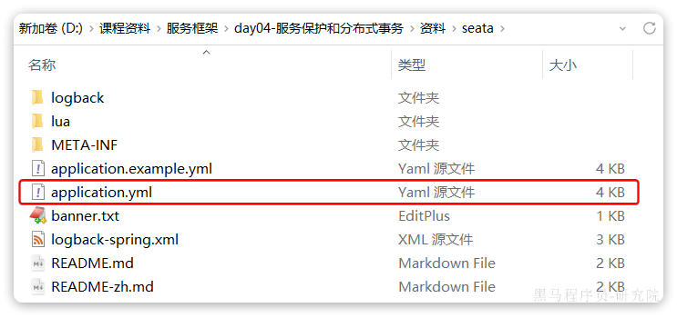

```YAML
server:
  port: 8080

spring:
  application:
    name: order-service  # 你的微服务名称
  cloud:
    alibaba:
      seata:
        tx-service-group: my_test_tx_group  # 事务群组名称，需要与Seata Server配置对应
  datasource:
    url: jdbc:mysql://localhost:3306/order_db?useUnicode=true&characterEncoding=UTF-8&serverTimezone=Asia/Shanghai
    username: root
    password: 123456
    driver-class-name: com.mysql.cj.jdbc.Driver

# Seata 配置
seata:
  enabled: true  # 是否开启Seata
  application-id: ${spring.application.name}  # 应用ID，通常使用服务名
  tx-service-group: ${spring.cloud.alibaba.seata.tx-service-group}  # 事务群组
  # 注册中心配置（这里使用nacos示例）
  registry:
    type: nacos  # 注册中心类型
    nacos:
      application: seata-server  # Seata Server在注册中心的服务名
      server-addr: 127.0.0.1:8848  # 注册中心地址
      namespace:  # 命名空间，可选
      group: SEATA_GROUP  # 分组，默认为SEATA_GROUP
      username: nacos  # 注册中心用户名
      password: nacos  # 注册中心密码
  # 配置中心配置（这里使用nacos示例）
  config:
    type: nacos  # 配置中心类型
    nacos:
      server-addr: 127.0.0.1:8848  # 配置中心地址
      namespace:  # 命名空间，可选
      group: SEATA_GROUP  # 分组，默认为SEATA_GROUP
      username: nacos  # 配置中心用户名
      password: nacos  # 配置中心密码
      data-id: seataServer.properties  # Seata配置在配置中心的数据ID
  # 客户端配置
  service:
    vgroup-mapping:
      my_test_tx_group: default  # 事务群组到Seata Server集群的映射
    enable-degrade: false  # 是否开启降级
    disable-global-transaction: false  # 是否禁用全局事务
  client:
    rm:
      report-success-enable: false  # RM报告成功是否启用
      async-commit-buffer-limit: 10000  # 异步提交缓存限制
      lock:
        retry-interval: 10  # 锁重试间隔(ms)
        retry-times: 30  # 锁重试次数
        retry-policy-branch-rollback-on-conflict: true  # 分支冲突时重试回滚
    tm:
      commit-retry-count: 5  # 提交重试次数
      rollback-retry-count: 5  # 回滚重试次数
    undo:
      data-validation: true  # 撤销日志数据验证
      log-serialization: jackson  # 撤销日志序列化方式
      log-table: undo_log  # 撤销日志表名

# MyBatis配置
mybatis:
  mapper-locations: classpath:mapper/*.xml
  configuration:
    map-underscore-to-camel-case: true

# 日志配置
logging:
  level:
    com.example: debug  # 你的项目包名
    io.seata: debug  # Seata日志级别
```

我们将整个seata文件夹拷贝到虚拟机的`/root`目录：

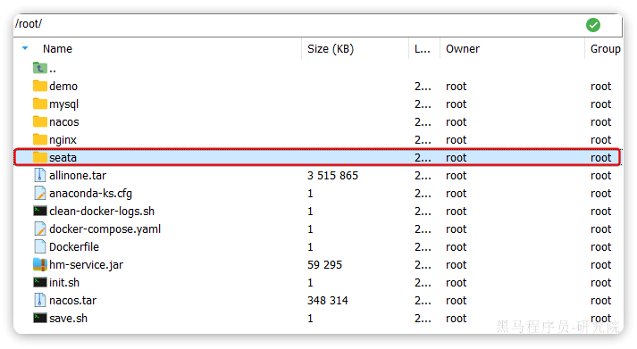


#### 2\.2\.3\.Docker部署

需要注意，要确保nacos、mysql都在hm\-net网络中。如果某个容器不再hm\-net网络，可以参考下面的命令将某容器加入指定网络：

```Shell
docker network connect [网络名] [容器名]
```

在虚拟机的`/root`目录执行下面的命令：

```Shell
docker run --name seata \
-p 8099:8099 \
-p 7099:7099 \
-e SEATA_IP=192.168.150.101 \
-v ./seata:/seata-server/resources \
--privileged=true \
--network hm-net \
-d \
seataio/seata-server:1.5.2
```

如果镜像下载困难，也可以把课前资料提供的镜像上传到虚拟机并加载：


### 微服务集成Seata

参与分布式事务的每一个微服务都需要集成Seata，我们以`trade-service`为例。

#### 2\.3\.1\.引入依赖

为了方便各个微服务集成seata，我们需要把seata配置共享到nacos，因此`trade-service`模块不仅仅要引入seata依赖，还要引入nacos依赖:

```XML
<!--统一配置管理-->
  <dependency>
      <groupId>com.alibaba.cloud</groupId>
      <artifactId>spring-cloud-starter-alibaba-nacos-config</artifactId>
  </dependency>
  <!--读取bootstrap文件-->
  <dependency>
      <groupId>org.springframework.cloud</groupId>
      <artifactId>spring-cloud-starter-bootstrap</artifactId>
  </dependency>
  <!--seata-->
  <dependency>
      <groupId>com.alibaba.cloud</groupId>
      <artifactId>spring-cloud-starter-alibaba-seata</artifactId>
  </dependency>
```

### 2\.3\.2\.改造配置

首先在nacos上添加一个共享的seata配置，命名为`shared-seata.yaml`：已经将TC服务注册为微服务在nacos里面了

```YAML
seata:
  registry: # TC服务注册中心的配置，微服务根据这些信息去注册中心获取tc服务地址
    type: nacos # 注册中心类型 nacos
    nacos:
      server-addr: 192.168.150.101:8848 # nacos地址
      namespace: "" # namespace，默认为空
      group: DEFAULT_GROUP # 分组，默认是DEFAULT_GROUP
      application: seata-server # seata服务名称
      username: nacos
      password: nacos
  tx-service-group: hmall # 事务组名称
  service:
    vgroup-mapping: # 事务组与tc集群的映射关系
      hmall: "default"
```

然后，改造`trade-service`模块，添加`bootstrap.yaml`：

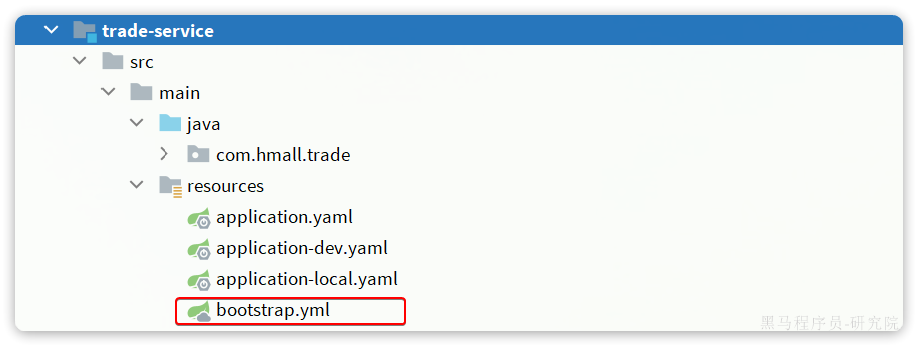

内容如下:

```YAML
spring:
  application:
    name: trade-service # 服务名称
  profiles:
    active: dev
  cloud:
    nacos:
      server-addr: 192.168.150.101 # nacos地址
      config:
        file-extension: yaml # 文件后缀名
        shared-configs: # 共享配置
          - dataId: shared-jdbc.yaml # 共享mybatis配置
          - dataId: shared-log.yaml # 共享日志配置
          - dataId: shared-swagger.yaml # 共享日志配置
          - dataId: shared-seata.yaml # 共享seata配置
```

可以看到这里加载了共享的seata配置。

然后改造application\.yaml文件，内容如下：

```YAML
server:
  port: 8085
feign:
  okhttp:
    enabled: true # 开启OKHttp连接池支持
  sentinel:
    enabled: true # 开启Feign对Sentinel的整合
hm:
  swagger:
    title: 交易服务接口文档
    package: com.hmall.trade.controller
  db:
    database: hm-trade
```

参考上述办法分别改造`hm-cart`和`hm-item`两个微服务模块。

### 2\.3\.3\.添加数据库表

seata的客户端在解决分布式事务的时候需要记录一些中间数据，保存在数据库中。因此我们要先准备一个这样的表。

将课前资料的seata\-at\.sql分别文件导入hm\-trade、hm\-cart、hm\-item三个数据库中：

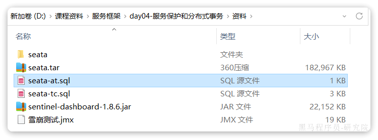

结果：

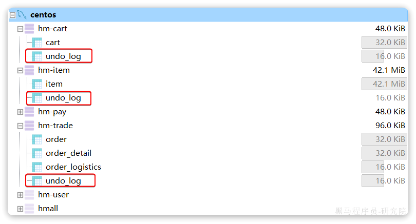

OK，至此为止，微服务整合的工作就完成了。可以参考上述方式对`hm-item`和`hm-cart`模块完成整合改造。

### 2\.3\.4\.测试

接下来就是测试的分布式事务的时候了。

我们找到`trade-service`模块下的`com.hmall.trade.service.impl.OrderServiceImpl`类中的`createOrder`方法，也就是下单业务方法。

将其上的`@Transactional`注解改为Seata提供的`@GlobalTransactional`：

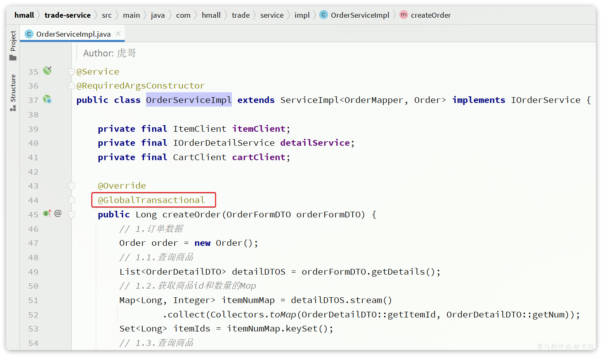

`@GlobalTransactional`注解就是在标记事务的起点，将来TM就会基于这个方法判断全局事务范围，初始化全局事务。

我们重启`trade-service`、`item-service`、`cart-service`三个服务。再次测试，发现分布式事务的问题解决了！

## 2\.4\.XA模式

Seata支持四种不同的分布式事务解决方案：

- **XA**

- **TCC**

- **AT**

- **SAGA**

这里我们以`XA`模式和`AT`模式来给大家讲解其实现原理。

`XA` 规范 是` X/Open` 组织定义的分布式事务处理（DTP，Distributed Transaction Processing）标准，XA 规范 描述了全局的`TM`与局部的`RM`之间的接口，几乎所有主流的数据库都对 XA 规范 提供了支持。

### 2\.4\.1\.两阶段提交

A是规范，目前主流数据库都实现了这种规范，实现的原理都是基于两阶段提交。

正常情况：

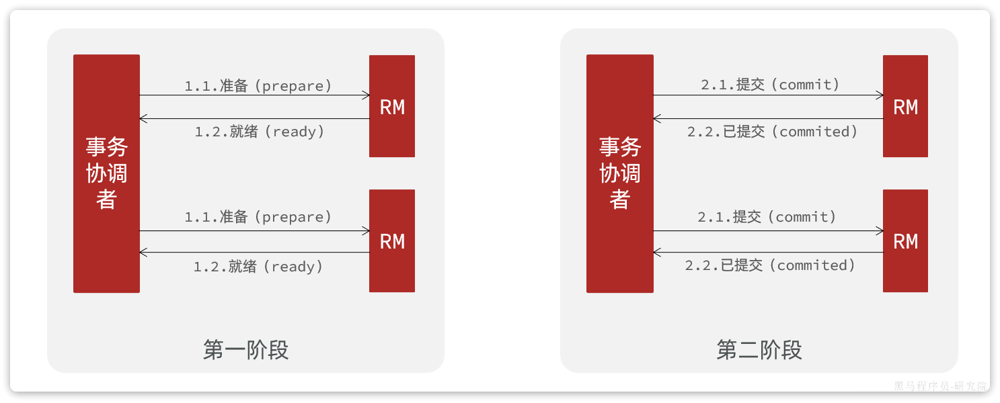

异常情况：

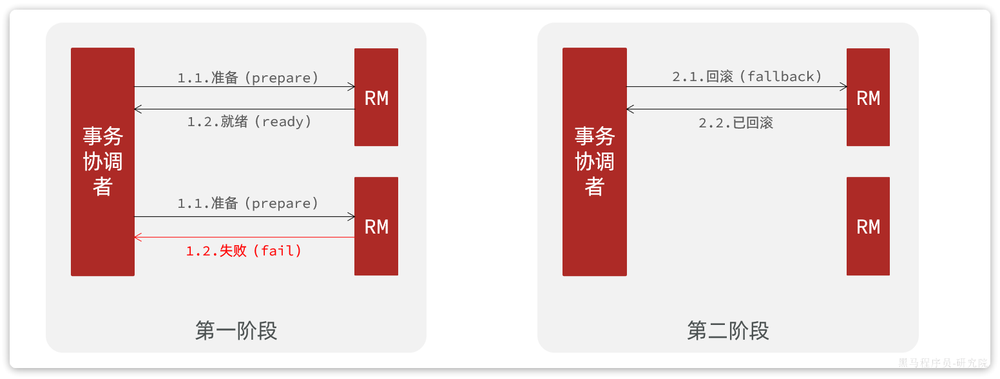

一阶段：

- 事务协调者通知每个事务参与者执行本地事务

- 本地事务执行完成后报告事务执行状态给事务协调者，此时事务不提交，继续持有数据库锁

二阶段：

- 事务协调者基于一阶段的报告来判断下一步操作

- 如果一阶段都成功，则通知所有事务参与者，提交事务

- 如果一阶段任意一个参与者失败，则通知所有事务参与者回滚事务

### 2\.4\.2\.Seata的XA模型

Seata对原始的XA模式做了简单的封装和改造，以适应自己的事务模型，基本架构如图：

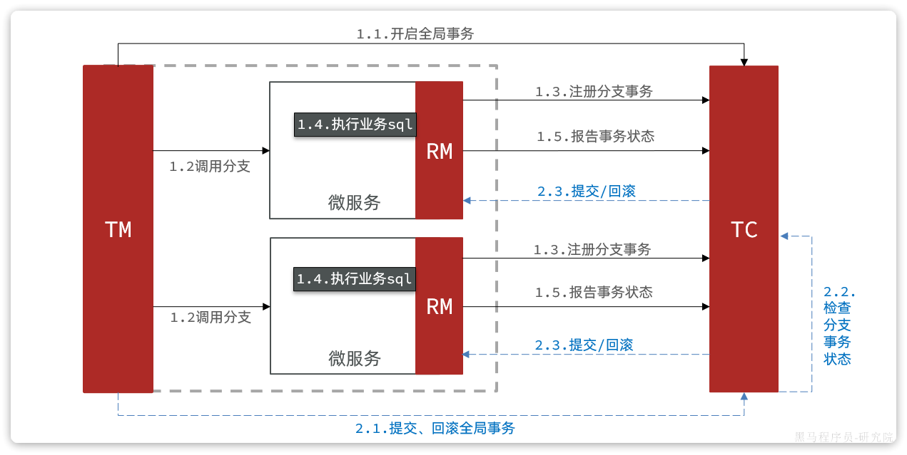

`RM`一阶段的工作：

1. 注册分支事务到`TC`

2. 执行分支业务sql但不提交

3. 报告执行状态到`TC`

`TC`二阶段的工作：

1. `TC`检测各分支事务执行状态

    1. 如果都成功，通知所有RM提交事务

    2. 如果有失败，通知所有RM回滚事务 

`RM`二阶段的工作：

- 接收`TC`指令，提交或回滚事务

### 2\.4\.3\.优缺点

`XA`模式的优点是什么？

- 事务的强一致性，满足ACID原则

- 常用数据库都支持，实现简单，并且没有代码侵入


`XA`模式的缺点是什么？

- 因为一阶段需要锁定数据库资源，等待二阶段结束才释放，性能较差

- 依赖关系型数据库实现事务

### 2\.4\.4\.实现步骤

首先，我们要在配置文件中指定要采用的分布式事务模式。我们可以在Nacos中的共享shared\-seata\.yaml配置文件中设置：

```YAML
**seata**:
  **data-source-proxy-mode**: XA
```

其次，我们要利用`@GlobalTransactional`标记分布式事务的入口方法：


## 2\.5\.AT模式

`AT`模式同样是分阶段提交的事务模型，不过缺弥补了`XA`模型中资源锁定周期过长的缺陷。

### 2\.5\.1\.Seata的AT模型

基本流程图：

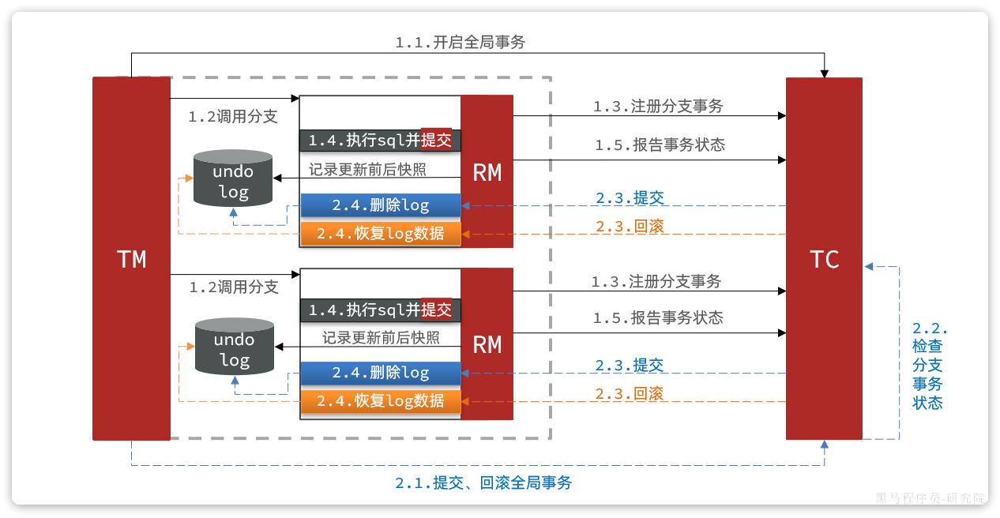

阶段一`RM`的工作：

- 注册分支事务

- 记录undo\-log（数据快照）

- 执行业务sql并提交

- 报告事务状态

阶段二提交时`RM`的工作：

- 删除undo\-log即可

阶段二回滚时`RM`的工作：

- 根据undo\-log恢复数据到更新前

### 2\.5\.2\.流程梳理

我们用一个真实的业务来梳理下AT模式的原理。

比如，现在有一个数据库表，记录用户余额：

|###### **id**|###### **money**|
|---|---|
|1|100|

其中一个分支业务要执行的SQL为：

```SQL
update tb_account set money = money - 10 where id = 1
```

AT模式下，当前分支事务执行流程如下：

**一阶段**：

1. `TM`发起并注册全局事务到`TC`

2. `TM`调用分支事务

3. 分支事务准备执行业务SQL

4. `RM`拦截业务SQL，根据where条件查询原始数据，形成快照。

```JSON
{
  "id": 1, "money": 100
}
```

1. `RM`执行业务SQL，提交本地事务，释放数据库锁。此时 money = 90

2. `RM`报告本地事务状态给`TC`

**二阶段**：

1. `TM`通知`TC`事务结束

2. `TC`检查分支事务状态

    1. 如果都成功，则立即删除快照

    2. 如果有分支事务失败，需要回滚。读取快照数据（\{"id": 1, "money": 100\}），将快照恢复到数据库。此时数据库再次恢复为100

流程图：

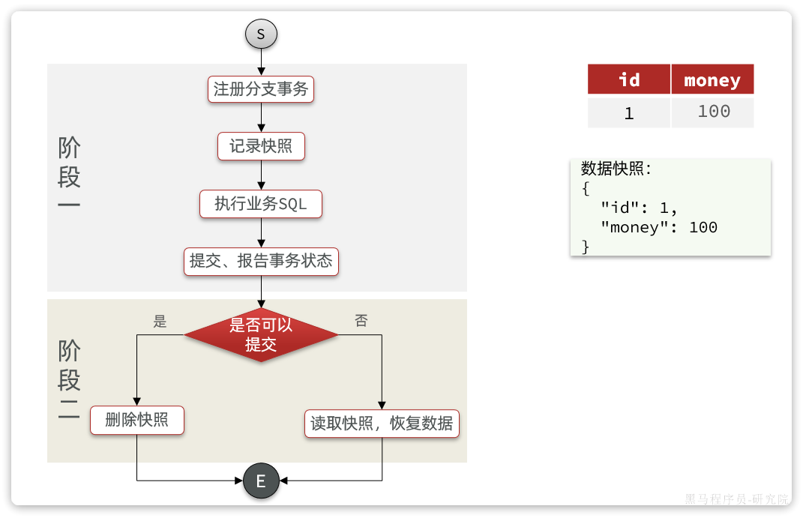

### 2\.5\.3\.AT与XA的区别

简述`AT`模式与`XA`模式最大的区别是什么？

- `XA`模式一阶段不提交事务，锁定资源；`AT`模式一阶段直接提交，不锁定资源。

- `XA`模式依赖数据库机制实现回滚；`AT`模式利用数据快照实现数据回滚。

- `XA`模式强一致；`AT`模式最终一致

可见，AT模式使用起来更加简单，无业务侵入，性能更好。因此企业90%的分布式事务都可以用AT模式来解决。

## 3\.练习

## 3\.1\.编写降级逻辑

给黑马商城中现有的FeignClient都编写对应的降级逻辑，并且改造项目中每一个微服务，将OpenFeign与Sentinel整合。

## 3\.2\.解决分布式事务

除了下单业务以外，用户如果选择余额支付，前端会将请求发送到pay\-service模块。而这个模块要做三件事情：

- 直接从user\-service模块调用接口，扣除余额付款

- 更新本地（pay\-service）交易流水表状态

- 通知交易服务（trade\-service）更新其中的业务订单状态


流程如图：

显然，这里也存在分布式事务问题。

对应的页面如下：

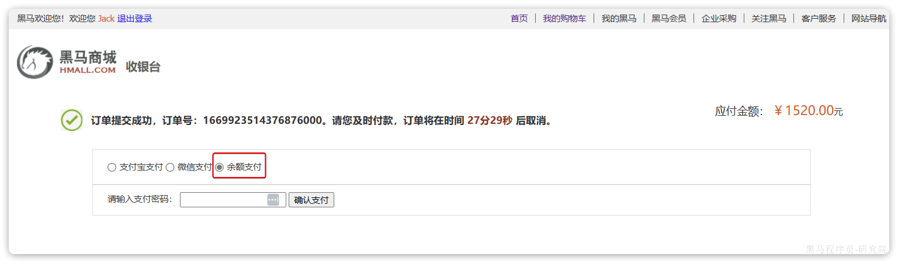

当我们提交订单成功后，进入支付页面，选择余额支付，输入密码后点击确认支付即可。

前端会提交支付请求，业务接口的入口在`com.hmall.pay.controller.PayController`类的`tryPayOrderByBalance`方法：

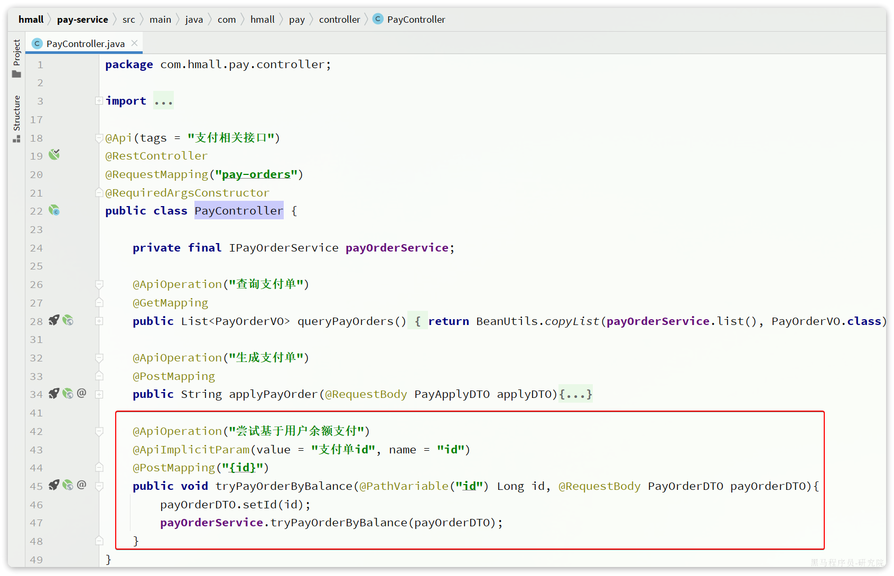

对应的service方法如下：

```Java
@Override
@Transactional
public void tryPayOrderByBalance(PayOrderDTO payOrderDTO) {
    // 1.查询支付单
    PayOrder po = getById(payOrderDTO.getId());
    // 2.判断状态
    if(!PayStatus.WAIT_BUYER_PAY.equalsValue(po.getStatus())){
        // 订单不是未支付，状态异常
        throw new BizIllegalException("交易已支付或关闭！");
    }
    // 3.尝试扣减余额
    userClient.deductMoney(payOrderDTO.getPw(), po.getAmount());
    // 4.修改支付单状态
    boolean success = markPayOrderSuccess(payOrderDTO.getId(), LocalDateTime.now());
    if (!success) {
        throw new BizIllegalException("交易已支付或关闭！");
    }
    // 5.修改订单状态
    tradeClient.markOrderPaySuccess(po.getBizOrderNo());
}
```

利用seata解决这里的分布式事务问题，并思考这个业务实现有没有什么值得改进的地方

# 订单状态管理：引入**状态机模式**对复杂的订单状态流转进行重构，将原本分散的条件判断转变为清晰的状态转移图，极大地**降低了代码复杂度**并避免了**非法状态转换**。

## 1\.1 什么是状态机

目标：能说出什么是状态机

### 1）**当前存在的问题**

在预约下单模块设计订单状态共有7种，如下图：

待支付：用户下单成功，该订单的初始状态为待支付。

派单中：用户支付成功后订单的状态由待支付变为派单中。

待服务：服务人员或机构抢单成功订单的状态由派单中变为待服务。

服务中：服务人员开始服务，订单状态变为服务中。

订单完成：服务人员完成服务，订单状态变为订单完成。

已取消：订单是待支付状态时用户取消订单，订单状态变为已取消。

已关闭：订单已支付状态下取消订单后订单状态变为已关闭。

目前我们使用了待支付、派单中两种状态，在代码中我们发现存在对订单状态进行硬编码的情况：

```Java
public void paySuccess(TradeStatusMsg tradeStatusMsg) {
  ...
  //订单状态为待支付时当支付成功更新为派单中
    if (ObjectUtil.equal(0, orders.getOrdersStatus())) {
       ...
    }

}
```

随着开发的深入这种代码会越来越多，比如在实现对订单进行关闭时代码会写成如下的形式：

```Java
1
  //运营人员在订单完成时取消订单
  //执行此场景下的业务逻辑
  //更新订单状态为派单中
  update(id,已关闭)
)
if(订单状态==服务中){
  //运营人员在服务中时取消订单
  //执行此场景下的业务逻辑
  //更新订单状态为已关闭
  update(id,已关闭)
)
...
```

以上代码存在问题如下：

**在业务代码中对订单状态进行硬编码如果有一天更改了业务逻辑就需要更改代码，不方便进行系统扩展和维护。**

**另外对订单状态的管理是散落在很多地方不方便对订单状态进行统一管理和维护。**

### 第一部分：为什么硬编码订单状态不利于维护？

假设我们有一个订单，它有多种状态：`待支付`、`已支付`、`已发货`、`已完成`、`已取消`、`退款中`等。

如果采用硬编码（通常在 `if...else` 或 `switch` 中直接写死状态判断逻辑），代码可能会散落在各个服务方法中，如下所示：

```TypeScript
// 订单服务 OrderService.java
public class OrderService {

    public void pay(Order order) {
        if (!"待支付".equals(order.getStatus())) {
            throw new RuntimeException("只有待支付的订单才能支付");
        }
        // ...支付逻辑
        order.setStatus("已支付");
    }

    public void deliver(Order order) {
        // 问题1：逻辑重复且可能不一致
        if (!"已支付".equals(order.getStatus())) {
            throw new RuntimeException("只有已支付的订单才能发货");
        }
        // ...发货逻辑
        order.setStatus("已发货");
    }

    public void cancel(Order order) {
        // 问题2：取消逻辑非常复杂，需要判断当前状态
        if ("已支付".equals(order.getStatus()) || "待支付".equals(order.getStatus())) {
            // ...执行取消逻辑
            order.setStatus("已取消");
        } else if ("已发货".equals(order.getStatus())) {
            // 需要联系客户拒收，并走退款流程
            // ...一长串复杂的逻辑
            order.setStatus("退款中");
        } else {
            throw new RuntimeException("当前状态无法取消订单");
        }
    }

    // 其他方法：confirmReceipt(确认收货), applyRefund(申请退款)等等...
    // 每个方法里都充满了关于当前状态的判断
}
```

这种方式的弊端非常明显：

1. 代码臃肿，重复代码多：每个业务方法（`pay`, `deliver`, `cancel`）都需要检查当前状态是否允许执行该操作。这些检查逻辑会散落在代码的各个角落，充斥着大量的 `if-else` 语句。

2. 逻辑不一致和错误风险高：由于规则是散落的，很容易在添加新功能时导致逻辑不一致。例如，可能在 `cancel` 方法里允许从“待支付”取消，但在另一个地方却忘了这个规则。

3. 可读性差，业务逻辑模糊：核心的业务逻辑（如何支付、如何发货）与状态控制逻辑（什么状态下能做什么）纠缠在一起，难以阅读和理解。新同事需要翻阅所有方法才能理清整个状态流转图。

4. 难以扩展和修改：这是最大的问题。假设产品经理提出一个新需求：“支持用户在一定时间内仅退款不退货”。这意味着你要：

    - 添加一个新状态 `仅退款中`。

    - 找到所有涉及退款和状态判断的地方（`cancel`, `refund` 等方法），小心翼翼地修改 `if-else` 条件，加入对新状态的处理。

    - 这个过程极易引入 bug，可能改了一个地方忘了另一个地方，导致状态流转出现漏洞。

5. 违反开闭原则（Open\-Closed Principle）：实体（类、模块、函数）应该对扩展开放，对修改关闭。每次添加新状态，你都需要修改现有的多个方法，而不是扩展它们。

### 2\) **使用状态机解决问题**

针对以上问题如何解决呢？

我们可以使用状态机对订单状态进行统一管理。

**什么是状态机？**

上图在UML中叫状态图（又叫状态机图），UML是软件开发中的一种建模语言，用来辅助进行软件设计，常用的如：类图、对象、状态图、序列图等，注意状态机图并不是状态机，**状态机是一种数学模型，应用在自动化控制、计算机科学、通信等很多领域，简单理解****状态机就是对状态进行统一管理的数学模型****。**

**我们画的状态图是状态机在计算机科学中的应用方法，还有状态机设计模式也是状态机在软件领域的应用方法。**

**状态机设计模式**是状态机在软件中的应用，状态机设计模式描述了一个对象在内部状态发生变化时如何改变其行为，将状态之间的变更定义为事件，将事件暴露出去，通过执行状态变更事件去更改状态，这是状态机设计模式的核心内容。

**理解状态机设计模式需要理解四个要素：现态、事件、动作、次态。**

（参考地址：https://baike\.baidu\.com/item/%E7%8A%B6%E6%80%81%E6%9C%BA/6548513?fr=ge\_ala ）

1、**现态**：是指当前所处的状态。

2、**事件**：当一个条件被满足，状态会由现态变为新的状态，事件发生会触发一个动作，或者执行一次状态的迁移。比如支付   待支付\-派单中  支付是事件

3、**动作**：发生事件执行的动作，动作执行完毕后，可以迁移到新的状态，也可以仍旧保持原状态。动作不是必需的，当条件满足后，也可以不执行任何动作，直接迁移到新状态。比如支付   待支付\-派单中   待支付\-派单中 （动作）

4、**次态**：条件满足后要迁往的新状态。比如支付   待支付\-派单中   待支付\-派单中  派单中（次态）

我们拿待支付状态到派单中状态举例：


**现态**：订单当前处于待支付状态那么现态为待支付。

**事件**：用户支付成功为事件，支付成功是条件，当条件满足进行状态迁移。

**动作**：将订单状态由待支付更改为派单中。

**次态**：派单中。

**使用状态机优化代码：**

使用状态机之后对代码进行以下优化。

支付成功更改订单状态的代码优化如下：

```Java
if(支付状态==支付成功){
    //调用状态机执行支付成功事件
    orderStateMachine.changeStatus(id,支付成功事件);
    //避免硬编码
    如果改了这个代码不需要-只需要变的就是事件里面具体的操作
}
```

订单取消的代码优化如下：

```Java
orderStateMachine.changeStatus(id,订单完成时取消订单事件);

```

我们发现使用状态机的代码并没有对订单状态进行硬编码，只是指定了订单id和事件名称，执行changeStatus方法后自动更改订单的状态。

### 3）**小结**

什么是状态机，它解决了什么问题？

状态机四个要素

**状态机就是对状态进行统一管理的数学模型**

状态机设计模式描述了一个对象在内部状态发生变化时如何改变其行为，将状态之间的变更定义为事件，将事件暴露出去，通过执行状态变更事件去更改状态

## 1\.2 实现订单状态机

### 1\.2\.1 编写订单状态机

目标：

能够基于状态机组件实现订单状态机

#### 1\) 添加状态机组件依赖

本项目基于状态机设计模式开发了状态机组件，代码在jzo2o\-framework中，如果在订单管理服务中实现订单状态机需要添加状态机的依赖。

在jzo2o\-orders\-base工程的pom\.xml中添加状态机组件的依赖

```XML
<dependency>
    <groupId>com.jzo2o</groupId>
    <artifactId>jzo2o-statemachine</artifactId>
    <version>1.0-SNAPSHOT</version>
</dependency>
```

添加完成刷新pom\.xml


下边使用状态机组件管理订单状态。

#### 2）**订单状态枚举类**

阅读订单状态枚举类，它实现了StatusDefine 状态接口，不论是现态还是次态都需要实现状态接口。

定义每个枚举需要注意见名知意，比如：NO\_PAY\(0, "待支付", "NO\_PAY"\)表示待支付状态。

订单状态枚举类如下：

```Java
package com.jzo2o.orders.base.enums;

import com.jzo2o.statemachine.core.StatusDefine;
import lombok.AllArgsConstructor;
import lombok.Getter;

/**
 * @author itcast
 */
@Getter
@AllArgsConstructor
public enum OrderStatusEnum implements StatusDefine {
    NO_PAY(0, "待支付", "NO_PAY"),
    DISPATCHING(100, "派单中", "DISPATCHING"),
    NO_SERVE(200, "待服务", "NO_SERVE"),
    SERVING(300, "服务中", "SERVING"),
    FINISHED(500, "已完成", "FINISHED"),
    CANCELED(600, "已取消", "CANCELED"),
    CLOSED(700, "已关闭", "CLOSED");

    private final Integer status;
    private final String desc;
    private final String code;

    /**
     * 根据状态值获得对应枚举
     *
     * @param status 状态
     * @return 状态对应枚举
     */
    public static OrderStatusEnum codeOf(Integer status) {
        for (OrderStatusEnum orderStatusEnum : values()) {
            if (orderStatusEnum.status.equals(status)) {
                return orderStatusEnum;
            }
        }
        return null;
    }
}
```

#### 3）**状态变更事件枚举类**

所有状态之间存在的变更都需要定义状态变更事件，它实现了StatusChangeEvent 状态变更事件接口，事件对应状态机四要素的事件

代码如下，重点看PAYED：

PAYED\(OrderStatusEnum\.NO\_PAY, OrderStatusEnum\.DISPATCHING, "支付成功", "payed"\)表示由NO\_PAY（未支付）状态变化为DISPATCHING（派单中）状态，事件名称为“支付成功”\(payed\)。

```Java
package com.jzo2o.orders.base.enums;

import com.jzo2o.statemachine.core.StatusChangeEvent;
import lombok.AllArgsConstructor;
import lombok.Getter;

/**
 * @author itcast
 */
@Getter
@AllArgsConstructor
public enum OrderStatusChangeEventEnum implements StatusChangeEvent {
   参数意思- 源状态-目标状态-描述-代码
    *PAYED*(OrderStatusEnum.*NO_PAY*, OrderStatusEnum.*DISPATCHING*, "支付成功", "payed"),
    *DISPATCH*(OrderStatusEnum.*DISPATCHING*, OrderStatusEnum.*NO_SERVE*, "接单/抢单成功", "dispatch"),
    *START_SERVE*(OrderStatusEnum.*NO_SERVE*, OrderStatusEnum.*SERVING*, "开始服务", "start_serve"),
    *COMPLETE_SERVE*(OrderStatusEnum.*SERVING*, OrderStatusEnum.*FINISHED*, "完成服务", "complete_serve"),
*//    EVALUATE(OrderStatusEnum.NO_EVALUATION, OrderStatusEnum.FINISHED, "评价完成", "evaluate"),*
*    CANCEL*(OrderStatusEnum.*NO_PAY*, OrderStatusEnum.*CANCELED*, "取消订单", "cancel"),
    *SERVE_PROVIDER_CANCEL*(OrderStatusEnum.*NO_SERVE*, OrderStatusEnum.*DISPATCHING*, "服务人员/机构取消订单", "serve_provider_cancel"),
    *CLOSE_DISPATCHING_ORDER*(OrderStatusEnum.*DISPATCHING*, OrderStatusEnum.*CLOSED*, "派单中订单关闭", "close_dispatching_order"),
    *CLOSE_NO_SERVE_ORDER*(OrderStatusEnum.*NO_SERVE*, OrderStatusEnum.*CLOSED*, "待服务订单关闭", "close_no_serve_order"),
    *CLOSE_SERVING_ORDER*(OrderStatusEnum.*SERVING*, OrderStatusEnum.*CLOSED*, "服务中订单关闭", "close_serving_order"),
*//    CLOSE_NO_EVALUATION_ORDER(OrderStatusEnum.NO_EVALUATION, OrderStatusEnum.CLOSED, "待评价订单关闭", "close_no_evaluation_order"),*
*    CLOSE_FINISHED_ORDER*(OrderStatusEnum.*FINISHED*, OrderStatusEnum.*CLOSED*, "已完成订单关闭", "close_finished_order");
    /**
     * 源状态
     */
    private final OrderStatusEnum sourceStatus;

    /**
     * 目标状态
     */
    private final OrderStatusEnum targetStatus;

    /**
     * 描述
     */
    private final String desc;

    /**
     * 代码
     */
    private final String code;
}
```

#### 4）**定义订单快照类**

快照是订单变化瞬间的状态及相关信息。

比如：001号订单创建成功此时记录它的快照信息（订单号、下单人、订单详细信息、订单状态等），当001号订单支付成功由待支付状态变化为派单中状态此时也会记录它的快照信息（订单号、下单人、支付状态、支付相关信息，订单状态等相关信息），由此可以看出订单快照可以追溯订单的历史变化信息，只要状态发生变化便会记录快照。

快照基础类型是StateMachineSnapshot，如果我们要实现订单快照则需要定义一个订单快照类OrderSnapshotDTO 去继承StateMachineSnapshot类型，代码如下：

```Java
public class OrderSnapshotDTO extends StateMachineSnapshot {
    // ... 原有订单的各种属性 (id, status, 金额、时间等) ...
    private Long id;
    private Integer ordersStatus;
    private BigDecimal amount;
    private LocalDateTime createTime;
    // ... 其他字段 ...

    // 获取快照的唯一标识。框架用这个来关联快照和具体的业务实体（订单）。
    @Override
    public String getSnapshotId() {
        // 将订单的 Long 类型 id 转换为 String 类型返回。
        // 这是框架要求的标识格式，通常是String以便更灵活。
        return String.valueOf(id);
    }

    // 获取快照的当前状态。框架需要知道状态机当前处于哪个状态。
    @Override
    public Integer getSnapshotStatus() {
        // 返回订单的当前状态码（ordersStatus）。
        return ordersStatus;
    }

    // 当框架从持久化存储（如数据库）加载快照数据时，会调用此方法来设置业务实体的ID。
    @Override
    public void setSnapshotId(String snapshotId) {
        // 将框架传来的 String 类型的 snapshotId 转换回 Long 类型，并设置到订单的 id 字段。
        this.id = Long.parseLong(snapshotId);
    }

    // 当框架从持久化存储加载快照数据时，会调用此方法来设置状态机的当前状态。
    @Override
    public void setSnapshotStatus(Integer snapshotStatus) {
        // 将框架传来的状态码（snapshotStatus）设置到订单的 ordersStatus 字段。
        this.ordersStatus = snapshotStatus;
    }
}
```

#### 5）定义事件变更动作类

当执行状态变更事件会伴随着执行具体的动作，此部分对应状态机四要素中的动作。

定义订单支付成功动作类，实现StatusChangeHandler接口，泛型中指定快照类型。

此动作是订单支付成功执行的动作。

动作类的bean名称为"状态机名称\_事件名称"，例如下边的动作类bean的名称为order\_payed，表示order状态机的payed事件。 

```Java

/**
 * 订单支付成功处理器
 *
 * @author itcast
 * @create 2023/8/17 18:08
 **/
@Slf4j
@Component("order_payed")
bean的名称规则  状态机名称_事件名称（就是最后的枚举编码）
状态机名称在OrderStateMachine （订单状态机类中指定）
bean名称只能这样
后面看底层源码的时候
他是通过bean的名称
来获取类-调用该类的handler方法
public class OrderPayedHandler implements StatusChangeHandler<OrderSnapshotDTO> {
    @Resource
    private IOrdersCommonService ordersService;

    /**
     * 订单支付处理逻辑
     *
     * @param bizId   业务id
     * @param bizSnapshot 快照
     */
    @Override
    public void handler(String bizId, StatusChangeEvent statusChangeEventEnum, OrderSnapshotDTO bizSnapshot) {
        log.info("支付成功事件处理逻辑开始，订单号：{}", bizId);
        
    }


}
```

#### 6）**定义订单状态机类**

AbstractStateMachine状态机抽象类是状态机的核心类，是具体的状态机要继承的抽象类，比如我们实现订单状态机就需要继承AbstractStateMachine抽象类。

**成员变量**：

初始状态：设置初始状态，比如订单的初始状态为待支付。

状态机名称：返回的状态机的标识，比如订单状态机返回“order”作为订单状态机的名称。

**方法**：

返回状态机名称：返回状态机的名称

返回初始状态：返回初始状态

启动状态机：开始进行状态机管理，通常在新建实例时调用此方法，比如：新建一个订单调用此方法将订单状态设置为初始状态，传入参数：业务主键（如订单id）

变更状态：调用此方法更改状态

后处理方法：当状态变更后统一执行的逻辑。

下边定义订单状态机类继承此抽象类，代码如下：

```Java
package com.jzo2o.orders.base.config;


/**
 * 订单状态机
 *
 * @author itcast
 * @create 2023/8/4 11:20
 **/
@Component
public class OrderStateMachine extends AbstractStateMachine<OrderSnapshotDTO> {

 
    public OrderStateMachine(StateMachinePersister stateMachinePersister, BizSnapshotService bizSnapshotService, RedisTemplate redisTemplate) {
        super(stateMachinePersister, bizSnapshotService, redisTemplate);
    }

    /**
     * 设置状态机名称
     *
     * @return 状态机名称
     */
    @Override
    protected String getName() {
        return "order";
    }

    @Override
    protected void postProcessor(OrderSnapshotDTO orderSnapshotDTO) {

    }

    /**
     * 设置状态机初始状态
     *
     * @return 状态机初始状态
     */
    @Override
    protected OrderStatusEnum getInitState() {
        return OrderStatusEnum.NO_PAY;
    }

}
```

#### 7）**状态机表设计**

状态机使用MySQL对状态进行持久化，涉及到如下表：

**状态机持久化表**：

每个订单对应状态机表中的一条记录。

state\_machine\_name ：针对订单的状态机起个名称叫order，针对服务单的状态机可以起个名称为serve。

biz\_id：存储订单id

state：记录该订单的当前状态

```Java
create table `jzo2o-orders`.state_persister
(
    id                 bigint auto_increment comment '主键'
        constraint `PRIMARY`
        primary key,
    state_machine_name varchar(255)                       null comment '状态机名称',
    biz_id             varchar(255)                       null comment '业务id',
    state              varchar(255)                       null comment '状态',
    create_time        datetime default CURRENT_TIMESTAMP null comment '创建时间',
    update_time        datetime default CURRENT_TIMESTAMP null on update CURRENT_TIMESTAMP comment '更新时间',
    constraint 唯一索引
        unique (state_machine_name, biz_id)
)
    comment '状态机持久化表' charset = utf8mb4;
```

**状态机快照表**：

一个订单在快照表有多条记录，每变一个状态会记录该状态下的快照信息（即订单相关的详细信息）便于查询订单变化的历史记录。

state\_machine\_name ：同上

biz\_id ：同上

db\_shard\_id：暂时用不到

state：对应快照的状态

biz\_data：快照信息（json格式），用在订单状态机就是记录订单相关的信息。

```Java
create table `jzo2o-orders`.biz_snapshot
(
    id                 bigint auto_increment comment '主键'
        constraint `PRIMARY`
        primary key,
    state_machine_name varchar(50)                        null comment '状态机名称',
    biz_id             varchar(50)                        null comment '业务id',
    db_shard_id        bigint                             null comment '分库键',
    state              varchar(50)                        null comment '状态代码',
    biz_data           varchar(5000)                      null comment '业务数据',
    create_time        datetime default CURRENT_TIMESTAMP not null comment '创建时间',
    update_time        datetime default CURRENT_TIMESTAMP not null on update CURRENT_TIMESTAMP comment '更新时间'
)
    comment '业务数据快照' charset = utf8mb4;
```


#### 8）**小结**

如何实现一个订单状态机？


### 1\.2\.2 测试订单状态机

目标：

测试状态机的方法实现订单状态变更。

能说出如何实现一个订单状态机。


#### 1\) 加载订单状态机

在orders\-base工程的AutoImportConfiguration类中配置导入订单状态机。


#### 2）**测试启动状态机**

下边在jzo2o\-orders\-manager下编写测试代码。

调用OrderStateMachine的start\(\)方法启动一个订单的状态机，启动状态机表示订单用状态机管理状态，启动状态机后会设置订单的初始状态。

```Java
package com.jzo2o.orders.manager.service;

import com.baomidou.mybatisplus.core.conditions.query.LambdaQueryWrapper;
import com.jzo2o.orders.base.config.OrderStateMachine;
import com.jzo2o.orders.base.model.domain.Orders;
import lombok.extern.slf4j.Slf4j;
import org.junit.jupiter.api.Test;
import org.springframework.boot.test.context.SpringBootTest;

import javax.annotation.Resource;
import java.util.List;

@SpringBootTest
@Slf4j
public class OrderStateMachineTest {

    @Resource
    private OrderStateMachine orderStateMachine;

    @Test
    public void test_start() {
        //启动状态机，指定订单id
        String start = orderStateMachine.start("101");
        log.info("返回初始状态:{}", start);
    }
}
```

执行测试方法，对101订单启动状态机管理，启动后101号订单的状态为NO\_PAY待支付状态。


观察state\_persister表有一条101号订单的状态持久化记录，每条订单对应state\_persister表的一条记录。

观察biz\_snapshot表有一条101号订单的快照信息，一条订单在biz\_snapshot表对应多个条记录，每次订单状态变更都会产生一个快照。

注意：如果报错：“java\.lang\.IllegalStateException: 已存在状态，不可初始化”  ，说明101号订单的状态机已启动，可以更改101测试其它订单状态机启动。


#### 3）**测试状态变更方法**

根据状态变更事件定义可知，执行测试方法后101订单的状态由NO\_PAY（待支付）变更为DISPATCHING（派单中）。

定义测试方法

```Java
@Test
public void test_changeStatus() {
    //状态变更
    参数-订单id-事件名称
    orderStateMachine.changeStatus("101",OrderStatusChangeEventEnum.PAYED);
}
```

执行此方法，预期结果：

state\_persister表中101订单的状态变更为DISPATCHING。

biz\_snapshot表多了一条101号订单的快照信息。

观察输出日志，如果输出“支付事件处理逻辑开始，订单号\.\.\.”表示此处理器已正常执行。

下边对102号订单进行状态机管理

```Java
@Test
public void test_orderStatMmachine() {
    //启动状态机
    String start = orderStateMachine.start("102");
    //状态变更
    orderStateMachine.changeStatus("102",OrderStatusChangeEventEnum.PAYED);
}
```

执行测试：

1）观察状态机持久化表是否有102订单的状态记录。

2）观察快照表是否有102订单的记录。

3）观察控制台，状态变更处理器的执行信息是否输出，有输出说明处理器已执行


#### 4）阅读源码

进入jzo2o\-framework下的jzo2o\-statemachine工程，阅读AbstractStateMachine类的源码，通过阅读代码理解状态机组件的运行过程。

阅读启动状态机方法：

首先判断该订单是否启动状态，如果没有启动则向状态机表插入记录，否则抛出异常"已存在状态，不可初始化"\.

接下来保存订单快照。

```JSON
*/***
* * 状态机初始化,不保存快照*
* **
* * @param bizId 业务id*
* * @return 初始化状态代码*
* */*
public String start(String bizId) {
    return start(null, bizId, initState, null);
}

*/***
* * 启动状态机，并设置当前状态和保存业务快照，快照分库分表*
* **
* * @param dbShardId    分库键*
* * @param bizId        业务id*
* * @param statusDefine 当前状态*
* * @param bizSnapshot  快照*
* * @return 当前状态代码*
* */*
public String start(Long dbShardId, String bizId, StatusDefine statusDefine, T bizSnapshot) {

    *//1.初始化状态机状态*
*    *String currentState = stateMachinePersister.getCurrentState(name, bizId);
    if (ObjectUtil.*isEmpty*(currentState)) {
        stateMachinePersister.init(name, bizId, statusDefine);
    } else {
        throw new IllegalStateException("已存在状态，不可初始化");
    }

    *//2.保存业务快照*
*    *if (bizSnapshot == null) {
        bizSnapshot = ReflectUtil.*newInstance*(getSnapshotClass());
    }
    *//设置快照id*
*    *bizSnapshot.setSnapshotId(bizId);
    *//设置快照状态*
*    *bizSnapshot.setSnapshotStatus(statusDefine.getStatus());
    *//快照转json*
*    *String bizSnapshotString = JSONUtil.*toJsonStr*(bizSnapshot);
    if (ObjectUtil.*isNotEmpty*(bizSnapshot)) {
        bizSnapshotService.save(dbShardId, name, bizId, statusDefine, bizSnapshotString);
    }
    *//执行后处理方法*
*    *postProcessor(bizSnapshot);

    return statusDefine.getCode();
}
```

阅读状态变更方法：

状态变更前会判断订单的当前状态是否和事件定义的源状态一致，如果不一致则说明当前订单的状态不能通过该事件去更新状态，此时将终止状态变更，否则将通过状态变更处理器更新订单的状态。

```JSON
*/***
* * 变更状态并保存快照，快照不进行分库*
* **
* * @param bizId                 业务id*
* * @param statusChangeEventEnum 状态变换事件*
* */*
public void changeStatus(String bizId, StatusChangeEvent statusChangeEventEnum) {
    changeStatus(null, bizId, statusChangeEventEnum, null);
}
*/***
* * 变更状态并保存快照，快照分库分表*
* **
* * @param dbShardId             分库键*
* * @param bizId                 业务id*
* * @param statusChangeEventEnum 状态变换事件*
* * @param bizSnapshot           业务数据快照（json格式）*
* */*
public void changeStatus(Long dbShardId, String bizId, StatusChangeEvent statusChangeEventEnum, T bizSnapshot) {
    *//1.查询当前状态*
*    *String statusCode = getCurrentState(bizId);

    *//2.校验起止状态是否与事件匹配*
*    *if (ObjectUtil.*isNotEmpty*(statusChangeEventEnum.getSourceStatus()) && ObjectUtil.*notEqual*(statusChangeEventEnum.getSourceStatus().getCode(), statusCode)) {
        throw new CommonException(*HTTP_INTERNAL_ERROR*, "状态机起止状态与事件不匹配");
    }

    *//3.获取状态处理程序bean*
*    //事件代码*
*    *String eventCode = statusChangeEventEnum.getCode();
    StatusChangeHandler bean = null;
    try {
        bean = SpringUtil.*getBean*(name + "_" + eventCode, StatusChangeHandler.class);
    } catch (Exception e) {
        *log*.info("不存在‘{}’StatusChangeHandler", name + "_" + eventCode);
    }
    if (bizSnapshot == null) {
        bizSnapshot = ReflectUtil.*newInstance*(getSnapshotClass());
    }
    *//设置快照id*
*    *bizSnapshot.setSnapshotId(bizId);
    *//设置目标状态*
*    *bizSnapshot.setSnapshotStatus(statusChangeEventEnum.getTargetStatus().getStatus());
    if (ObjectUtil.*isNotNull*(bean)) {
        *//4.执行状态变更*
*       ** *bean.handler(bizId, statusChangeEventEnum, bizSnapshot);
    }

    *//5.状态持久化*
*    *stateMachinePersister.persist(name, bizId, statusChangeEventEnum.getTargetStatus());

    *//6、存储快照*
*    *if (ObjectUtil.*isNotEmpty*(bizSnapshot)) {
        *//构建新的快照信息*
*        *bizSnapshot = buildNewSnapshot(bizId, bizSnapshot, statusChangeEventEnum.getSourceStatus());
        String newBizSnapShotString = JSONUtil.*toJsonStr*(bizSnapshot);
        bizSnapshotService.save(dbShardId, name, bizId, statusChangeEventEnum.getTargetStatus(), newBizSnapShotString);
    }

    *//7.清理快照缓存*
*    *String key = "JZ_STATE_MACHINE:" + name + ":" + bizId;
    redisTemplate.delete(key);

    *//执行后处理方法*
*    *postProcessor(bizSnapshot);
}
```


#### 5）**小结**

本节测试了状态机的两个方法：

1. 启动状态机

启动状态机表示开始用状态机管理状态，并且设置初始状态。

2. 状态变更

使用状态机进行状态变更只需要指定状态变更事件即可不在业务代码中硬编码。

能说出如何实现一个订单状态机。


### 1\.2\.3 使用订单状态机

目标：

下单时使用状态机

在支付成功时使用状态机

#### 1）**下单时启动状态机**

下单后创建一个新订单，使用状态机的启动方法表示用状态机对该订单的状态开始进行管理。

首先在OrdersCreateServiceImpl中注入状态机：

```Java
@Resource
private OrderStateMachine orderStateMachine;
```

代码如下：

```Java
@Transactional(rollbackFor = Exception.class)
public void add(Orders orders) {
    boolean save = this.save(orders);
    if (!save) {
        throw new DbRuntimeException("下单失败");
    }
   //构建快照对象
    OrderSnapshotDTO orderSnapshotDTO = BeanUtil.toBean(baseMapper.selectById(orders.getId()), OrderSnapshotDTO.class);
    //状态机启动
    orderStateMachine.start(null,String.*valueOf*(orders.getId()),orderSnapshotDTO);
}
```

**注意：状态机的操作方法放在业务方法中且和业务方法处于一个事务中。**

#### 2）**支付成功使用状态机**

支付成功通过状态机将订单状态由待支付更新派单中。

1. **定义状态变更动作类**

在动作类中更新订单的状态，在动作类中更新订单的状态要比在多处业务代码中对订单状态硬编码要强的多，因为可以在动作类中统一对订单状态进行管理。

除了更新订单状态以外还需要填充订单快照的相关信息，这里主要是支付相关的信息，包括：支付状态、支付时间、支付服务的交易单号、第三方支付的交易单号等。

代码如下：

注意动作类的bean名称规则是：状态机名称\_事件名称

order\_payed：状态机名称为order，中间用“\_”分隔，payed为状态变更事件名称（从OrderStatusChangeEventEnum中查找）

```Java
/**
 * 订单支付成功处理器
 *
 * @author itcast
 * @create 2023/8/17 18:08
 **/
@Slf4j
@Component("order_payed")
public class OrderPayedHandler implements StatusChangeHandler<OrderSnapshotDTO> {
    @Resource
    private IOrdersCommonService ordersService;

    /**
     * 订单支付处理逻辑
     *
     * @param bizId   业务id
     * @param statusChangeEventEnum   状态变更事件
     * @param bizSnapshot 快照
     */
    @Override
    public void handler(String bizId, StatusChangeEvent statusChangeEventEnum, OrderSnapshotDTO bizSnapshot) {
        log.info("支付成功事件处理逻辑开始，订单号：{}", bizId);
        // 修改订单状态和支付状态
        OrderUpdateStatusDTO orderUpdateStatusDTO = OrderUpdateStatusDTO.builder().id(Long.valueOf(bizId))
                .originStatus(OrderStatusEnum.NO_PAY.getStatus())
                .targetStatus(OrderStatusEnum.DISPATCHING.getStatus())
                .payStatus(OrderPayStatusEnum.PAY_SUCCESS.getStatus())
                .payTime(bizSnapshot.getPayTime())
                .tradingOrderNo(bizSnapshot.getTradingOrderNo())
                .transactionId(bizSnapshot.getThirdOrderId())
                .tradingChannel(bizSnapshot.getTradingChannel())
                .build();
        int result = ordersService.updateStatus(orderUpdateStatusDTO);
        if (result <= 0) {
            throw new DbRuntimeException("支付事件处理失败");
        }
    }


}
```


2. **在支付成功方法中使用状态机**

使用状态机执行支付成功状态变更。

```Java
@Transactional(rollbackFor = Exception.class)
public void paySuccess(TradeStatusMsg tradeStatusMsg) {
    //查询订单
    Orders orders = baseMapper.selectById(tradeStatusMsg.getProductOrderNo());

    //2：待支付，4：支付成功
    if (ObjectUtil.notEqual(OrderPayStatusEnum.NO_PAY.getStatus(), orders.getPayStatus())) {
        log.info("当前订单：{}，不是待支付状态", orders.getId());
        return;
    }

    //第三方支付单号校验
    if (ObjectUtil.isEmpty(tradeStatusMsg.getTransactionId())) {
        throw new CommonException("支付成功通知缺少第三方支付单号");
    }
    // 修改订单状态和支付状态
    OrderSnapshotDTO orderSnapshotDTO = OrderSnapshotDTO.builder()
            .payTime(LocalDateTime.now())
            .tradingOrderNo(tradeStatusMsg.getTradingOrderNo())
            .tradingChannel(tradeStatusMsg.getTradingChannel())
            .thirdOrderId(tradeStatusMsg.getTransactionId())
            .build();
    orderStateMachine.changeStatus( String.valueOf(orders.getId()), OrderStatusChangeEventEnum.PAYED, orderSnapshotDTO);
}
```


#### 3）**测试**

测试流程：

创建一个订单

进行支付，支付成功

预期结果：

1. 创建订单

新创建一个订单，观察状态机持久化表和状态机快照表是否有订单相关的记录。

示例：

状态机持久化表：

```JSON
{
  "id": 1731873761497014273,
  "state_machine_name": "order",
  "biz_id": "2312050000000000058",
  "state": "NO_PAY",
  "create_time": "2023-12-05 11:11:47",
  "update_time": "2023-12-05 11:11:47"
}
```

状态机快照表：

```JSON
{
  "id": 1731873761516351488,
  "state_machine_name": "order",
  "biz_id": "2312050000000000058",
  "db_shard_id": 1,
  "state": "NO_PAY",
  "biz_data": "{\"ordersStatus\":0,\"cityCode\":\"010\",\"serveItemName\":\"日常保洁\",\"serveId\":1693815624114970626,\"discountAmount\":0,\"lon\":\"116.23189\",\"serveAddress\":\"北京市北京市昌平区北京市昌平区城北街道北京市昌平区政府信息公开办公室北京市昌平区人民政府\",\"contactsName\":\"苗先生\",\"serveItemId\":1685894105234755585,\"price\":1,\"serveItemImg\":\"https://yjy-xzbjzfw-oss.oss-cn-hangzhou.aliyuncs.com/aa6489e5-cd92-42f0-837a-952c99653b8b.png\",\"realPayAmount\":1,\"serveStartTime\":1701757800000,\"id\":2312050000000000058,\"lat\":\"40.221\",\"serveTypeId\":1678649931106705409,\"updateTime\":1701745907000,\"userId\":1716346406098296832,\"totalAmount\":1,\"unit\":1,\"contactsPhone\":\"13333333333\",\"createTime\":1701745907000,\"payStatus\":2,\"purNum\":1,\"serveTypeName\":\"保洁清洗\"}",
  "create_time": "2023-12-05 11:11:47",
  "update_time": "2023-12-05 11:11:47"
}
```

订单表：

```JSON
{
  "id": 2312050000000000058,
  "user_id": 1716346406098296832,
  "serve_type_id": 1678649931106705409,
  "serve_type_name": "保洁清洗",
  "serve_item_id": 1685894105234755585,
  "serve_item_name": "日常保洁",
  "serve_item_img": "https://yjy-xzbjzfw-oss.oss-cn-hangzhou.aliyuncs.com/aa6489e5-cd92-42f0-837a-952c99653b8b.png",
  "unit": 1,
  "serve_id": 1693815624114970626,
  "orders_status": 0,
  "pay_status": 2,
  "refund_status": null,
  "price": 1.00,
  "pur_num": 1,
  "total_amount": 1.00,
  "real_pay_amount": 1.00,
  "discount_amount": 0.00,
  "city_code": "010",
  "serve_address": "北京市北京市昌平区北京市昌平区城北街道北京市昌平区政府信息公开办公室北京市昌平区人民政府",
  "contacts_phone": "13333333333",
  "contacts_name": "苗先生",
  "serve_start_time": "2023-12-05 14:30:00",
  "lon": 116.23189,
  "lat": 40.221,
  "pay_time": null,
  "evaluation_time": null,
  "evaluation_status": 0,
  "trading_order_no": null,
  "transaction_id": null,
  "refund_no": null,
  "refund_id": null,
  "trading_channel": null,
  "display": 1,
  "sort_by": 1701757800058,
  "real_serve_end_time": null,
  "create_time": "2023-12-05 11:11:47",
  "update_time": "2023-12-05 11:11:47"
}
```


2. 支付成功

观察该订单的状态是否变为派单中。

观察状态机持久化表中该订单状态是否为派单中。

观察状态机快照表中该订单的快照信息是否正确。

示例：

状态机持久化表

```JSON
{
  "id": 1731873761497014273,
  "state_machine_name": "order",
  "biz_id": "2312050000000000058",
  "state": "DISPATCHING",
  "create_time": "2023-12-05 11:11:47",
  "update_time": "2023-12-05 11:14:31"
}
```

状态机快照表：

```JSON
{
  "id": 1731873761516351488,
  "state_machine_name": "order",
  "biz_id": "2312050000000000058",
  "db_shard_id": 1,
  "state": "NO_PAY",
  "biz_data": "{\"ordersStatus\":0,\"cityCode\":\"010\",\"serveItemName\":\"日常保洁\",\"serveId\":1693815624114970626,\"discountAmount\":0,\"lon\":\"116.23189\",\"serveAddress\":\"北京市北京市昌平区北京市昌平区城北街道北京市昌平区政府信息公开办公室北京市昌平区人民政府\",\"contactsName\":\"苗先生\",\"serveItemId\":1685894105234755585,\"price\":1,\"serveItemImg\":\"https://yjy-xzbjzfw-oss.oss-cn-hangzhou.aliyuncs.com/aa6489e5-cd92-42f0-837a-952c99653b8b.png\",\"realPayAmount\":1,\"serveStartTime\":1701757800000,\"id\":2312050000000000058,\"lat\":\"40.221\",\"serveTypeId\":1678649931106705409,\"updateTime\":1701745907000,\"userId\":1716346406098296832,\"totalAmount\":1,\"unit\":1,\"contactsPhone\":\"13333333333\",\"createTime\":1701745907000,\"payStatus\":2,\"purNum\":1,\"serveTypeName\":\"保洁清洗\"}",
  "create_time": "2023-12-05 11:11:47",
  "update_time": "2023-12-05 11:11:47"
},
{
  "id": 1731874449264766976,
  "state_machine_name": "order",
  "biz_id": "2312050000000000058",
  "db_shard_id": 1,
  "state": "DISPATCHING",
  "biz_data": "{\"tradingChannel\":\"WECHAT_PAY\",\"ordersStatus\":100,\"payTime\":1701746020020,\"cityCode\":\"010\",\"serveItemName\":\"日常保洁\",\"serveId\":1693815624114970626,\"discountAmount\":0,\"lon\":\"116.23189\",\"serveAddress\":\"北京市北京市昌平区北京市昌平区城北街道北京市昌平区政府信息公开办公室北京市昌平区人民政府\",\"contactsName\":\"苗先生\",\"serveItemId\":1685894105234755585,\"price\":1,\"serveItemImg\":\"https://yjy-xzbjzfw-oss.oss-cn-hangzhou.aliyuncs.com/aa6489e5-cd92-42f0-837a-952c99653b8b.png\",\"thirdOrderId\":\"4200002069202312059443886005\",\"realPayAmount\":1,\"serveStartTime\":1701757800000,\"id\":2312050000000000058,\"lat\":\"40.221\",\"serveTypeId\":1678649931106705409,\"updateTime\":1701745907000,\"userId\":1716346406098296832,\"tradingOrderNo\":1731874360980430850,\"totalAmount\":1,\"unit\":1,\"contactsPhone\":\"13333333333\",\"createTime\":1701745907000,\"payStatus\":2,\"purNum\":1,\"serveTypeName\":\"保洁清洗\"}",
  "create_time": "2023-12-05 11:14:31",
  "update_time": "2023-12-05 11:14:31"
}
```

订单的状态

```JSON
{
  "id": 2312050000000000058,
  "user_id": 1716346406098296832,
  "serve_type_id": 1678649931106705409,
  "serve_type_name": "保洁清洗",
  "serve_item_id": 1685894105234755585,
  "serve_item_name": "日常保洁",
  "serve_item_img": "https://yjy-xzbjzfw-oss.oss-cn-hangzhou.aliyuncs.com/aa6489e5-cd92-42f0-837a-952c99653b8b.png",
  "unit": 1,
  "serve_id": 1693815624114970626,
  "orders_status": 100,
  "pay_status": 4,
  "refund_status": null,
  "price": 1.00,
  "pur_num": 1,
  "total_amount": 1.00,
  "real_pay_amount": 1.00,
  "discount_amount": 0.00,
  "city_code": "010",
  "serve_address": "北京市北京市昌平区北京市昌平区城北街道北京市昌平区政府信息公开办公室北京市昌平区人民政府",
  "contacts_phone": "13333333333",
  "contacts_name": "苗先生",
  "serve_start_time": "2023-12-05 14:30:00",
  "lon": 116.23189,
  "lat": 40.221,
  "pay_time": "2023-12-05 11:13:40",
  "evaluation_time": null,
  "evaluation_status": 0,
  "trading_order_no": 1731874360980430850,
  "transaction_id": "4200002069202312059443886005",
  "refund_no": null,
  "refund_id": null,
  "trading_channel": "WECHAT_PAY",
  "display": 1,
  "sort_by": 1701757800058,
  "real_serve_end_time": null,
  "create_time": "2023-12-05 11:11:47",
  "update_time": "2023-12-05 11:14:31"
}
```


#### 4）复制状态变更动作类

通过订单状态变更事件类OrderStatusChangeEventEnum可以清楚订单状态之间变更的情况。

```Java
public enum OrderStatusChangeEventEnum implements StatusChangeEvent {
    PAYED(OrderStatusEnum.NO_PAY, OrderStatusEnum.DISPATCHING, "支付成功", "payed"),
    DISPATCH(OrderStatusEnum.DISPATCHING, OrderStatusEnum.NO_SERVE, "接单/抢单成功", "dispatch"),
    START_SERVE(OrderStatusEnum.NO_SERVE, OrderStatusEnum.SERVING, "开始服务", "start_serve"),
    COMPLETE_SERVE(OrderStatusEnum.SERVING, OrderStatusEnum.NO_EVALUATION, "完成服务", "complete_serve"),
    //EVALUATE(OrderStatusEnum.NO_EVALUATION, OrderStatusEnum.FINISHED, "评价完成", "evaluate"),
    CANCEL(OrderStatusEnum.NO_PAY, OrderStatusEnum.CANCELED, "取消订单", "cancel"),
    SERVE_PROVIDER_CANCEL(OrderStatusEnum.NO_SERVE, OrderStatusEnum.DISPATCHING, "服务人员/机构取消订单", "serve_provider_cancel"),
    CLOSE_DISPATCHING_ORDER(OrderStatusEnum.DISPATCHING, OrderStatusEnum.CLOSED, "派单中订单关闭", "close_dispatching_order"),
    CLOSE_NO_SERVE_ORDER(OrderStatusEnum.NO_SERVE, OrderStatusEnum.CLOSED, "待服务订单关闭", "close_no_serve_order"),
    CLOSE_SERVING_ORDER(OrderStatusEnum.SERVING, OrderStatusEnum.CLOSED, "服务中订单关闭", "close_serving_order"),
    //CLOSE_NO_EVALUATION_ORDER(OrderStatusEnum.NO_EVALUATION, OrderStatusEnum.CLOSED, "待评价订单关闭", "close_no_evaluation_order"),
    CLOSE_FINISHED_ORDER(OrderStatusEnum.FINISHED, OrderStatusEnum.CLOSED, "已完成订单关闭", "close_finished_order");
```

每个事件关联一个动作类，从课程资料下的源码目录找到“订单状态变更动作类” 将所有的动作类拷贝到订单管理工程


#### 5）小结

项目使用状态机实现什么功能？为什么这样做？

## 状态机组件是怎么实现的？

为了对订单状态进行统一管理我们开发了状态机组件，状态机组件适合对状态较多且状态之间变化复杂进行状态信息进行统一管理。

根据状态机设计模式开发状态机组件，状态机设计模式简单理解就是通过状态变更事件去更改状态，状态变更事件包括变更前的状态和变更后的状态，通过变更事件可以将原状态更改为新状态。

1. 首先定义状态接口，接口中包括获取状态代码和状态名称等方法。

订单状态会单独定义在枚举类中，并实现此状态接口。

2. 定义状态变更事件接口，接口中包括获取变更前的状态和获取变更后的状态等方法。

订单状态变更事件定义在枚举类中，并实现状态变更事件接口。

3. 定义快照抽象类

订单快照类会继承此抽象类

4. 定义状态机抽象类

订单状态机继承状态机抽象类，实现抽象方法，指定状态机的名称，以及初始状态。


在变更订单状态时使用订单状态机的方法去变更。

在状态机中针对订单状态之间的变更定义了事件，每个事件对应一个动作类，对订单状态的变更是在动作类统一维护，这样就实现了对状态的统一管理，避免在业务代码中对订单状态进行硬编码，提高系统的可扩展性。

# 订单调度优化：为提升系统扩展性，使用**策略模式**封装多种派单策略（如就近派单、接单数少），并采用**责任链模式**串联接单、调度、推送等流程节点，实现了**业务功能的灵活配置**与**高效解耦**

## 2\.2 责任链模式

### 1）什么是责任链模式

责任链模式是一种行为型设计模式，它允许你将请求沿着处理者链进行传递，直到有一个处理者处理请求为止。每个处理者都可以决定是否将请求传递给下一个处理者。

根据派单的需求，根据订单信息从服务提供池中获取师傅及机构的信息，通过距离优先规则、评分优先规则等最终获取一个要派单的服务或机构。

下图描述了按距离优先派单的过程：

UML图示如下：

下边用责任链模式实现。

首先，阅读下边的匹配派单规则数据处理规则的接口：

```Java
*/***
* * @author Mr.M*
* * @version 1.0*
* * @description TODO*
* * @date 2023/11/24 5:56*
* */*
public interface IProcessRule {

    */***
*     * 根据派单规则过滤服务人员*
*     * @param serveProviderDTOS*
*     * @return*
*     */*
     参数是List 返回也是List 距离优先规则筛选出来后可能也有多个需要匹配下一个规则
*    *List<ServeProviderDTO> filter(List<ServeProviderDTO> serveProviderDTOS);

    */***
*     * 获取下一级规则*
*     **
*     * @return*
*     */*
*    *IProcessRule next();
}
```

根据需求定义距离优先规则。

```Java
*/***
* * @author Mr.M*
* * @version 1.0*
* * @description 按距离排序*
* * @date 2023/11/24 5:58*
* */*
 //实现接口IProcessRule
public class DistanceRule implements IProcessRule {
    private IProcessRule next;

    public DistanceRule(IProcessRule next) {
        this.next = next;
    }

    public List<ServeProviderDTO> doFilter(List<ServeProviderDTO> serveProviderDTOS) {
    //根据距离排序，找到最近的师傅
    //如果只有一个师傅最近则直接返回
    //如果有多个则继续匹配下一个规则
        System.*out*.println("按距离排序，拿到距离最近的服务提供者");
        return null;
    }

    @Override
    public List<ServeProviderDTO> filter(List<ServeProviderDTO> serveProviderDTOS) {
        List<ServeProviderDTO> result = this.doFilter(serveProviderDTOS);
        if(CollUtils.*size*(result) > 1 && next != null) {
            return next.filter(result);
        }else {
            return result;
        }
    }

    @Override
    public IProcessRule next() {
        return next;
    }


}
```

再定义最少接单数规则：

```Java

*/***
* * @author Mr.M*
* * @version 1.0*
* * @description 按接单数*
* * @date 2023/11/24 5:58*
* */*
 //依然实现IProcessRule 接口
public class AcceptNumRule extends AbstractProcessRule implements IProcessRule {
    private IProcessRule next;

    public AcceptNumRule(IProcessRule next) {
        this.next = next;
    }

    public List<ServeProviderDTO> doFilter(List<ServeProviderDTO> serveProviderDTOS) {
    //根据接单数排序，找到最近的师傅
    //如果只有一个师傅最近则直接返回
    //如果有多个则继续匹配下一个规则
        System.*out*.println("按接单数排序，拿到最少接单少的服务提供者");
        return null;
    }

    @Override
    public List<ServeProviderDTO> filter(List<ServeProviderDTO> serveProviderDTOS) {
        List<ServeProviderDTO> result = this.doFilter(serveProviderDTOS);
        if(CollUtils.*size*(result) > 1 && next != null) {
            return next.filter(result);
        }else {
            return result;
        }
    }

    @Override
    public IProcessRule next() {
        return next;
    }
}
```

下边将规则组成一个链儿，调用链儿中第一个规则的filter方法，最终获取处理后的结果，如果处理结果的数量大于1则随机选择一个，否则取出唯一的结果。

注意：上边的规则类还未实现，下边的代码暂时不运行，当前目的是去理解责任链模式。

```Java
package com.jzo2o.orders.dispatch.strategys;

import com.jzo2o.common.utils.CollUtils;
import com.jzo2o.orders.dispatch.model.dto.ServeProviderDTO;

import java.util.Arrays;
import java.util.List;

*/***
* * @author Mr.M*
* * @version 1.0*
* * @description TODO*
* * @date 2023/11/24 6:05*
* */*
public class RuleHandlerTest {

    public static void main(String[] args) {

        *// 策略1：构建责任链,先距离优先，距离相同再判断接单数*
*        *IProcessRule rule = new AcceptNumRule(null);AcceptNumRule//最小接单规则下一个没有了为null
        IProcessRule ruleChain = new DistanceRule(rule);//距离优先规则下一个是最少接单规则
        *// 策略2：构建责任链,先评分优先，评分相同再判断接单数*
*//        IProcessRule rule = new AcceptNumRule(null);*
*//        IProcessRule ruleChain = new ScoreRule(rule);*
*        // 策略3：构建责任链,先接单数优先，接单数相同再判断评分*
*//        IProcessRule rule = new ScoreRule(null);*
*//        IProcessRule ruleChain = new AcceptNumRule(rule);*

*        // 创建数据*
*        *List<ServeProviderDTO> serveProviderDTOS = Arrays.*asList*(
                *//1号 接单数最少*
*                *ServeProviderDTO.*builder*().id(1L).acceptanceNum(0).acceptanceDistance(30).evaluationScore(50).build(),
                *//2号 得分最高*
*                *ServeProviderDTO.*builder*().id(2L).acceptanceNum(1).acceptanceDistance(10).evaluationScore(100).build(),
                *//3号 得分最高*
*                *ServeProviderDTO.*builder*().id(3L).acceptanceNum(2).acceptanceDistance(10).evaluationScore(100).build(),
                *//4号 距离最近*
*                *ServeProviderDTO.*builder*().id(4L).acceptanceNum(2).acceptanceDistance(5).evaluationScore(50).build(),
                *//4号 距离最近*
*                *ServeProviderDTO.*builder*().id(5L).acceptanceNum(1).acceptanceDistance(5).evaluationScore(50).build()
        );

        *// 发起处理请求*
*        *List<ServeProviderDTO> list = ruleChain.filter(serveProviderDTOS);
        *//处理结果*
*        *ServeProviderDTO result = null;
        *// 3.1.唯一高优先级直接返回*
*        *int size = 1;
        if((size = CollUtils.*size*(list)) == 1) {
            result = list.get(0);
        }
        *// 3.2.多个高优先级随机返回,生成0到size之间的随机整数*
*        *int randomIndex = (int) (Math.*random*() * size);
        result = list.get(randomIndex);
        System.*out*.println(result);
    }
}
```


### 2）完善派单规则


距离排序规则：

```Java
package com.jzo2o.orders.dispatch.strategys;

import com.jzo2o.common.utils.CollUtils;
import com.jzo2o.orders.dispatch.model.dto.ServeProviderDTO;
import com.jzo2o.orders.dispatch.rules.IDispatchRule;

import java.util.Comparator;
import java.util.List;
import java.util.stream.Collectors;

*/***
* * @author Mr.M*
* * @version 1.0*
* * @description 按距离排序*
* * @date 2023/11/24 5:58*
* */*
public class DistanceRule implements IProcessRule {
    private IProcessRule next;

    public DistanceRule(IProcessRule next) {
        this.next = next;
    }

    public List<ServeProviderDTO> doFilter(List<ServeProviderDTO> serveProviderDTOS) {
        System.*out*.println("按距离排序");
        if (CollUtils.*size*(serveProviderDTOS) < 2) {
            return serveProviderDTOS;
        }
        *//  2.按照比较器进行排序，排在最前方优先级最高*
*        *serveProviderDTOS = serveProviderDTOS.stream().sorted(Comparator.*comparing*(ServeProviderDTO::getAcceptanceDistance)).collect(Collectors.*toList*());
        *// 3.遍历优先级最高一批数据*
*        *ServeProviderDTO first = CollUtils.*getFirst*(serveProviderDTOS);

        *//获取相同级别的*
*        *return serveProviderDTOS.stream()
                .filter(origin -> origin.getAcceptanceDistance().compareTo(first.getAcceptanceDistance()) == 0)
                .collect(Collectors.*toList*());
    }

    @Override
    public List<ServeProviderDTO> filter(List<ServeProviderDTO> serveProviderDTOS) {
        List<ServeProviderDTO> result = this.doFilter(serveProviderDTOS);
        if(CollUtils.*size*(result) > 1 && next != null) {
            return next.filter(result);
        }else {
            return result;
        }
    }

    @Override
    public IProcessRule next() {
        return next;
    }


}
```

按接单数排序规则:

```Java
*/***
* * @author Mr.M*
* * @version 1.0*
* * @description 按接单数*
* * @date 2023/11/24 5:58*
* */*
public class AcceptNumRule extends AbstractProcessRule implements IProcessRule {
    private IProcessRule next;

    public AcceptNumRule(IProcessRule next) {
        this.next = next;
    }

    public List<ServeProviderDTO> doFilter(List<ServeProviderDTO> serveProviderDTOS) {
        System.*out*.println("按接单数排序");
        if (CollUtils.*size*(serveProviderDTOS) < 2) {
            return serveProviderDTOS;
        }
        *//  2.按照比较器进行排序，排在最前方优先级最高*
*        *serveProviderDTOS = serveProviderDTOS.stream().sorted(Comparator.*comparing*(ServeProviderDTO::getAcceptanceNum)).collect(Collectors.*toList*());
        *// 3.遍历优先级最高一批数据*
*        *ServeProviderDTO first = CollUtils.*getFirst*(serveProviderDTOS);

        *//获取相同级别的*
*        *return serveProviderDTOS.stream()
                .filter(origin -> origin.getAcceptanceNum().compareTo(first.getAcceptanceNum()) == 0)
                .collect(Collectors.*toList*());
    }

    @Override
    public List<ServeProviderDTO> filter(List<ServeProviderDTO> serveProviderDTOS) {
        List<ServeProviderDTO> result = this.doFilter(serveProviderDTOS);
        if(CollUtils.*size*(result) > 1 && next != null) {
            return next.filter(result);
        }else {
            return result;
        }
    }

    @Override
    public IProcessRule next() {
        return next;
    }
}
```

下边进行测试

```Java
package com.jzo2o.orders.dispatch.strategys;

import com.jzo2o.common.utils.CollUtils;
import com.jzo2o.orders.dispatch.model.dto.ServeProviderDTO;

import java.util.Arrays;
import java.util.List;

*/***
* * @author Mr.M*
* * @version 1.0*
* * @description TODO*
* * @date 2023/11/24 6:05*
* */*
public class RuleHandlerTest {

    public static void main(String[] args) {

        *// 策略1：构建责任链,先距离优先，距离相同再判断评分*
*        *IProcessRule rule = new AcceptNumRule(null);
        IProcessRule ruleChain = new DistanceRule(rule);
        *// 策略2：构建责任链,先评分优先，评分相同再判断接单数*
*//        IProcessRule rule = new AcceptNumRule(null);*
*//        IProcessRule ruleChain = new ScoreRule(rule);*
*        // 策略3：构建责任链,先接单数优先，接单数相同再判断评分*
*//        IProcessRule rule = new ScoreRule(null);*
*//        IProcessRule ruleChain = new AcceptNumRule(rule);*

*        // 创建数据*
*        *List<ServeProviderDTO> serveProviderDTOS = Arrays.*asList*(
                *//1号 接单数最少*
*                *ServeProviderDTO.*builder*().id(1L).acceptanceNum(0).acceptanceDistance(30).evaluationScore(50).build(),
                *//2号 得分最高*
*                *ServeProviderDTO.*builder*().id(2L).acceptanceNum(1).acceptanceDistance(10).evaluationScore(100).build(),
                *//3号 得分最高*
*                *ServeProviderDTO.*builder*().id(3L).acceptanceNum(2).acceptanceDistance(10).evaluationScore(100).build(),
                *//4号 距离最近*
*                *ServeProviderDTO.*builder*().id(4L).acceptanceNum(2).acceptanceDistance(5).evaluationScore(50).build(),
                *//4号 距离最近*
*                *ServeProviderDTO.*builder*().id(5L).acceptanceNum(1).acceptanceDistance(5).evaluationScore(50).build()
        );

        *// 发起处理请求*
*        *List<ServeProviderDTO> list = ruleChain.filter(serveProviderDTOS);
        *//处理结果*
*        *ServeProviderDTO result = null;
        *// 3.1.唯一高优先级直接返回*
*        *int size = 1;
        if((size = CollUtils.*size*(list)) == 1) {
            result = list.get(0);
        }
        *// 3.2.多个高优先级随机返回*
*        *int randomIndex = (int) (Math.*random*() * size);
        result = list.get(randomIndex);
        System.*out*.println(result);
    }
}
```

### 3）责任链模式优化

上边的代码每个规则中filter方法和next方法都是重复一样的，我们创建抽象类提取

```Java
package com.jzo2o.orders.dispatch.strategys;

import com.jzo2o.common.utils.CollUtils;
import com.jzo2o.orders.dispatch.model.dto.ServeProviderDTO;

import java.util.Comparator;
import java.util.List;
import java.util.stream.Collectors;

*/***
* * @author Mr.M*
* * @version 1.0*
* * @description 规则抽象类*
* * @date 2023/11/24 11:00*
* */*
public abstract class AbstractProcessRule implements IProcessRule{

    private IProcessRule next;

    public AbstractProcessRule(IProcessRule next) {
        this.next = next;
    }

    public abstract List<ServeProviderDTO> doFilter(List<ServeProviderDTO> serveProviderDTOS);

    @Override
    public List<ServeProviderDTO> filter(List<ServeProviderDTO> serveProviderDTOS) {
        List<ServeProviderDTO> result = this.doFilter(serveProviderDTOS);
        if(CollUtils.*size*(result) > 1 && next != null) {
            return next.filter(result);
        }else {
            return result;
        }
    }

    @Override
    public IProcessRule next() {
        return next;
    }
}
```

修改每个规则类：

下边以DistanceRule举例，其它的规则类自行修改。

```Java
package com.jzo2o.orders.dispatch.strategys;

import com.jzo2o.common.utils.CollUtils;
import com.jzo2o.orders.dispatch.model.dto.ServeProviderDTO;

import java.util.Comparator;
import java.util.List;
import java.util.stream.Collectors;

*/***
* * @author Mr.M*
* * @version 1.0*
* * @description 按距离排序*
* * @date 2023/11/24 5:58*
* */*
public class DistanceRule extends AbstractProcessRule  {
*//    private IProcessRule next;*

*    *public DistanceRule(IProcessRule next) {
        super(next);
*//        this.next = next;*
*    *}

    public List<ServeProviderDTO> doFilter(List<ServeProviderDTO> serveProviderDTOS) {
        System.*out*.println("按距离排序");
        if (CollUtils.*size*(serveProviderDTOS) < 2) {
            return serveProviderDTOS;
        }
        *//  2.按照比较器进行排序，排在最前方优先级最高*
*        *serveProviderDTOS = serveProviderDTOS.stream().sorted(Comparator.*comparing*(ServeProviderDTO::getAcceptanceDistance)).collect(Collectors.*toList*());
        *// 3.遍历优先级最高一批数据*
*        *ServeProviderDTO first = CollUtils.*getFirst*(serveProviderDTOS);

        *//获取相同级别的*
*        *return serveProviderDTOS.stream()
                .filter(origin -> origin.getAcceptanceDistance().compareTo(first.getAcceptanceDistance()) == 0)
                .collect(Collectors.*toList*());
    }

*//    @Override*
*//    public List<ServeProviderDTO> filter(List<ServeProviderDTO> serveProviderDTOS) {*
*//        List<ServeProviderDTO> result = this.doFilter(serveProviderDTOS);*
*//        if(CollUtils.size(result) > 1 && next != null) {*
*//            return next.filter(result);*
*//        }else {*
*//            return result;*
*//        }*
*//    }*
*//*
*//    @Override*
*//    public IProcessRule next() {*
*//        return next;*
*//    }*

}
```

重新 进行测试。

### 4）小结

首先有一个接口类\-\-定义过滤规则\-和next 下一个链路的规则 \- 如果通过过滤后还不能确定一个唯一的的数\-则走下一个规则的过滤方法

UML图示如下：

## 2\.3 定义派单策略模式

定义策略模式管理责任链模式

### 1）技术方案

在前边我们测试责任链模式，如下代码怎么优化：

```Java
*// 策略1：构建责任链,先距离优先，距离相同再判断评分*
*       IProcessRule rule = new AcceptNumRule(null);
*        I*ProcessRule ruleChain = new DistanceRule(rule);*
        *// 策略2：构建责任链,先评分优先，评分相同再判断接单数*
*//        IProcessRule rule = new AcceptNumRule(null);*
*//        IProcessRule ruleChain = new ScoreRule(rule);*
*        // 策略3：构建责任链,先接单数优先，接单数相同再判断评分*
*//        IProcessRule rule = new ScoreRule(null);*
*//        IProcessRule ruleChain = new AcceptNumRule(rule);*
```

根据需求我们平台支持距离优先策略、评分优先策略、最少接单优先策略，针对上边的代码我们可以基于策略模式定义不同的策略去优化。

首先阅读下边的策略接口：

```Java
*/***
* * @author Mr.M*
* * @version 1.0*
* * @description 策略接口*
* * @date 2023/11/24 10:56*
* */*
public interface IProcessStrategy {
    */***
*     * 从服务人员/机构列表中获取高优先级别的一个，如果出现多个相同优先级随机获取一个*
*     **
*     * @param serveProviderDTOS 服务人员/机构列表*
*     * @return*
*     */*
*    *ServeProviderDTO getPrecedenceServeProvider(List<ServeProviderDTO> serveProviderDTOS);
}
```

根据策略接口实现不同的策略类，

### 2\) 编码实现

每个策略类都需要实现getPrecedenceServeProvider\(List\<ServeProviderDTO\> serveProviderDTOS\)方法，其逻辑是一样的，每个策略类组装的责任链是不同的，我们定义抽象类将共同的方法写在抽象类中。

阅读抽象策略类：

```Java
*/***
* * @author Mr.M*
* * @version 1.0*
* * @description 抽象策略类*
* * @date 2023/11/24 11:53*
* */*
public abstract class AbstractStrategyImpl implements IProcessStrategy {
    //责任链当中的首部规则
    private final IProcessRule processRule;

    public AbstractStrategyImpl() {
        this.processRule = getRules();
    }

    */***
*     * 设置派单规则*
*     **
*     * @return*
*     */*
*    *protected abstract IProcessRule getRules();

    @Override
    public ServeProviderDTO getPrecedenceServeProvider(List<ServeProviderDTO> serveProviderDTOS) {
        *// 1.判空*
*        *if (CollUtils.*isEmpty*(serveProviderDTOS)) {
            return null;
        }

        *// 2.根据优先级获取高优先级别的*
*        *serveProviderDTOS = processRule.filter(serveProviderDTOS);

        *// 3.数据返回*
*        // 3.1.唯一高优先级直接返回*
*        *int size = 1;
        if ((size = CollUtils.*size*(serveProviderDTOS)) == 1) {
            return serveProviderDTOS.get(0);
        }
        *// 3.2.多个高优先级随即将返回*
*        *int randomIndex = (int) (Math.*random*() * size);
        return serveProviderDTOS.get(randomIndex);
    }
}
```

定义各个策略类：

定义距离优先策略类

```Java
package com.jzo2o.orders.dispatch.strategys;

*/***
* * @author Mr.M*
* * @version 1.0*
* * @description 先距离优先，距离相同再判断评分*
* * @date 2023/11/24 11:56*
* */*
public class DistanceStrategyImpl extends AbstractStrategyImpl  {
    @Override
    protected IProcessRule getRules() {
        *//构建责任链,先距离优先，距离相同再判断接单数*
*        IProcessRule acceptNumRule = new AcceptNumRule(null);*
        IProcessRule ruleChain = new DistanceRule(rule);
        return ruleChain;
    }
}
```

定义最少接单优先策略：

```Java
package com.jzo2o.orders.dispatch.strategys;

*/***
* * @author Mr.M*
* * @version 1.0*
* * @description 最少接单优先*
* * @date 2023/11/24 11:59*
* */*
public class LeastAcceptOrderStrategyImpl extends AbstractStrategyImpl {
    @Override
    protected IProcessRule getRules() {
        *// 构建责任链,先接单数优先，接单数相同再判断评分*
*        *IProcessRule rule = new ScoreRule(null);
        IProcessRule ruleChain = new AcceptNumRule(rule);
        return ruleChain;
    }
}
```

阅读评分优先策略：

```Java
package com.jzo2o.orders.dispatch.strategys;

*/***
* * @author Mr.M*
* * @version 1.0*
* * @description 先评分优先，评分相同再判断接单数*
* * @date 2023/11/24 12:00*
* */*
public class EvaluationScoreStrategyImpl extends AbstractStrategyImpl  {
    @Override
    protected IProcessRule getRules() {
        *// 构建责任链,先评分优先，评分相同再判断接单数*
*        *IProcessRule rule = new AcceptNumRule(null);
        IProcessRule ruleChain = new ScoreRule(rule);
        return ruleChain;
    }
}
```

### 3\) 测试

```Java
package com.jzo2o.orders.dispatch.strategys;

import com.jzo2o.common.utils.CollUtils;
import com.jzo2o.orders.dispatch.model.dto.ServeProviderDTO;

import java.util.Arrays;
import java.util.List;

*/***
* * @author Mr.M*
* * @version 1.0*
* * @description TODO*
* * @date 2023/11/24 6:05*
* */*
public class StrategyTest {

    public static void main(String[] args) {
        *// 创建数据*
*        *List<ServeProviderDTO> serveProviderDTOS = Arrays.*asList*(
                *//1号 接单数最少*
*                *ServeProviderDTO.*builder*().id(1L).acceptanceNum(0).acceptanceDistance(30).evaluationScore(50).build(),
                *//2号 得分最高*
*                *ServeProviderDTO.*builder*().id(2L).acceptanceNum(1).acceptanceDistance(10).evaluationScore(100).build(),
                *//3号 得分最高*
*                *ServeProviderDTO.*builder*().id(3L).acceptanceNum(2).acceptanceDistance(10).evaluationScore(100).build(),
                *//4号 距离最近*
*                *ServeProviderDTO.*builder*().id(4L).acceptanceNum(2).acceptanceDistance(5).evaluationScore(50).build(),
                *//4号 距离最近*
*                *ServeProviderDTO.*builder*().id(5L).acceptanceNum(1).acceptanceDistance(5).evaluationScore(50).build()
        );
        *//获取距离优先策略*
*        *IProcessStrategy processStrategy = new DistanceStrategyImpl();
        *//通过策略bean进行匹配处理*
*        *ServeProviderDTO precedenceServeProvider = processStrategy.getPrecedenceServeProvider(serveProviderDTOS);
        System.*out*.println(precedenceServeProvider);
    }
}
```


## 责任链模式用在哪里？怎么使用？在开发中注意什么？

责任链模式适用于那些处理逻辑可以被划分成多个独立处理器，并且这些处理器之间存在某种顺序关系组合成一个链，依次执行链中的处理器，最终拿到处理结果。

通常应用在如下场景：

**事件处理系统：** 在事件处理系统中，一个事件可能经过多个处理者处理，每个处理者负责一部分的事件处理逻辑。责任链模式可以用于处理事件的分发和处理。

**请求传递与处理解耦：** 当一个请求可能被多个处理者中的一个处理，而请求的发送者不需要知道是哪个处理者来处理时，责任链模式可以实现请求的发送者和接收者的解耦。

**多级审批流程：** 典型的场景是多级审批流程，例如请假审批、报销审批等。不同级别的审批人员可以构成一个责任链，每个审批人员处理请求后，可以将请求传递给下一级审批人员，直到得到最终审批结果。

**日志记录与处理：** 日志记录可以通过责任链模式来实现。不同级别的日志处理者可以负责记录不同级别的日志信息，形成一个级别递增的责任链。


使用责任链模式步骤：

1. 定义责任接口或抽象类。

2. 定义处理器类

3. 将多个处理器组成一个链。

4. 客户端通过链中的第一个处理器开始执行。


开发中注意以下几点：

1. **确保每个处理者的处理逻辑清晰：** 每个具体处理者应该专注于自己的处理逻辑，确保责任链的每个环节都清晰可理解。

2. **避免形成无限循环：** 在设计责任链时，要避免形成闭环，确保请求不会在责任链中无限循环。

3. **动态修改责任链：** 责任链模式允许在运行时动态修改处理者链，这样可以灵活地调整请求的处理顺序。

4. **适时终止责任链：** 某个处理者在处理请求时，如果确定无需继续传递请求，可以适时终止责任链的传递，提高效率。


## 派单策略是怎么定义的？

派单程序支持以下策略：

距离优先策略：谁距离近谁优先，距离相同看接单数，谁接单数少谁优先

评分优先策略：谁评分高谁优先，评分相同看接单数，谁接单数少谁优先

最少接单优先策略：谁接单数少谁优先，如果接单数一样看评分，谁的分高谁优先

每个策略会根据不同中的规则去匹配，比如：距离优先策略首先按距离排序，获取最近的服务人员，我们是通过Elasticsearch计算服务人员位置与用户下单位置之间的距离，距离值是小数的转为整数，如果最近的服务人员距离相同的继续根据接单数去判断，谁的接单数少谁优先，如果接单数也一样则随机选一个。

我们使用的责任链模式去进行规则匹配，创建了距离优先规则、评分优先规则、最少接单数优先规则。

不同的派单策略就是对三个规则的不同组装，所以我们通过策略模式定义了距离优先策略、评分优先策略、最少接单优先策略。

拿距离优先策略举例：

距离优先策略组装责任链模式的顺序是：

距离优先规则\-\-\-》最少接单数优先规则


